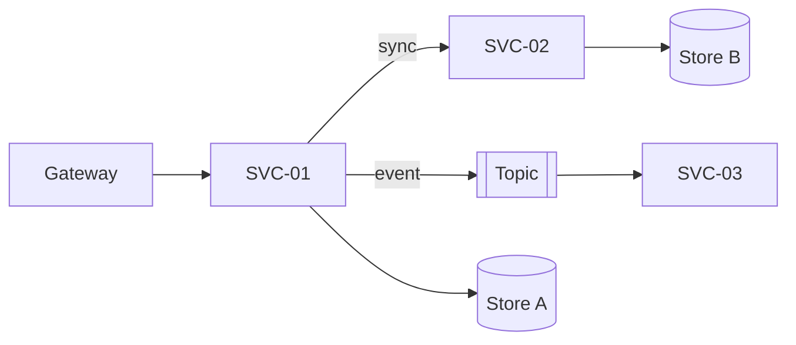
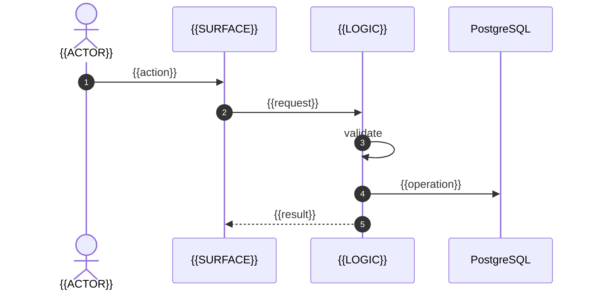

<!-- generated by the AI SDLC specification builder -->
# Crate — Software Specification

> This is the specification for **Crate**, assembled for the software development lifecycle and ordered by phase. It is the authority. Placeholders are written `{{LIKE_THIS}}`; **a remaining placeholder at review time is a review failure, not a cosmetic issue.**

| Field | Value |
|---|---|
| Application | Crate |
| Version | 0.1.0 |
| Owner |  |
| Date | 2026-10-07 |
| Application type | API, Web, Mobile |
| Architecture pattern | Event-driven |
| Rigor tier | Standard |
| Lifecycle phases in this document | 10 |
| Capability modules specified | 4 |
| Source documents merged | 18 |
| Assembled from | Core document set · architecture pattern · domain packs · capability modules |

## How to read this document

Each phase below settles something the next phase depends on, and states the condition under which it is finished. Work them in order. Where a phase is absent, the tailoring rules excluded it for a recorded reason — the appendix names every exclusion and why.

Three conventions carry the weight:

- **Identifiers.** `REQ-`, `FEAT-`, `FLOW-`, `UI-`, `IF-`, `ENT-`, `THR-`, `CTL-`, `TEST-`, `GATE-`. Capability content is scoped to its module, in the form `REQ-<MODULE>-NN`, so any combination of modules composes without collision.
- **Provenance.** *(A)* given, *(B)* inherited, *(C)* derived. Anything undecided is marked `DECISION REQUIRED` and is visible, never silently assumed.
- **Acceptance vocabulary.** `PASS`, `FAIL`, `BLOCKED`, `NOT_APPLICABLE`, `NOT EVALUATED`. A gate that has not run reads `NOT EVALUATED`, never `PASS`.

## The scope this was built from

**Read as:** Create a full-stack application for a subscription-based service for trendy clothes and accessories, featuring an event-driven architecture using Node.js, React, Redis, MongoDB, and Docker.

The brief, kept verbatim. Where the specification below and this statement disagree, this statement is the one that was agreed and the specification is what needs correcting.

> # crate
>
> ## What the repository says about itself
>
> > # 🆕 Upgraded version is now available!
> > An upgraded and more modern version with full-stack monorepo, featuring an event-driven, highly scalable architecture using Node.js, React, Redis, MongoDB, and Docker is now available,
>  check out [github.com/atulmy/fullstack-event-driven-architecture](https://github.com/atulmy/fullstack-event-driven-architecture)
>
>
> 
>
> # Crate 👕👖📦
>
> #### Get monthly subscription of trendy clothes and accessories.
> - **API** built with Node, GraphQL, Express, Sequelize (MySQL) and JWT Auth
> - **WebApp** built with React and Redux along with Server Side Rendering (SSR) / SEO friendly
> - **Mobile** (Android and iOS) Native App build with React Native
> - Written in ES6+ using Babel + Webpack
> - Designed using Adobe Experience Design. Preview it [here](https://xd.adobe.com/view/a662a49f-57e7-4ffd-91bd-080b150b0317/).
>
>
> ## Features
> - Modular and easily scalable code structure
> - Emphasis on developer experience
> - UI components in separate folder which can be swapped for your favorite UI framework easily
> - Responsive UI for React Native to support Mobile and Tablet
> - GraphQL schema with associations
> - Database migration and data seeding
> - User authentication using JSON Web Tokens with GraphQL API
> - File upload feature with GraphQL
> - React storybook demonstrating UI components for web
> - Server side rendering
> - Multi-package setup and dev scripts for an automated dev experiance
>
>
> ## Useful for
> - Developers with basic knowledge on React exploring advance React projects
> - Developers learning React Native
> - Exploring GraphQL
> - Scalable project structure and code
> - Starter application for Mobile and Web along with SSR
> - Multi-package scripts
> - Sample project with combination of all above
>
>
> ## Screenshots and GIFs
> Click on image to view fullscreen and zoom
>
> ### Desktop
> [IMAGE](https://github.com/atulmy/atulmy.github.io/blob/master/images/crate/desktop-all-with-link.png)
>
> 
>
> ### Mobile
> [IMAGE](https://github.com/atulmy/atulmy.github.io/blob/master/images/crate/mobile-all-with-link.png) · [GIF](https://github.com/atulmy/atulmy.github.io/blob/master/images/crate/mobile.gif)
>
> 
>
> ### Tablet
> [IMAGE](https://github.com/atulmy/atulmy.github.io/blob/master/images/crate/tablet-all-with-link.png) · [GIF](https://github.com/atulmy/atulmy.github.io/blob/master/images/crate/tablet.gif)
>
> 
>
>
> ## Core Structure
>     code
>       ├── package.json
>       │
>       ├── api (api.example.com)
>       │   ├── public
>       │   ├── src
>       │   │   ├── config
>       │   │   ├── migrations
>       │   │   ├── modules
>       │   │   ├── seeders
>       │   │   ├── setup
>       │   │   └── index.js
>       │   │
>       │   └── package.json
>       │
>       ├── mobile (Android, iOS)
>       │   ├── assets
>       │   ├── src
>       │   │   ├── modules
>       │   │   ├── setup
>       │   │   ├── ui
>       │   │   └── index.js
>       │   │
>       │   └── package.json
>       │
>       ├── web (example.com)
>       │   ├── public
>       │   ├── src
>       │   │   ├── modules
>       │   │   ├── setup
>       │   │   ├── ui
>       │   │   └── index.js
>       │   ├── storybook
>       │   │
>       │   └── package.json
>       │
>       ├── .gitignore
>       └── README.md
>
>
> ## Setup and Running
> - Prerequisites
>   - Node
>   - MySQL (or Postgres / Sqlite / MSSQL)
> - Clone repo `git clone git@github.com:atulmy/crate.git crate`
> - Switch to `code` directory `cd code`
> - Configurations
>   - Modify `/api/src/config/database.json` for database credentials
>   - Modify `/api/.env` for PORT (optional)
>   - Modify `/web/.env` for PORT / API URL (optional)
>   - Modify `/mobile/src/setup/config.json` for API URL (tip: use `ifconfig` to get your local IP address)
> - Setup
>   - API: Install packages and database setup (migrations and seed) `cd api` and `npm run setup`
>   - Webapp: Install packages `cd web` and `npm install`
>   - Mobile: 
>     1. Install packages `cd mobile` and `npm install`
>     2. Install iOS dependencies `cd mobile/ios` `pod install`
> - Development
>   - Run API `cd api` and `npm start`, browse GraphiQL at http://localhost:8000/
>   - Run Webapp `cd web` and `npm start`, browse webapp at http://localhost:3000/
>   - Run Mobile `cd mobile` and `npx react-native run-ios` for iOS and `npx react-native run-android` for Android
> - Production
>   - Run API `cd api` and `npm run start:prod`, creates an optimized build in `build` directory and runs the server
>   - Run Webapp `cd web` and `npm run start:prod`, creates an optimized build in `build` directory and runs the server
>
> ## Multi-package automation
> - New developers are advised to run through the above 'setup and running' process before reading further.
> - Optional multi-package automation for faster setup and easier dev environment initiation.
> - No need to cd to sub-folders unless working with mobile or running a production build.
> - Once Node, MySQL, repo clone and configuration are setup correctly
>     - Switch to `code` directory `cd code`
>     - Setup
>         - Setup API, Webapp and Mobile with a single command `npm run setup`
>     - Development
>         - Run API and Webapp `npm start`, browse GraphiQL at http://localhost:8000/ and Webapp at http://localhost:8000/
>         - Run API alone `npm start:api`, browse GraphiQL at http://localhost:8000/
>         - Run Webapp alone `npm start:web`, browse webapp at http://localhost:3000/
>
> ## Resources and Inspirations
> - ✍️ Opinionated project architecture for Full-Stack JavaScript Applications - [GitHub](https://github.com/atulmy/fullstack-javascript-architecture)
> - 🌈 Simple Fullstack GraphQL Application - [GitHub](https://github.com/atulmy/fullstack
>
> ## What it is written in
>
> JavaScript (234 files), Java (2 files)
>
> ## What it is built on
>
> - Express — an HTTP API (seen in code/api/package.json, code/web/package.json)
> - React — a browser interface (seen in code/mobile/android/app/build.gradle, code/mobile/android/build.gradle)
> - MySQL — a relational database (seen in code/api/package.json)
> - Jest — an automated test suite (seen in code/mobile/package.json)
>
> ## How it is reached
>
> an HTTP API
>
> ## What is in the repository
>
> - files considered: 301
> - automated tests: none found
> - CI pipelines: none found
> - container or infrastructure files: none found
> - database migrations: 4
> - documentation files: 2

*Tailored by the deterministic keyword analyser. Every inclusion is listed in the appendix with its reason.*

## The business this was written for

Agreed before the technical specification below it was written. This was marked agreed by its author.

**People and organisations involved**

- `BIZ-AUD-01` **Members of the public** — Anybody who arrives without an account, whose intent and technical confidence cannot be assumed.

**How the work flows**

- `BIZ-PRO-01` **People sign in to their own account** — Who they are is known, so what they see and do can depend on it.
- `BIZ-PRO-02` **Somebody new can get started on their own** — Without a person setting them up, if that is what is wanted.
- `BIZ-PRO-03` **Documents and files are kept against the right record** — Who may upload, who may read, and how long they are kept.
- `BIZ-PRO-04` **Somebody asks what we hold about them, or asks us to delete it** — A legal obligation with a clock on it, and a process almost no scope remembers until the first request arrives.
  - The request arrives and the person is identified
  - What is held about them is found, across everywhere it is held
  - It is supplied, corrected or removed
  - The response is recorded as evidence
  - **DECISION REQUIRED** — Who owns this, and what is the deadline?
  - **DECISION REQUIRED** — What may be refused, and on what grounds?
  - **DECISION REQUIRED** — What must be kept even after a deletion request?
- `BIZ-PRO-05` **Create a subscription for trendy clothes and accessories** — Customers sign up for a monthly subscription service that delivers trendy clothes and accessories. This involves selecting a subscription plan, entering personal and payment details, and confirming the subscription choice.
  - Customer selects a subscription plan
  - Customer enters personal and payment details
  - Customer confirms the subscription choice
  - **DECISION REQUIRED** — What subscription plans are offered and at what price?
  - **DECISION REQUIRED** — How do we handle failed payments or subscription cancellations?
- `BIZ-PRO-06` **Fulfill monthly subscription orders** — Each month, the business prepares and sends a curated selection of clothes and accessories to subscribers based on their preferences and the subscription plan chosen.
  - Select clothes and accessories according to subscription plan
  - Package items for delivery
  - Ship package to subscriber
  - Confirm delivery with the customer
  - **DECISION REQUIRED** — What happens if an item is out of stock when fulfilling orders?
  - **DECISION REQUIRED** — How are customer preferences tracked and managed?

**Business rules and policies**

- `BIZ-RUL-01` **Subscription billing cycle** — Billing occurs monthly on the anniversary of the subscription start date, and it covers the cost of that month's shipment. Cancellation policies apply if the customer decides to end their subscription.

**What the business keeps track of**

- `BIZ-INF-01` **Customer preferences** — Details about customer preferences for clothing styles, sizes, and accessory types that guide the selection of their subscription items.

**Success measures**

- `BIZ-MEA-01` **No finding on an audit of how regulated data is handled** — Zero material findings at {{AUDIT}}, with the evidence produced from the system rather than assembled by hand.

**Constraints**

- `BIZ-CON-01` **Regulated or personal data is held, so the law applies** — {{REGULATION}} governs what may be collected, how long it is kept, who may see it and what happens when somebody asks for it to be removed. Name the regulation — the technical half writes controls against whatever this says.

## Decisions taken

Answered while the specification was assembled. Each is binding on the build; changing one is a specification change, not an implementation choice.

| # | Area | Decision required | Decided |
|---|---|---|---|
| DEC-01 | `session-management` | Must a subject be able to see and revoke their own other sessions? | Yes — a session list with device, location, and a revoke action |
| DEC-02 | `session-management` | What is the maximum acceptable delay between an administrator revoking a session and that session being refused? | Immediate — every request checks the session against the store |
| DEC-03 | `login` | Is self-service registration permitted, or is every account provisioned by an administrator? | Self-service, with email verification |
| DEC-04 | `login` | Must a successful sign-in from an unrecognised device notify the subject, and through which channel? | Yes — by email, every time |
| DEC-05 | `login` | What is the required retention period for authentication audit records? | One year |
| DEC-06 | `signup-onboarding` | Is an unverified account purged after a period, and what period? | Purged after 30 days |
| DEC-07 | `signup-onboarding` | Where Self-service, invitation only is invitation only, may an invitation be forwarded, and what stops it? | An invitation is bound to one email address and cannot be forwarded |
| DEC-08 | `file-storage` | Is a deleted file removed from backups, and within what period? | Yes — within 30 days, as backups roll over |
| DEC-09 | `file-storage` | May a file be shared outside the tenant, and is that revocable? | Yes, by expiring link; revoking the link revokes access at once |

## Decisions required before build

Each is `DECISION REQUIRED`. They are collected here because a decision buried in a document nobody reached is a decision nobody made. Answer them on the review screen and regenerate, or record each in a decision record before the readiness gate.

- **DECISION REQUIRED** — Specific regulatory requirements beyond handling personal and financial data.
- **DECISION REQUIRED** — Whether multi-tenancy is supported or needed.

## Lifecycle contents

| Phase | Settles | Finished when |
|---|---|---|
| **1. [Inception and Scope](#phase-1-inception-and-scope)** | What is being built, for whom, and why — in the author's own words, before any structure is imposed on it. | The scope statement and the glossary are agreed, and no term in the rest of the document is used before it is defined here. |
| **2. [Requirements](#phase-2-requirements)** | Every requirement, each with an identifier that a test and an acceptance gate will cite later. | Every requirement has an ID, a provenance tag, and a verification method. No requirement reads *should probably*. |
| **3. [Architecture and Design](#phase-3-architecture-and-design)** | The shape of the system: components, boundaries, the layering pattern, and the data it holds. | Every layer states what may never cross its boundary, something enforces it, and every entity has its fields, types, and invariants. |
| **4. [Detailed Design](#phase-4-detailed-design)** | Behaviour in full: features, flows, surfaces, and the contracts other software calls. | Every flow has its preconditions, happy path, postconditions, failure modes, concurrency, and idempotency. Every surface has its empty, loading, error, denied, and offline states. |
| **5. [Security and Compliance](#phase-5-security-and-compliance)** | Threats, the controls that answer them, and the obligations that come with the data being handled. | Every threat has a control, every control has a test, and the system fails closed by default. |
| **6. [Verification and Test](#phase-6-verification-and-test)** | How every requirement is proved, and what a failure means. | Every requirement ID appears in at least one test case, and every test has a PASS / FAIL / BLOCKED / NOT_APPLICABLE outcome defined. |
| **7. [Build, Package, and Deploy](#phase-7-build-package-and-deploy)** | How the thing is built reproducibly, configured per environment, and rolled out — and rolled back. | A clean machine can build and deploy it from this document, and every configuration key states whether it is a secret. |
| **8. [Acceptance and Sign-off](#phase-8-acceptance-and-sign-off)** | The gates that decide whether it is done, in a vocabulary that cannot be argued with. | Every gate is objective, cites the requirements it covers, and has a named approver. |
| **9. [Build Guide and Handover](#phase-9-build-guide-and-handover)** | What a developer or a coding agent needs in order to build this without asking a question. | No placeholder remains, and every open question has been decided rather than carried. |
| **10. [Appendices](#phase-10-appendices)** | The record of how this document was tailored, and the conventions it relies on. | The profile matches the document: every inclusion and exclusion in the appendix is reflected in the body. |


---

<a id="phase-1-inception-and-scope"></a>

## Phase 1 — Inception and Scope

**This phase settles.** What is being built, for whom, and why — in the author's own words, before any structure is imposed on it.

**Finished when.** The scope statement and the glossary are agreed, and no term in the rest of the document is used before it is defined here.

<a id="02-master-specification-md"></a>

### Crate — Master Specification

<!-- source: 02-MASTER-SPECIFICATION.md -->

| Field | Value |
|---|---|
| Application | Crate |
| Application type | API, Web, Mobile |
| Document | `02-MASTER-SPECIFICATION.md` |
| Version | 0.1.0 |
| Status | DRAFT / IN REVIEW / **APPROVED** |
| Date | 2026-10-07 |
| Owner | {{OWNER}} |
| Derived from | `01-PRODUCT-REQUIREMENTS-SPEC.md` v0.1.0 |
| Authority | **This is the canonical document for Crate.** Where any other document in the set conflicts with it, this one wins until the conflict is resolved and recorded here. |
| Nature | **Design-only.** Nothing here is implemented or authorized. |

---

#### 0. How to read this set

##### 0.1 Normative keywords

**MUST / MUST NOT / SHOULD / SHOULD NOT / MAY** in the RFC-2119 sense. Prose without a keyword is
context, not a requirement.

##### 0.2 Provenance tags

Every requirement, rule, and decision carries exactly one:

| Tag | Meaning |
|---|---|
| **(A)** | Given — from the approved requirement, customer, or regulation |
| **(B)** | Inherited — from an existing system, standard, or platform constraint |
| **(C)** | Derived — a new design decision made in this specification |

A **(C)** item MUST NOT be phrased so it reads as **(A)** or **(B)**. A (C) item needing an owner
decision additionally carries `DECISION REQUIRED`.

##### 0.3 Acceptance vocabulary

`PASS` · `FAIL` · `BLOCKED` · `NOT_APPLICABLE`, and `NOT EVALUATED` for anything not yet run. There
is no *mostly passed*, *conditional*, or *fix-later*. Nothing is `PASS` by reasoning.

#### 1. System overview

{{TWO_PARAGRAPHS}} — what the system is, in terms someone can hold in their head. Then the one
diagram that shows it.

```mermaid
flowchart LR
    User([{{USER}}]) --> App[Crate<br/>API, Web, Mobile]
    App --> Store[({{DATA_STORE}})]
    App --> Ext[{{EXTERNAL_DEPENDENCY}}]
```

#### 2. Glossary

Every domain term used anywhere in the set. Where two words could mean the same thing, pick one and
say the other is not used.

| Term | Means | Not to be confused with |
|---|---|---|
| {{TERM}} | {{DEFINITION}} | {{OTHER_TERM}} |

**Terms deliberately not used:** {{LIST}} — and what to say instead.

<!-- Module content injected at `02.glossary`. Each block below comes from a selected module in `_modules/`. -->

##### Session management — terms

| Term | Means exactly |
|---|---|
| Session | Server-side state that a subject is authenticated, addressed by an identifier the client carries. Not the cookie, and not the token — those carry the address |
| Idle timeout | Time since the last request before the session stops being accepted |
| Absolute lifetime | Time since issuance before the session stops being accepted, whatever the activity |
| Revocation | Making a session identifier stop being accepted before it would have expired |

##### Login and authentication — terms

| Term | Means exactly |
|---|---|
| Subject | The account attempting to authenticate. Not the same as a person: one person may hold several subjects, and a service account is a subject with no person behind it |
| Credential | The secret or key the subject presents. Never the subject identifier itself |
| Authentication | Establishing *which subject* is present. It answers who, never what they may do |
| Lockout | A temporary refusal to evaluate further credentials for a subject, regardless of whether the next credential presented would have been correct |

##### Registration and onboarding — terms

| Term | Means exactly |
|---|---|
| Registration | Creating the subject and its credential. It does not imply an active account |
| Activation | The transition to `ACTIVE` after the contact channel is proved |
| Onboarding | The steps between activation and the subject's first useful state. Not a security boundary |

##### File upload and storage — terms

| Term | Means exactly |
|---|---|
| Blob | The stored bytes. Addressed by an internal key, never by the user's filename |
| Sniffed type | The content type determined by inspecting the bytes. The only type that is trusted |
| Signed URL | A time-limited, single-purpose URL granting access to one blob |
| Quarantine | The state of an uploaded file that has not yet cleared scanning |

#### 3. The conceptual model

How the domain concepts connect, before any storage or interface detail. A reader who understands
only this section should be able to follow every downstream document.

```text
{{CONCEPT_A}} ──owns──> {{CONCEPT_B}} ──produces──> {{CONCEPT_C}}
```

| Concept | Is | Is not | Lifecycle |
|---|---|---|---|
| {{CONCEPT}} | {{DEFINITION}} | {{BOUNDARY}} | {{STATES}} |

#### 4. The rules that govern everything

The three to seven statements that, if violated, mean the application is wrong regardless of what
else works. Repeat each verbatim wherever it could be misread.

> ## **{{RULE_1}}**

> ## **{{RULE_2}}**

#### 5. Scope boundary

##### 5.1 This system owns

| Owns | Meaning |
|---|---|

##### 5.2 This system does not own

| Does not own | Owned instead by | Interface |
|---|---|---|

##### 5.3 Explicit non-goals

Inherited from `01` §6.2 and extended with design-level non-goals discovered here.

#### 6. Key architecture decisions

Summarised here, detailed in `03`. Every row cites the register in §8.

| ID | Decision | Alternatives considered | Why this one | Consequence |
|---|---|---|---|---|
| `DEC-001` | {{DECISION}} | {{ALTERNATIVES}} | {{RATIONALE}} | {{WHAT_FOLLOWS}} |

#### 7. Vocabularies that MUST stay separate

Where the system carries several similar-sounding concepts, name them here and forbid conflating
them. This section prevents the most expensive class of downstream error.

| Vocabulary | Values | Owner | Never conflated with |
|---|---|---|---|

#### 8. Decision register

**This is the one register.** Every other document cites it; none restates a decision as a second
authority.

| ID | Decision | Standing | Rationale | Affects | Date |
|---|---|---|---|---|---|
| `DEC-001` | {{DECISION}} | `RESOLVED` | {{WHY}} | `03`, `05` | 2026-10-07 |
| `DEC-002` | {{DECISION}} | `DECISION REQUIRED` | — | {{DOCS}} | — |
| `DEC-003` | {{DECISION}} | `NOT EVIDENCED` | Settled from live evidence during implementation | {{DOCS}} | — |
| `DEC-004` | {{DECISION}} | `SUPERSEDED BY DEC-00N` | {{WHY}} | {{DOCS}} | 2026-10-07 |

Standings: `RESOLVED` · `DECISION REQUIRED` · `NOT EVIDENCED` · `SUPERSEDED BY DEC-NNN` · `RETIRED`.
A retired identifier is never reused.

<!-- Module content injected at `02.decisions`. Each block below comes from a selected module in `_modules/`. -->

##### Session management — decisions

| ID | Decision | Standing | Rationale | Affects |
|---|---|---|---|---|
| `DEC-SESSION-01` | The session is carried by Opaque server-side session id in a cookie | `RESOLVED` | Chosen for its revocation properties, which matter more than its request cost | `07`, `08` |
| `DEC-SESSION-02` | The session has both an idle timeout of 30 minutes and an absolute lifetime of 12 hours | `RESOLVED` | Idle alone lets a stolen session live indefinitely under synthetic activity | `08`, `09` |
| `DEC-SESSION-Q1` | Whether revocation must be effective globally within one second, or within the access-token lifetime | `DECISION REQUIRED` | Immediate global revocation rules out a purely stateless token | `03`, `08` |

##### Login and authentication — decisions

| ID | Decision | Standing | Rationale | Affects |
|---|---|---|---|---|
| `DEC-LOGIN-01` | Passwords are stored only as a Argon2id digest with a per-credential salt | `RESOLVED` | A stolen store must not yield usable credentials; a reversible or fast digest makes the breach total rather than partial | `04`, `08` |
| `DEC-LOGIN-02` | Authentication failure returns one indistinguishable result for unknown subject and wrong credential | `RESOLVED` | Distinguishing them turns the sign-in form into a subject-enumeration oracle | `07`, `08` |
| `DEC-LOGIN-03` | Sign-in is rate limited per subject and per source address, and the two limits are independent | `RESOLVED` | Per-subject alone lets a spray attack across many subjects through; per-address alone lets a distributed attack on one subject through | `08`, `09` |
| `DEC-LOGIN-Q1` | Whether a locked account unlocks on a timer, on a reset, or only by an administrator | `DECISION REQUIRED` | Timer unlock is self-service but leaves a slow-drip attack viable; administrator unlock is safe and expensive | `05`, `08` |

##### Registration and onboarding — decisions

| ID | Decision | Standing | Rationale | Affects |
|---|---|---|---|---|
| `DEC-SIGNUP-01` | Account creation reports the same outcome whether or not the identifier is already registered | `RESOLVED` | A distinct already-registered message turns registration into the enumeration oracle the sign-in form was built to avoid | `05`, `08` |
| `DEC-SIGNUP-02` | An account is `PENDING_VERIFICATION` until the contact channel is proved | `RESOLVED` | An unproved channel is not a channel you can send a reset to, which makes recovery unsafe from day one | `04`, `05` |
| `DEC-SIGNUP-03` | Onboarding progress is stored on the subject, not in the session | `RESOLVED` | Progress in the session is progress lost on every device change | `04` |

##### File upload and storage — decisions

| ID | Decision | Standing | Rationale | Affects |
|---|---|---|---|---|
| `DEC-FILES-01` | The client-supplied filename and content type are treated as untrusted metadata; the stored type is the sniffed one | `RESOLVED` | A client-declared type routes the file to a parser the caller chose, which is the caller choosing the attack surface | `08` |
| `DEC-FILES-02` | Files are served by Time-limited signed URL, and every access is authorized | `RESOLVED` | A public URL is permanent unauthenticated access to whatever it names | `07`, `08` |
| `DEC-FILES-03` | A file is unavailable until scanning completes where Before the file becomes available requires it | `RESOLVED` | A file available before it is scanned is a file distributed before it is scanned | `05`, `08` |

#### 9. Identifier conventions

| Kind | Pattern | Allocated range | Owner document |
|---|---|---|---|
| Requirement | `REQ-NNN` | 001– | `01` |
| Non-functional | `NFR-NNN` | 001– | `01`, `09` |
| Decision | `DEC-NNN` | 001– | this document |
| Feature | `FEAT-NNN` | 001– | `05` |
| Flow | `FLOW-NNN` | 001– | `05` |
| Surface | `UI-NNN` | 001– | `06` |
| Interface operation | `IF-NNN` | 001– | `07` |
| Entity | `ENT-NNN` | 001– | `04` |
| Threat / control | `THR-NNN` / `CTL-NNN` | 001– | `08` |
| Test | `TEST-NNN` | 001– | `10` |
| Gate | `GATE-NNN` | 001– | `13` |

#### 10. Traceability approach

```text
REQ  →  FEAT  →  FLOW  →  UI / IF  →  ENT  →  TEST  →  GATE
```

| Hop | Table that carries it |
|---|---|
| REQ → FEAT | `05` §2 |
| FLOW → UI / IF | `05` per-flow sections |
| UI / IF → ENT | `06` / `07` per-item sections |
| Everything → TEST | `10` §H |
| TEST → GATE | `13` §5 |

A requirement absent from `10` §H is unverifiable, and that is a finding.

#### 11. Package contents

| Document | Owns | Depends on this document's |
|---|---|---|
| `03-ARCHITECTURE-SPEC.md` | Stack, components, boundaries | §5, §6 |
| `04-DATA-MODEL-SPEC.md` | Entities and storage | §3 |
| `05-FUNCTIONAL-SPEC.md` | Features and flows | §3, §4 |

#### 12. Validation checklist

- [ ] Every term used in the set appears in §2.
- [ ] Every decision in §6 appears in the §8 register with the same standing.
- [ ] No `DECISION REQUIRED` row is unsurfaced in `00-SPEC-INDEX.md` §5.
- [ ] Every identifier series in §9 is used consistently across the set.
- [ ] §5.2 names an interface for every non-owned concern.
- [ ] Every document in §11 exists and cites this document's current version.
- [ ] No document restates a §8 decision as its own authority.


---

<a id="phase-2-requirements"></a>

## Phase 2 — Requirements

**This phase settles.** Every requirement, each with an identifier that a test and an acceptance gate will cite later.

**Finished when.** Every requirement has an ID, a provenance tag, and a verification method. No requirement reads *should probably*.

<a id="01-product-requirements-spec-md"></a>

### Crate — Product Requirements Specification

<!-- source: 01-PRODUCT-REQUIREMENTS-SPEC.md -->

| Field | Value |
|---|---|
| Application | Crate |
| Application type | API, Web, Mobile |
| Document | `01-PRODUCT-REQUIREMENTS-SPEC.md` |
| Version | 0.1.0 |
| Status | DRAFT / IN REVIEW / **APPROVED** |
| Date | 2026-10-07 |
| Owner | {{OWNER}} |
| Derived from | {{SOURCE}} — customer request, discovery notes, regulation, or prior product |
| Nature | **Requirements only.** This document says *what* and *why*. It never says *how* — that is `03`. |

---

#### 1. The problem

{{TWO_PARAGRAPHS}} — the situation today, what it costs, and who feels it. Write it so a reader who
disagrees can say precisely what they disagree with.

**What happens if we build nothing:** {{CONSEQUENCE}}

#### 2. Users

| ID | User | Context | Technical level | What they need |
|---|---|---|---|---|
| `USR-01` | {{ROLE}} | {{WHERE_AND_WHEN}} | {{LEVEL}} | {{NEED}} |

For each user, state the **environment they actually work in** — offline, shared machine, locked-down
corporate device, small screen, noisy floor, screen reader. This constrains the design more than any
feature list.

#### 3. Jobs to be done

| ID | Job | Today | With Crate | Frequency |
|---|---|---|---|---|
| `JOB-01` | {{JOB}} | {{CURRENT}} | {{FUTURE}} | {{HOW_OFTEN}} |

#### 4. Functional requirements

Each row is testable. If you cannot imagine the test, the requirement is not yet a requirement.

| ID | Requirement | Priority | Provenance | Verified by |
|---|---|---|---|---|
| `REQ-001` | The system MUST {{BEHAVIOR}} | MUST / SHOULD / MAY | (A) / (B) / (C) | `TEST-NNN` |

Priority meaning, fixed:

| Priority | Meaning |
|---|---|
| **MUST** | v1 does not ship without it |
| **SHOULD** | v1 ships without it only with a recorded decision |
| **MAY** | Explicitly optional; never allowed to delay v1 |

<!-- Module content injected at `01.requirements`. Each block below comes from a selected module in `_modules/`. -->

##### Session management — functional requirements

| ID | Requirement | Priority | Provenance | Module |
|---|---|:---:|:---:|---|
| `REQ-SESSION-01` | The system MUST issue a session only after authentication completes, including any second factor | **MUST** | (C) | `session-management` |
| `REQ-SESSION-02` | The system MUST generate the session identifier from a cryptographically secure random source with at least 128 bits of entropy | **MUST** | (B) | `session-management` |
| `REQ-SESSION-03` | The system MUST refuse a session after 30 minutes of inactivity or 12 hours since issuance, whichever comes first | **MUST** | (C) | `session-management` |
| `REQ-SESSION-04` | The system MUST regenerate the session identifier on every privilege change | **MUST** | (B) | `session-management` |
| `REQ-SESSION-05` | The system MUST support revoking a single session and every session for a subject | **MUST** | (C) | `session-management` |
| `REQ-SESSION-06` | The system MUST carry the session in an `HttpOnly`, `Secure`, `SameSite={{SAMESITE}}` cookie where a browser is the client, and MUST NOT place it in `localStorage` | **MUST** | (B) | `session-management` |
| `REQ-SESSION-07` | The system MUST NOT accept a session identifier supplied in a URL or query string | **MUST NOT** | (B) | `session-management` |
| `REQ-SESSION-08` | The system MUST treat a revoked, expired, or unknown identifier identically | **MUST** | (C) | `session-management` |

##### Login and authentication — functional requirements

| ID | Requirement | Priority | Provenance | Module |
|---|---|:---:|:---:|---|
| `REQ-LOGIN-01` | The system MUST authenticate a subject by Email and password before issuing any authenticated session | **MUST** | (C) | `login` |
| `REQ-LOGIN-02` | The system MUST store local passwords only as a Argon2id digest with a unique per-credential salt, and MUST NOT store, log, or transmit the plaintext at any point | **MUST** | (B) | `login` |
| `REQ-LOGIN-03` | The system MUST return an identical failure response and an indistinguishable response time for an unknown subject and for a wrong credential | **MUST** | (C) | `login` |
| `REQ-LOGIN-04` | The system MUST lock a subject after 10 consecutive failed attempts, for 15 minutes | **MUST** | (C) | `login` |
| `REQ-LOGIN-05` | The system MUST record every authentication attempt — subject, result, source address, user agent, and UTC timestamp — whether it succeeded or failed | **MUST** | (C) | `login` |
| `REQ-LOGIN-06` | The system MUST invalidate every existing session for a subject when that subject's credential changes | **MUST** | (C) | `login` |
| `REQ-LOGIN-07` | The system MUST NOT include the credential in any URL, query string, log line, error message, or crash report | **MUST NOT** | (B) | `login` |
| `REQ-LOGIN-08` | The system SHOULD offer a remember-me session of Yes that is separately revocable from the ordinary session | **SHOULD** | (C) | `login` |
| `REQ-LOGIN-09` | The system MUST re-authenticate the subject before any credential change, regardless of how recently the session was issued | **MUST** | (C) | `login` |

##### Registration and onboarding — functional requirements

| ID | Requirement | Priority | Provenance | Module |
|---|---|:---:|:---:|---|
| `REQ-SIGNUP-01` | The system MUST return an identical response whether or not the identifier is already registered | **MUST** | (C) | `signup-onboarding` |
| `REQ-SIGNUP-02` | The system MUST create the subject as `PENDING_VERIFICATION` where Yes is enabled, and MUST NOT issue a full session before activation | **MUST** | (C) | `signup-onboarding` |
| `REQ-SIGNUP-03` | The system MUST validate the credential against {{PASSWORD_POLICY}} and screen it against {{BREACH_LIST}} at registration | **MUST** | (C) | `signup-onboarding` |
| `REQ-SIGNUP-04` | The system MUST rate limit registration per source address and per identifier | **MUST** | (C) | `signup-onboarding` |
| `REQ-SIGNUP-05` | The system MUST make every onboarding step resumable on any device, and MUST NOT lose progress on sign-out | **MUST** | (C) | `signup-onboarding` |
| `REQ-SIGNUP-06` | The system MUST record acceptance of {{TERMS_VERSION}} with the subject, the version, and the UTC timestamp | **MUST** | (A) | `signup-onboarding` |
| `REQ-SIGNUP-07` | The system MUST NOT reveal, in the registration response, that an identifier belongs to an existing account — including through a different response time | **MUST NOT** | (C) | `signup-onboarding` |
| `REQ-SIGNUP-08` | Where Self-service, invitation only is invitation only, the system MUST refuse registration without a valid, unconsumed invitation | **MUST** | (C) | `signup-onboarding` |

##### File upload and storage — functional requirements

| ID | Requirement | Priority | Provenance | Module |
|---|---|:---:|:---:|---|
| `REQ-FILES-01` | The system MUST determine the content type by inspecting the bytes and MUST reject a file whose declared and sniffed types disagree | **MUST** | (C) | `file-storage` |
| `REQ-FILES-02` | The system MUST store the blob under a generated internal key and MUST NOT use any part of the client-supplied filename as a storage path | **MUST NOT** | (C) | `file-storage` |
| `REQ-FILES-03` | The system MUST enforce 25 MB and the accepted-type list before storing, and MUST enforce the size limit on the stream rather than a declared header | **MUST** | (C) | `file-storage` |
| `REQ-FILES-04` | The system MUST hold a file in quarantine until scanning completes where Before the file becomes available requires it | **MUST** | (C) | `file-storage` |
| `REQ-FILES-05` | The system MUST authorize every read, and MUST make a signed URL expire within {{FILES_URL_TTL}} and grant access to one blob only | **MUST** | (C) | `file-storage` |
| `REQ-FILES-06` | The system MUST serve every file with `Content-Disposition: attachment` and a nosniff header unless the type is on the explicit inline allow-list | **MUST** | (B) | `file-storage` |
| `REQ-FILES-07` | The system MUST NOT serve user-uploaded content from the application's own origin where a browser will execute it | **MUST NOT** | (B) | `file-storage` |
| `REQ-FILES-08` | The system MUST record every upload, download, and deletion with subject, blob, and outcome | **MUST** | (C) | `file-storage` |
| `REQ-FILES-09` | The system MUST make a deleted file irretrievable within {{FILES_DELETION_SLA}}, including by any previously issued signed URL | **MUST** | (C) | `file-storage` |

#### 5. Non-functional requirements

Numbers, not adjectives. "Fast" is not a requirement; "opens a 50 MB project in under 2 seconds on
the reference machine" is.

| ID | Requirement | Target | Measured how | Priority |
|---|---|---|---|---|
| `NFR-001` | {{QUALITY}} | {{NUMBER}} | {{METHOD}} | MUST |

Cover at least: startup time, responsiveness under normal load, resource ceiling, availability,
data-loss tolerance, accessibility standard, supported platform versions. `09` expands each.

<!-- Module content injected at `01.nfr`. Each block below comes from a selected module in `_modules/`. -->

##### Session management — non-functional requirements

| ID | Aspect | Target | Measured by |
|---|---|---|---|
| `NFR-SESSION-01` | Session validation cost | Under 5 ms at the 95th percentile, cache included | `TEST-SESSION-06` |
| `NFR-SESSION-02` | Revocation latency | A revoked session is refused within {{REVOCATION_SLA}} everywhere | `TEST-SESSION-04` |

##### Login and authentication — non-functional requirements

| ID | Aspect | Target | Measured by |
|---|---|---|---|
| `NFR-LOGIN-01` | Sign-in latency | 95th percentile under 400 ms at {{PEAK_CONCURRENT}} concurrent attempts, excluding deliberate hash cost | Load test `TEST-LOGIN-09` |
| `NFR-LOGIN-02` | Hash cost | Argon2id tuned so a single verification takes 150–500 ms on the reference environment | Benchmark recorded in `09` section 1 |
| `NFR-LOGIN-03` | Credential store availability | Sign-in fails closed and states so; it never falls back to a weaker check | Fault injection `TEST-LOGIN-10` |

##### Registration and onboarding — non-functional requirements

| ID | Aspect | Target | Measured by |
|---|---|---|---|
| `NFR-SIGNUP-01` | Registration latency | Under 600 ms at the 95th percentile including the hash cost | `TEST-SIGNUP-06` |
| `NFR-SIGNUP-02` | Verification delivery | Leaves the system within 30 seconds at the 95th percentile | `TEST-SIGNUP-07` |

##### File upload and storage — non-functional requirements

| ID | Aspect | Target | Measured by |
|---|---|---|---|
| `NFR-FILES-01` | Upload throughput | {{FILES_UPLOAD_THROUGHPUT}} sustained | `TEST-FILES-07` |
| `NFR-FILES-02` | Time to available | Under {{FILES_AVAILABLE_SLA}} at the 95th percentile including scanning | `TEST-FILES-08` |
| `NFR-FILES-03` | Durability | {{FILES_DURABILITY}} as provided by Object storage (S3-compatible) | Backend SLA plus a restore test |

#### 6. Scope

##### 6.1 In scope for v1

| # | Item | Requirements |
|---|---|---|
| 1 | {{ITEM}} | `REQ-001`, `REQ-004` |

##### 6.2 Explicit non-goals

The most-read section of this document six months from now. Be generous with it.

| # | Not doing | Why | Revisit when |
|---|---|---|---|
| 1 | {{NON_GOAL}} | {{REASON}} | {{CONDITION}} |

##### 6.3 Deferred to a later version

| Item | Version | Why deferred |
|---|---|---|

#### 7. Success criteria

How you will know, after release, whether this worked. Stated before building, so it cannot be
rewritten to match the outcome.

| # | Criterion | Target | Measured how | When |
|---|---|---|---|---|
| 1 | {{CRITERION}} | {{TARGET}} | {{METHOD}} | {{WHEN}} |

#### 8. Constraints

| Kind | Constraint | Source | Consequence |
|---|---|---|---|
| Platform | {{CONSTRAINT}} | (B) | {{WHAT_IT_RULES_OUT}} |
| Regulatory / policy | | (A) | |
| Budget / time | | (A) | |
| Existing systems | | (B) | |
| Team skills | | (A) | |

#### 9. Assumptions

Each one is a risk. State how you would find out it was wrong.

| ID | Assumption | If wrong | How we would learn |
|---|---|---|---|
| `ASM-01` | {{ASSUMPTION}} | {{IMPACT}} | {{SIGNAL}} |

#### 10. Open questions

| ID | Question | Blocks | Owner | Standing |
|---|---|---|---|---|
| `Q-001` | {{QUESTION}} | `REQ-NNN` | {{OWNER}} | `DECISION REQUIRED` |

#### 11. Validation checklist

- [ ] Every requirement has an ID, a priority, a provenance tag, and a verification method.
- [ ] Every requirement is testable as written.
- [ ] Every NFR carries a number and a measurement method.
- [ ] Every user in §2 has at least one requirement serving them.
- [ ] §6.2 non-goals contradict nothing in §6.1.
- [ ] No requirement specifies an implementation — no framework, library, or schema appears here.
- [ ] Every assumption states how it would be falsified.
- [ ] Every open question is `DECISION REQUIRED` and named in `00-SPEC-INDEX.md` §5.


---

<a id="phase-3-architecture-and-design"></a>

## Phase 3 — Architecture and Design

**This phase settles.** The shape of the system: components, boundaries, the layering pattern, and the data it holds.

**Finished when.** Every layer states what may never cross its boundary, something enforces it, and every entity has its fields, types, and invariants.

Parts: *Crate — Architecture Specification* · *Crate — Architecture Pattern: Event-Driven* · *Crate — Service Topology Specification* · *Crate — Consistency & Resilience Specification* · *Crate — Data Model Specification*

<a id="03-architecture-spec-md"></a>

### Crate — Architecture Specification

<!-- source: 03-ARCHITECTURE-SPEC.md -->

| Field | Value |
|---|---|
| Application | Crate |
| Application type | API, Web, Mobile |
| Document | `03-ARCHITECTURE-SPEC.md` |
| Version | 0.1.0 |
| Status | DRAFT / IN REVIEW / **APPROVED** |
| Date | 2026-10-07 |
| Owner | {{OWNER}} |
| Derived from | `02-MASTER-SPECIFICATION.md` v0.1.0 |
| Nature | **Design-only.** Nothing here is implemented. |

---

#### 1. Application type resolution

**This section is what makes the rest of the set concrete.** Fill it before any other document below
`03`. See `00-APPLICATION-TYPE-PROFILES.md`.

| Concept | Resolves to | Specified in |
|---|---|---|
| **Application type** | API, Web, Mobile | this document |
| **Surface** | {{WINDOW_PAGE_SCREEN_COMMAND}} | `06` |
| **Interface contract** | {{HTTP_GRPC_CLI_IPC_FILE_EVENT}} | `07` |
| **Data store** | PostgreSQL | `04` |
| **Distribution** | {{INSTALLER_CONTAINER_STORE_REGISTRY}} | `11` |

Where the application is more than one type, state which component is which, and name the document
that owns the boundary between them.

#### 2. Technology stack

Every entry is pinned. "Latest" is not a version, and an unpinned dependency is an unspecified one.

| Layer | Technology | Version | Why this | Alternatives rejected |
|---|---|---|---|---|
| Language | **Swift** | 6.0 | The first-party language for Apple platforms; everything else is a wrapper around it | React Native — one codebase, and a lag behind every OS release |
| Runtime / framework | **SwiftUI** | iOS 18 / macOS 15 | The first-party declarative UI stack for Apple platforms | UIKit — more control, far more code |
| Frontend / UI toolkit | **SwiftUI** | iOS 18 | First-party, and the only stack that gets a new OS feature on the day | React Native — cross-platform, and always a release behind |
| Data access | **Driver and hand-written SQL** | — | No mapping layer at all, where the access pattern is narrow and the SQL is the specification | An ORM — an abstraction this application does not need |
| Data store | **PostgreSQL** | 17 | Transactional, relational, and extensible — JSON, full text, and vectors in the store you already run, which removes a second store and its consistency problem | MySQL — comparable, with fewer extensions |
| Data platform | `DECISION REQUIRED` | — | Where analytical data is moved and modelled | — |
| Messaging / streaming | **Azure Service Bus** | — | Managed queues and topics with sessions and dead-lettering, inside the Azure boundary | RabbitMQ — self-hosted, and yours to patch |
| Key libraries | `DECISION REQUIRED` | — | Anything else a reader must have to build it | — |
| Testing | **XCTest / Swift Testing, Playwright** | Xcode 16 / 1.49 | First-party, and the only runner the device tooling drives | {{ALTERNATIVES}} |
| Build | **Xcode / `xcodebuild`** | 16 | The only supported path to a signed Apple artefact | {{ALTERNATIVES}} |
| Packaging | **App Store / Play Store package** | — | The only supported distribution to a consumer device | Sideloading — unsupported, and blocked by default |
| Hosting / runtime target | **The end user's device** | — | A desktop, mobile, or CLI artefact runs where its user is | {{ALTERNATIVES}} |

**2 of 12 layers are undecided.** Each is a `DECISION REQUIRED` above, not an omission: some of them genuinely do not apply to this application, and saying so in the row is what records that it was considered. Replace the marker either way — with the technology, or with `NOT_APPLICABLE` and the reason.

> **Confirm every version before this document is approved.** The versions above are the current stable line as at the template's release, proposed so the table is not empty. A version that is wrong and looks decided is more dangerous than one that is visibly still a question.

**Minimum supported platform versions:** {{OS_AND_RUNTIME_FLOOR}} — and what happens on an older one.

#### 3. Component structure

| ID | Component | Responsibility | Depends on | May never |
|---|---|---|---|---|
| `CMP-01` | {{NAME}} | {{ONE_SENTENCE}} | {{DEPS}} | {{PROHIBITION}} |

**The `May never` column is load-bearing.** It is what stops a presentation layer reaching the data
store directly, or a domain component taking a UI dependency. State it as a rule a reviewer can check.

<!-- Module content injected at `03.components`. Each block below comes from a selected module in `_modules/`. -->

##### Session management — components

| Component | Responsibility | Must not | Depends on |
|---|---|---|---|
| `SessionIssuer` | Creates the session and its identifier | Reuse an identifier, or issue before authentication completes | Random source, session store |
| `SessionValidator` | Resolves an identifier to a subject on every request | Extend the absolute lifetime, or accept an identifier it cannot find | Session store |
| `SessionStore` | Persists session state | Be the only revocation path where a stateless token is also in use | Data layer or cache |

##### Login and authentication — components

| Component | Responsibility | Must not | Depends on |
|---|---|---|---|
| `AuthController` | Accepts the sign-in request, applies rate limits, returns the result | Read the credential store directly, or branch on why authentication failed | `AuthService` |
| `AuthService` | Verifies the credential, applies lockout, issues the session | Format any user-facing message, or know about HTTP | `CredentialStore`, `SessionIssuer` |
| `CredentialStore` | Reads and writes credential digests | Return a digest to any caller, or accept a plaintext for storage | Data layer |
| `LoginAuditSink` | Appends the attempt record | Be skipped when the attempt fails, or block the response path | `audit-log` module |

#### 4. Project / module layout

The exact structure the repository will have. An agent creating a project not listed here is
violating the specification.

```text
{{SOLUTION_OR_ROOT}}
├── {{PROJECT_1}}/          {{RESPONSIBILITY}}
├── {{PROJECT_2}}/          {{RESPONSIBILITY}}
├── {{TEST_PROJECT}}/       Unit and integration tests
└── {{E2E_PROJECT}}/        End-to-end / UI automation
```

**No component, project, or module is added to this layout without a recorded decision (`DEC-NNN`).**

#### 5. Layering and boundaries

```mermaid
flowchart TD
    UI[Presentation<br/>{{PROJECT}}] --> APP[Application / domain<br/>{{PROJECT}}]
    APP --> DATA[Data access<br/>{{PROJECT}}]
    DATA --> STORE[(PostgreSQL)]
    APP --> EXT[{{EXTERNAL}}]
```

| Boundary | Crossed by | Never crossed by | Enforced how |
|---|---|---|---|
| {{FROM}} → {{TO}} | {{ALLOWED}} | {{FORBIDDEN}} | {{MECHANISM}} |

For any application with a client and a server: **the server independently enforces every rule.**
Client-side validation is a convenience; it is never the enforcement point, and UI visibility is
never authorization.

#### 7. External dependencies

| ID | Dependency | Version | Purpose | If unavailable | Licence |
|---|---|---|---|---|---|
| `EXT-01` | {{NAME}} | 0.1.0 | {{PURPOSE}} | **{{DEGRADED_BEHAVIOR}}** | {{LICENCE}} |

**Every dependency states its failure behavior.** "If unavailable" left blank means the application's
behavior in that case is unspecified, and it will be discovered in production.

<!-- Module content injected at `03.dependencies`. Each block below comes from a selected module in `_modules/`. -->

##### Login and authentication — external dependencies

| Dependency | Pinned version | Used for | When unavailable |
|---|---|---|---|
| Argon2id implementation | 0.1.0 — pinned, no floating range | Credential digesting | Sign-in fails closed with `AUTH_UNAVAILABLE`; it never degrades to a weaker algorithm |

#### 8. Cross-cutting concerns

| Concern | Approach | Where it lives |
|---|---|---|
| Configuration | {{APPROACH}} | `11` |
| Secrets | {{APPROACH}} — never in source, never in logs | `08`, `11` |
| Logging | {{APPROACH}} | `09` |
| Error handling | {{APPROACH}} | `05` |
| Validation | {{APPROACH}} | `05`, `07` |
| Concurrency | {{APPROACH}} | `04`, `05` |
| Caching | {{APPROACH}} | `09` |
| Background work | {{APPROACH}} | `05` |
| Dependency injection | {{APPROACH}} | this document |
| Threading / async | {{APPROACH}} | this document |

#### 9. Architecture decisions

Detail for the summary in `02` §6. One subsection per significant decision.

##### `DEC-NNN` — {{DECISION}}

**Context.** What forced a choice.
**Options.** Each with its real trade-off, not a straw man.
**Decision.** What was chosen, and by whom.
**Consequences.** What becomes easy, what becomes hard, what is now hard to reverse.

#### 10. What this architecture deliberately does not do

| Not doing | Why | What would change the answer |
|---|---|---|

#### 11. Validation checklist

- [ ] §1 resolves all five concepts, and every downstream document uses those resolutions.
- [ ] Every technology in §2 has a pinned version.
- [ ] Every component in §3 has a `May never` rule.
- [ ] The §4 layout matches what `12-IMPLEMENTATION-PLAN.md` phase 1 will create.
- [ ] Every boundary in §5 names its enforcement mechanism.
- [ ] Every external dependency in §7 states its unavailable-behavior and licence.
- [ ] Every §8 concern names where it is specified in full.
- [ ] Every significant decision appears in the `02` §8 register.

<a id="03a-architecture-pattern-md"></a>

### Crate — Architecture Pattern: Event-Driven

<!-- source: 03A-ARCHITECTURE-PATTERN.md -->

| Field | Value |
|---|---|
| Application | Crate |
| Document | `03A-ARCHITECTURE-PATTERN.md` |
| Pattern | **Event-driven** — components react to events rather than calling each other |
| Version | 0.1.0 |
| Status | DRAFT / IN REVIEW / **APPROVED** |
| Companion | `03-ARCHITECTURE-SPEC.md` |

---

#### 1. When this pattern is right

| Fits | Does not fit |
|---|---|
| Work that can happen slightly later | A user waiting for an immediate answer |
| One action with many independent consequences | Simple request-response flows |
| Decoupling producers from unknown consumers | Small systems where a direct call is clearer |
| Absorbing load spikes | Anything needing strong cross-component consistency |
| Audit and replay requirements | |

**The trade:** you gain decoupling and resilience; you lose the ability to reason about the system by
reading a call stack, and you accept eventual consistency everywhere.

#### 2. Events

| ID | Event | Meaning | Producer | Consumers | Ordering | Retention |
|---|---|---|---|---|---|---|
| `EVT-01` | `{{Noun}}{{PastTenseVerb}}` | {{WHAT_HAPPENED}} | {{COMPONENT}} | {{LIST}} | none / per-key | {{PERIOD}} |

| Rule | Statement |
|---|---|
| **Events are facts** | Named in the past tense. `OrderPlaced`, not `PlaceOrder` |
| Events are not commands | A producer states what happened; it does not instruct a consumer |
| Producers do not know consumers | Adding a consumer requires no producer change |
| Events are immutable | A published event is never edited. A correction is a new event |
| Self-contained enough | Carrying what consumers need, without forcing a call back |

**Event payload size trade-off:** thin events (just an id) keep coupling low but force callbacks;
fat events avoid callbacks but couple consumers to the producer's shape. State which you chose and
why, per event.

#### 3. Delivery reality

Assume the worst unless the infrastructure genuinely guarantees otherwise, in writing.

| Property | Assume | Consequence |
|---|---|---|
| Delivery | **At-least-once** | Every consumer is idempotent |
| Ordering | **None across keys** | Consumers tolerate out-of-order arrival |
| Timing | **Eventually** | No consumer assumes promptness |
| Duplicates | **Will happen** | Deduplication by {{KEY}} |
| Loss | Possible on {{CONDITIONS}} | {{MITIGATION}} |

#### 4. Consumers

| Consumer | Consumes | Idempotency key | On failure | Dead letter |
|---|---|---|---|---|
| {{NAME}} | `EVT-01` | {{KEY}} | Retry {{N}}, then DLQ | {{DESTINATION}} |

| Rule | Statement |
|---|---|
| **Idempotent** | Processing the same event twice produces the same result |
| Independent | One consumer failing does not affect another |
| No consumer chains | Consumer emitting an event another consumes is fine; a long chain is not — see §7 |
| Poison messages | {{POLICY}} after {{N}} failures |
| **Dead-letter monitoring** | {{WHO}} watches, at {{CADENCE}} — an unwatched DLQ is silent data loss |

#### 5. Schema evolution

| Change | Allowed | Note |
|---|:---:|---|
| Add an optional field | ✅ | Consumers ignore unknown fields |
| Add a required field | ❌ | Breaks existing consumers |
| Remove a field | ❌ | |
| Rename or change a type | ❌ | Publish a new event version instead |

| Aspect | Value |
|---|---|
| Schema registry | {{WHERE}} |
| Versioning | {{SCHEME}} |
| Both versions in flight | {{DURATION}} during a rollout |
| Consumer compatibility rule | Ignore unknown fields; never fail on them |

#### 6. Observability

The hardest part of this pattern. Without these, debugging is guesswork.

| Aspect | Value |
|---|---|
| Correlation id | Generated at the originating action, carried through **every** event and call |
| Causation id | Which event caused this event |
| End-to-end trace | {{TOOL}} — one business action visible across all consumers |
| Consumer lag | Monitored, alert above {{THRESHOLD}} |
| Event flow documentation | {{WHERE}} — kept current, or it is worse than nothing |
| Replay capability | {{SUPPORTED_HOW}} and its safety implications |

**The diagnosis test:** for "a customer says their order never shipped", name the artifact that shows
which events fired, which consumers ran, and which did not. If the answer is "check each service's
logs", that is a gap.

#### 7. Common failure modes

| Failure | Looks like | Prevention |
|---|---|---|
| Events as disguised commands | `SendEmail` published as an event | §2 naming rule |
| Hidden coupling | Adding a consumer requires a producer change | §2 |
| Consumer chains | A → B → C → D, nobody knows the full flow | Bound the depth; document flows |
| Missing idempotency | Duplicate charges, duplicate emails | §4 |
| Unwatched dead letters | Work silently lost | §4 |
| Untraceable failures | "Something didn't happen and we don't know why" | §6 |
| Eventual consistency surprising users | "I saved it, why isn't it there?" | Surface it in the interface |

#### 8. What the user sees

Eventual consistency is a **user-experience** decision, not only a technical one.

| Action | Immediate feedback | Actual completion | User is told how |
|---|---|---|---|
| {{ACTION}} | {{WHAT_THEY_SEE_NOW}} | {{WHEN_IT_IS_REALLY_DONE}} | {{MECHANISM}} |

A silent "saved" that is not yet true is the defect users report as data loss.

#### 9. Validation checklist

- [ ] Every event is named as a past-tense fact.
- [ ] No event is a disguised command.
- [ ] Every consumer is idempotent, with a stated key.
- [ ] Consumers tolerate duplicates and out-of-order arrival.
- [ ] Every dead-letter destination has a named watcher and cadence.
- [ ] Schema evolution rules are stated; consumers ignore unknown fields.
- [ ] Correlation and causation ids flow through every event.
- [ ] The §6 diagnosis test is answered by a named artifact.
- [ ] Consumer lag is monitored with an alert threshold.
- [ ] Eventual consistency is surfaced honestly in the interface.

<a id="15-service-topology-spec-md"></a>

### Crate — Service Topology Specification

<!-- source: 15-SERVICE-TOPOLOGY-SPEC.md -->

| Field | Value |
|---|---|
| Application | Crate |
| Document | `15-SERVICE-TOPOLOGY-SPEC.md` |
| Extension pack | Distributed-Services (added because Q7 = Yes) |
| Version | 0.1.0 |
| Status | DRAFT / IN REVIEW / **APPROVED** |
| Date | 2026-10-07 |
| Owner | {{OWNER}} |
| Derived from | `03-ARCHITECTURE-SPEC.md` v0.1.0 |
| Companion | `16-CONSISTENCY-RESILIENCE-SPEC.md` |
| Nature | **Design-only.** |

---

#### 1. Why these are separate services

The honest question, answered before the diagram. Separate services buy independent deployment,
independent scaling, and team autonomy — and cost you network failure, eventual consistency,
distributed debugging, and versioned contracts between everything.

| Boundary | Why it is separate | What it costs | Considered keeping together? |
|---|---|---|---|
| {{SERVICE_A}} / {{SERVICE_B}} | {{REASON}} | {{COST}} | {{YES_AND_WHY_NOT}} |

**A service split for organisational reasons is legitimate — say so.** A split with no stated reason
is a distributed monolith waiting to be discovered.

#### 2. Service inventory

| ID | Service | Owns | Owning team | Data store | Deployable independently |
|---|---|---|---|---|:---:|
| `SVC-01` | {{NAME}} | {{DOMAIN}} | {{TEAM}} | PostgreSQL | ✅ |

**One service owns each piece of data.** Two services writing the same table is a single service
wearing a disguise; record it as a defect, not an architecture.

#### 3. Topology



| From | To | Style | Contract | Timeout | Failure behavior |
|---|---|---|---|---|---|
| `SVC-01` | `SVC-02` | sync / async | `IF-NNN` | {{MS}} | {{DEGRADE_QUEUE_FAIL}} |

**Every synchronous call states a timeout.** A call without one eventually takes down the caller.

#### 4. Communication rules

| Rule | Statement |
|---|---|
| No shared database | A service reads another's data only through its contract |
| No chained synchronous calls beyond {{N}} hops | Latency and failure probability compound |
| Async by default | Synchronous coupling is chosen deliberately and justified |
| Contract versioning | `07` §2 governs; a breaking change is versioned, never silent |
| Backward compatibility window | {{DURATION}} — both versions run during a rollout |
| Circular dependency | **Prohibited.** If two services must call each other, the boundary is wrong |

#### 5. Contracts between services

| Contract | Producer | Consumers | Kind | Compatibility | Verified by |
|---|---|---|---|---|---|
| `IF-NN` | `SVC-01` | `SVC-02`, `SVC-03` | request / event | backward-compatible | Contract test `TEST-NNN` |

**A consumer-driven contract test is what stops a producer breaking a consumer.** Without one, the
first sign is a production incident. Add these tests to `10-TEST-SPEC.md` §4.

#### 6. Events

| Event | Producer | Payload | Ordering guarantee | Delivery | Duplicate handling | Consumers |
|---|---|---|---|---|---|---|
| `EVT-01` | `SVC-01` | {{SCHEMA}} | none / per-key | at-least-once | idempotent by {{KEY}} | {{LIST}} |

**Assume at-least-once and out-of-order** unless the infrastructure genuinely guarantees otherwise.
Every consumer is idempotent, and every event carries what a consumer needs to detect a replay.

#### 7. Shared concerns

| Concern | Approach | Owner |
|---|---|---|
| Identity propagation | {{HOW_THE_CALLER_IDENTITY_FLOWS}} | |
| Authorization | **Each service authorizes independently.** A call from a trusted service is not authorized by its source | |
| Correlation id | {{PROPAGATION_RULE}} | |
| Configuration | {{APPROACH}} | |
| Secrets | {{APPROACH}} | |
| Schema registry | {{WHERE}} | |
| Service discovery | {{MECHANISM}} | |

#### 8. Deployment independence

| Aspect | Value |
|---|---|
| Deploy order constraints | {{ANY}} — and why they exist |
| Database migration relative to deployment | Expand → migrate → contract, or the stated alternative |
| Rollback of one service alone | Supported / not — and what breaks |
| Feature-flag coordination | {{APPROACH}} |
| Version-skew tolerance | Which version pairs must interoperate during a rollout |

**Version skew is the normal state during a deploy, not an edge case.** Specify which combinations
must work.

#### 9. Local development and testing

| Aspect | Value |
|---|---|
| Running the whole system locally | {{FEASIBLE_HOW}} |
| Running one service against stubs | {{APPROACH}} |
| Shared test environment | {{APPROACH_AND_ITS_LIMITS}} |
| End-to-end test scope | {{WHAT_IS_ACTUALLY_COVERED}} |

#### 10. Validation checklist

- [ ] Every service split has a stated reason and an acknowledged cost.
- [ ] No two services write the same data.
- [ ] Every synchronous call has a timeout and a failure behavior.
- [ ] No circular service dependency exists.
- [ ] Every contract has a consumer-driven contract test.
- [ ] Every event consumer is idempotent.
- [ ] Every service authorizes independently — no service trusts another's word.
- [ ] Version-skew combinations that must interoperate are named.
- [ ] Migration ordering relative to deployment is specified.

<a id="16-consistency-resilience-spec-md"></a>

### Crate — Consistency & Resilience Specification

<!-- source: 16-CONSISTENCY-RESILIENCE-SPEC.md -->

| Field | Value |
|---|---|
| Application | Crate |
| Document | `16-CONSISTENCY-RESILIENCE-SPEC.md` |
| Extension pack | Distributed-Services (added because Q7 = Yes) |
| Version | 0.1.0 |
| Status | DRAFT / IN REVIEW / **APPROVED** |
| Date | 2026-10-07 |
| Owner | {{OWNER}} |
| Derived from | `15-SERVICE-TOPOLOGY-SPEC.md` v0.1.0 |
| Nature | **Design-only.** |

---

#### 1. The rule this document exists for

> ## **In a distributed system, every remote call has three outcomes: success, failure, and unknown.**

"Unknown" — a timeout, a dropped connection, a response lost after the work completed — is the one
that corrupts data, because the caller cannot tell whether the work happened. Every operation below
states what it does when the answer is unknown.

#### 2. Consistency model

| Data | Consistency | Staleness window | Who tolerates it |
|---|---|---|---|
| {{DATA}} | strong / read-your-writes / eventual | {{DURATION}} | {{CONSUMER}} |

For each eventually-consistent item, state what a user sees during the window and whether the
interface admits it — a value that silently reads stale is a support ticket that nobody can reproduce.

#### 3. Transactions spanning services

A distributed transaction is not available. State what replaces it.

| ID | Business transaction | Services | Approach | Compensation |
|---|---|---|---|---|
| `TXN-01` | {{NAME}} | `SVC-01`, `SVC-02` | saga / outbox / two-phase-free | {{COMPENSATING_ACTION}} |

##### `TXN-NN` — {{NAME}}

| Step | Service | Action | Compensation | Compensation can fail? |
|---:|---|---|---|---|
| 1 | `SVC-01` | {{ACTION}} | {{UNDO}} | {{WHAT_THEN}} |

**Every compensation can itself fail.** Say what happens then — usually an alert and a human, and
that is an acceptable answer as long as it is written down rather than discovered.

**Partial completion visible to users.** State what a user sees between step 1 and step N.

#### 4. Idempotency

| Operation | Idempotency key | Key source | Dedup window | Storage | Repeat returns |
|---|---|---|---|---|---|
| `IF-NN` | {{KEY}} | client / derived | {{DURATION}} | {{WHERE}} | original result |

**Every non-read operation reachable across the network is idempotent.** Without it, a retry after an
unknown outcome duplicates the work — the double charge, the duplicate order, the second email.

#### 5. Retry policy

| Operation class | Retryable | Attempts | Backoff | Jitter | Budget | Then |
|---|:---:|---|---|:---:|---|---|
| Idempotent read | ✅ | {{N}} | exponential | ✅ | {{MS}} | Fail with a clear error |
| Idempotent write | ✅ | {{N}} | exponential | ✅ | {{MS}} | Escalate |
| Non-idempotent write | ❌ | — | — | — | — | **Never retried blindly** |

**Jitter is not optional.** Synchronised retries across many callers turn a brief blip into an outage.

#### 6. Failure isolation

| Mechanism | Applied to | Configuration | Behavior when tripped |
|---|---|---|---|
| Timeout | Every remote call | {{MS}} per call | Fail fast |
| Circuit breaker | {{CALLS}} | {{THRESHOLD}}, {{RESET}} | {{FALLBACK}} |
| Bulkhead | {{RESOURCE}} | {{LIMIT}} | Reject rather than exhaust |
| Rate limit | {{ENDPOINTS}} | {{LIMIT}} | 429 with retry-after |
| Load shedding | {{CONDITION}} | {{RULE}} | Shed lowest-value work first |

#### 7. Degradation

What the system does when a dependency is gone. **Specified, not discovered.**

| Dependency down | Still works | Degraded | Unavailable | User sees |
|---|---|---|---|---|
| `SVC-02` | {{FEATURES}} | {{FEATURES}} | {{FEATURES}} | {{MESSAGE}} |

**Critical-path dependencies.** Which failures take the whole system down, and whether that is
acceptable. A dependency you cannot degrade around is a single point of failure; name it.

#### 8. Data ownership and duplication

| Data | Owner | Copied to | Sync mechanism | Staleness | Conflict rule |
|---|---|---|---|---|---|
| {{DATA}} | `SVC-01` | `SVC-02` | event / poll | {{DURATION}} | owner wins |

A copy is a cache with feelings. State how it is invalidated and who wins a disagreement.

#### 9. Distributed diagnosis

| Aspect | Value |
|---|---|
| Correlation id | Generated at {{POINT}}, propagated through every call and event |
| Tracing | {{TOOL}}, sampling {{RATE}}, always-on for errors |
| Log correlation | Every log line carries the correlation id |
| Clock skew | Assumed up to {{DURATION}}; **never order events by wall clock across services** |
| Health endpoints | Liveness vs readiness, and what each actually checks |

**The diagnosis test.** For "a user says their request failed five minutes ago, what happened" — name
the artifact that answers it. If the answer is "check each service's logs by hand", that is an
observability gap.

#### 10. Failure rehearsal

| Scenario | Expected behavior | Rehearsed | Last rehearsed |
|---|---|:---:|---|
| One service instance dies | | | |
| A whole service is unavailable | | | |
| Network partition between two services | | | |
| A dependency is slow, not down | | | |
| Message queue backs up | | | |
| Duplicate message delivered | | | |
| Deploy with version skew | | | |

**"Slow, not down" is the hardest and most common.** A dependency at 30-second latency breaks more
systems than one that is cleanly unreachable.

#### 11. Validation checklist

- [ ] Every operation states its behavior on an unknown outcome.
- [ ] Every non-read cross-network operation is idempotent with a stated key.
- [ ] No non-idempotent operation is retried automatically.
- [ ] Every retry policy includes jitter and an overall budget.
- [ ] Every distributed transaction has compensations, and compensation failure is handled.
- [ ] Every dependency has a specified degraded mode, or is named as a single point of failure.
- [ ] Nothing orders events by wall-clock time across services.
- [ ] The §9 diagnosis test is answered by a named artifact.
- [ ] Every §10 scenario has an expected behavior; the untested ones are marked honestly.

<a id="04-data-model-spec-md"></a>

### Crate — Data Model Specification

<!-- source: 04-DATA-MODEL-SPEC.md -->

| Field | Value |
|---|---|
| Application | Crate |
| Application type | API, Web, Mobile |
| Document | `04-DATA-MODEL-SPEC.md` |
| Version | 0.1.0 |
| Status | DRAFT / IN REVIEW / **APPROVED** |
| Date | 2026-10-07 |
| Owner | {{OWNER}} |
| Derived from | `02-MASTER-SPECIFICATION.md` v0.1.0 §3 |
| Store technology | PostgreSQL — relational, document, key-value, file, registry, or in-memory |
| Nature | **Design-only.** No schema is created by this document. |

---

#### 1. Storage strategy

| Aspect | Decision | Why |
|---|---|---|
| Store technology | PostgreSQL | `DEC-NNN` |
| Location | {{PATH_OR_ENDPOINT}} — e.g. `%LocalAppData%\Crate\data.db`, or a server instance | |
| Per-user or shared | {{SCOPE}} | |
| Encryption at rest | {{APPROACH}} | `08` |
| Backup responsibility | {{WHO}} | |
| Portability | Whether the store can be copied to another machine, and what breaks if it is | |

For a desktop or mobile application, be explicit about **what a second user on the same device
sees**, and what happens on a roaming or synced profile.

#### 2. Naming and type conventions

| Aspect | Convention | Example |
|---|---|---|
| Entity / table naming | {{RULE}} | |
| Field naming | {{RULE}} | |
| Identifier strategy | {{RULE}} — GUID, sequence, natural key | |
| Timestamps | {{RULE}} — **UTC always**, with the precision stated | |
| Enumerated values | {{RULE}} — stored as string or integer, and which | |
| Soft delete | {{RULE}} — or explicitly none | |
| Concurrency token | {{RULE}} | |

#### 3. Entity overview

| ID | Entity | Purpose | Owns | Lifetime |
|---|---|---|---|---|
| `ENT-01` | {{NAME}} | {{ONE_SENTENCE}} | {{WHAT_IT_OWNS}} | {{CREATED_TO_DELETED}} |

<!-- Module content injected at `04.entities`. Each block below comes from a selected module in `_modules/`. -->

##### Session management — entities

| ID | Entity | Purpose | Owns | Lifetime |
|---|---|---|---|---|
| `ENT-SESSION-01` | `Session` | One authenticated session | Its identifier hash, subject, timestamps, and device fingerprint | Created at sign-in, ends at expiry or revocation, purged after {{SESSION_RETENTION}} |

##### Login and authentication — entities

| ID | Entity | Purpose | Owns | Lifetime |
|---|---|---|---|---|
| `ENT-LOGIN-01` | `Subject` | The authenticatable account | Its identifier, status, and credential reference | Created at provisioning, retained per `04` retention policy after deactivation |
| `ENT-LOGIN-02` | `Credential` | One password digest belonging to one subject | Its digest, salt, algorithm, and rotation history | Created with the subject, replaced on every change, never updated in place |
| `ENT-LOGIN-03` | `LoginAttempt` | The immutable record of one authentication attempt | Nothing; it is append-only evidence | Written once, never updated, purged on the audit retention schedule |

##### Registration and onboarding — entities

| ID | Entity | Purpose | Owns | Lifetime |
|---|---|---|---|---|
| `ENT-SIGNUP-01` | `Invitation` | One authorisation to register | Its token hash, target identifier, inviter, and use state | Issued by an inviter, dies on use or expiry |
| `ENT-SIGNUP-02` | `OnboardingProgress` | One subject's position in the onboarding sequence | Its completed steps and timestamps | Created at activation, retained after completion as evidence |
| `ENT-SIGNUP-03` | `TermsAcceptance` | One recorded acceptance of terms | Nothing; append-only evidence | Written once per acceptance, never updated |

##### File upload and storage — entities

| ID | Entity | Purpose | Owns | Lifetime |
|---|---|---|---|---|
| `ENT-FILES-01` | `StoredFile` | One stored file's metadata | Its internal key, sniffed type, size, scan state, and access scope | Created on upload, purged on deletion |
| `ENT-FILES-02` | `FileAccess` | One recorded access | Nothing; append-only evidence | Written per access, purged on the audit schedule |

#### 4…N. Entity specifications

One section per entity.

##### `ENT-NN` — {{EntityName}}

**Purpose.** One sentence. **What it deliberately does not store:** {{EXCLUSIONS}}.

| # | Field | Type | Size / range | Required | Default | Validation | Notes |
|---:|---|---|---|:---:|---|---|---|
| 1 | `Id` | {{TYPE}} | — | yes | {{GENERATED}} | — | Primary identity |
| 2 | `{{Field}}` | {{TYPE}} | {{RANGE}} | yes | — | {{RULE}} | |
| 3 | `CreatedUtc` | timestamp | — | yes | now (UTC) | — | |
| 4 | `Version` | {{TYPE}} | — | yes | — | — | Concurrency token |

**Invariants.** Rules that are true at all times, stated so a test could check each.

| ID | Invariant | Enforced by |
|---|---|---|
| `INV-NN` | {{RULE}} | Store constraint / application code / both |

**States.** Where the entity has a lifecycle:

| From | Event | To | Guard | Side effects |
|---|---|---|---|---|

**Uniqueness and lookup.** Which combinations are unique, and which fields are queried often enough
to need an index.

<!-- Module content injected at `04.entityspecs`. Each block below comes from a selected module in `_modules/`. -->

##### Session management — entity specifications

###### `ENT-SESSION-01` — Session

**Purpose.** One authenticated session **What it deliberately does not store:** the raw session identifier — only its hash is stored, so a store breach does not yield usable sessions

| # | Field | Type | Size / range | Required | Default | Validation | Notes |
|---:|---|---|---|:---:|---|---|---|
| 1 | `Id` | {{ID_TYPE}} | — | yes | generated | — | Internal key, not the client-visible identifier |
| 2 | `IdentifierHash` | binary | 32 bytes | yes | — | SHA-256 of the raw identifier | Indexed; the raw value is never stored |
| 3 | `SubjectId` | {{ID_TYPE}} | — | yes | — | references an active `Subject` | — |
| 4 | `IssuedUtc` | timestamp | — | yes | now (UTC) | — | Drives absolute lifetime |
| 5 | `LastSeenUtc` | timestamp | — | yes | now (UTC) | monotonically non-decreasing | Drives idle timeout |
| 6 | `AbsoluteExpiryUtc` | timestamp | — | yes | `IssuedUtc` + 12 hours | never extended after issuance | The invariant that makes a stolen session mortal |
| 7 | `RevokedUtc` | timestamp | — | no | null | null or in the past | Set once, never cleared |
| 8 | `DeviceFingerprint` | string | 0–256 characters | no | — | — | Shown to the subject in a session list |

**Invariants.** True at all times, each stated so a test could check it.

| ID | Invariant | Enforced by |
|---|---|---|
| `INV-SESSION-011` | `AbsoluteExpiryUtc` is never increased after insert | Store trigger or append-only update policy, asserted by `TEST-SESSION-03` |
| `INV-SESSION-012` | A session with a non-null `RevokedUtc` is never accepted, whatever its expiry | `SessionValidator`, asserted by `TEST-SESSION-04` |
| `INV-SESSION-013` | `IdentifierHash` is unique | Unique index |

##### Login and authentication — entity specifications

###### `ENT-LOGIN-01` — Subject

**Purpose.** The authenticatable account **What it deliberately does not store:** the credential digest, which belongs to `Credential`, and any profile attribute, which belongs to the `user-profile` module

| # | Field | Type | Size / range | Required | Default | Validation | Notes |
|---:|---|---|---|:---:|---|---|---|
| 1 | `Id` | {{ID_TYPE}} | — | yes | generated | — | Primary identity; never reused after deletion |
| 2 | `Identifier` | string | 3–254 characters | yes | — | normalised to lowercase and trimmed; unique case-insensitively | The Email and password subject part |
| 3 | `Status` | enum | `ACTIVE`, `LOCKED`, `DISABLED`, `PENDING_VERIFICATION` | yes | `PENDING_VERIFICATION` | one of the four; no other value is accepted | Only `ACTIVE` may authenticate |
| 4 | `FailedAttemptCount` | integer | 0–255 | yes | 0 | reset to 0 on any success | Drives lockout |
| 5 | `LockedUntilUtc` | timestamp | — | no | null | null or strictly in the future when set | UTC always |
| 6 | `LastSuccessUtc` | timestamp | — | no | null | — | Shown to the subject on next sign-in |
| 7 | `CreatedUtc` | timestamp | — | yes | now (UTC) | — | — |
| 8 | `Version` | {{CONCURRENCY_TYPE}} | — | yes | — | — | Concurrency token |

**Invariants.** True at all times, each stated so a test could check it.

| ID | Invariant | Enforced by |
|---|---|---|
| `INV-LOGIN-011` | A subject with `Status = LOCKED` MUST have a non-null `LockedUntilUtc` | Store check constraint and application code |
| `INV-LOGIN-012` | `Identifier` is unique case-insensitively across all subjects, including disabled ones | Unique index on the normalised column |
| `INV-LOGIN-013` | `FailedAttemptCount` is 0 whenever `LastSuccessUtc` equals the most recent attempt | Application code, asserted by `TEST-LOGIN-04` |

###### `ENT-LOGIN-02` — Credential

**Purpose.** One password digest belonging to one subject **What it deliberately does not store:** any plaintext, any reversible form, and any password hint

| # | Field | Type | Size / range | Required | Default | Validation | Notes |
|---:|---|---|---|:---:|---|---|---|
| 1 | `Id` | {{ID_TYPE}} | — | yes | generated | — | — |
| 2 | `SubjectId` | {{ID_TYPE}} | — | yes | — | references an existing `Subject` | Cascade on subject delete |
| 3 | `Digest` | binary | algorithm-defined length | yes | — | never empty; never compared with a non-constant-time comparison | Opaque to every layer above the store |
| 4 | `Salt` | binary | at least 16 bytes | yes | generated per credential | cryptographically random; never shared between credentials | — |
| 5 | `Algorithm` | string | 1–32 characters | yes | `Argon2id` | a currently approved algorithm | Recorded so a rotation can re-hash on next successful sign-in |
| 6 | `CreatedUtc` | timestamp | — | yes | now (UTC) | — | Drives age-based rotation policy |
| 7 | `SupersededUtc` | timestamp | — | no | null | null for exactly one credential per subject | Retained to block reuse of the last {{PASSWORD_HISTORY}} credentials |

**Invariants.** True at all times, each stated so a test could check it.

| ID | Invariant | Enforced by |
|---|---|---|
| `INV-LOGIN-021` | Exactly one `Credential` per subject has a null `SupersededUtc` | Partial unique index |
| `INV-LOGIN-022` | `Digest` is never returned by any query that a layer above `CredentialStore` can call | Repository interface shape, asserted by `TEST-LOGIN-11` |

##### Registration and onboarding — entity specifications

###### `ENT-SIGNUP-01` — Invitation

**Purpose.** One authorisation to register **What it deliberately does not store:** the raw token, and any credential — an invitation authorises registration, it does not carry one

| # | Field | Type | Size / range | Required | Default | Validation | Notes |
|---:|---|---|---|:---:|---|---|---|
| 1 | `Id` | {{ID_TYPE}} | — | yes | generated | — | — |
| 2 | `TokenHash` | binary | 32 bytes | yes | — | SHA-256 of the raw token | Unique index |
| 3 | `TargetIdentifier` | string | 3–254 characters | no | null | normalised the same way as a subject identifier | Null means the invitation is not bound to one address |
| 4 | `TenantId` | {{ID_TYPE}} | — | no | null | required where `multi-tenancy` is selected | — |
| 5 | `InvitedBySubjectId` | {{ID_TYPE}} | — | yes | — | references a `Subject` holding `iam.invite` | — |
| 6 | `ExpiresUtc` | timestamp | — | yes | now + {{INVITE_TTL}} | never extended | — |
| 7 | `ConsumedUtc` | timestamp | — | no | null | set exactly once | Single-use enforcement |

**Invariants.** True at all times, each stated so a test could check it.

| ID | Invariant | Enforced by |
|---|---|---|
| `INV-SIGNUP-011` | `ConsumedUtc` is set in the same transaction as the subject creation | Transaction boundary, asserted by `TEST-SIGNUP-03` |
| `INV-SIGNUP-012` | An invitation with a non-null `TargetIdentifier` registers only that identifier | Application check, asserted by `TEST-SIGNUP-04` |

##### File upload and storage — entity specifications

###### `ENT-FILES-01` — StoredFile

**Purpose.** One stored file's metadata **What it deliberately does not store:** the bytes, which live in Object storage (S3-compatible) — and the client-supplied filename is stored as a display label only, never as a path component

| # | Field | Type | Size / range | Required | Default | Validation | Notes |
|---:|---|---|---|:---:|---|---|---|
| 1 | `Id` | {{ID_TYPE}} | — | yes | generated | — | — |
| 2 | `StorageKey` | string | 1–512 characters | yes | generated | contains no part of the client-supplied name; no path traversal sequence | **The only address used to fetch bytes** |
| 3 | `DisplayName` | string | 1–255 characters | yes | — | control characters stripped; never used as a path or a header value unescaped | Shown to users; **not trusted** |
| 4 | `DeclaredType` | string | 1–128 characters | yes | — | — | Recorded for diagnosis only |
| 5 | `SniffedType` | string | 1–128 characters | yes | detected | must be on the accepted list and match `DeclaredType` | **The type the system acts on** |
| 6 | `SizeBytes` | integer | 1–25 MB | yes | measured | measured from the stream, never a declared header | — |
| 7 | `ContentHash` | binary | 32 bytes | yes | computed | SHA-256 of the bytes | Deduplication and integrity |
| 8 | `ScanState` | enum | `QUARANTINED`, `CLEAN`, `INFECTED`, `SCAN_FAILED`, `NOT_SCANNED` | yes | `QUARANTINED` | one of the five | **Only `CLEAN` or `NOT_SCANNED` may be served** |
| 9 | `TenantId` | {{ID_TYPE}} | — | no | null | required where `multi-tenancy` is selected | — |
| 10 | `OwnerSubjectId` | {{ID_TYPE}} | — | yes | — | references a `Subject` | — |
| 11 | `CreatedUtc` | timestamp | — | yes | now (UTC) | — | — |
| 12 | `DeletedUtc` | timestamp | — | no | null | set once | Purge follows within {{FILES_DELETION_SLA}} |

**Invariants.** True at all times, each stated so a test could check it.

| ID | Invariant | Enforced by |
|---|---|---|
| `INV-FILES-011` | `StorageKey` contains no substring of `DisplayName` and no traversal sequence | Generation rule, asserted by `TEST-FILES-02` |
| `INV-FILES-012` | A file with `ScanState` other than `CLEAN` or `NOT_SCANNED` is never served | Serving guard, asserted by `TEST-FILES-03` |
| `INV-FILES-013` | `SizeBytes` equals the measured stream length | Upload handler, asserted by `TEST-FILES-04` |

#### N+1. Relationships

| From | To | Cardinality | On delete | Reason |
|---|---|---|---|---|

```mermaid
erDiagram
    {{ENTITY_A}} ||--o{ {{ENTITY_B}} : "{{relationship}}"
```

#### N+2. Constraints and indexes

| Name | Kind | Target | Enforces / serves |
|---|---|---|---|
| {{NAME}} | unique / check / foreign key / index | {{FIELDS}} | {{INVARIANT_OR_QUERY}} |

Every index names the query it exists for. Every invariant in §4 appears here, or in the table below.

**Invariants enforced in application code, not the store:**

| Invariant | Why not a store constraint | Where enforced | How tested |
|---|---|---|---|

An invariant in neither table is unenforced. That is a finding, not a gap to fill later.

#### N+3. Seed and initial data

| Data | Source | Initial state | Idempotent on re-run |
|---|---|---|---|

**No seeded record arrives in an approved, verified, or completed state that no human set.** Check
this explicitly; it is a recurring real defect.

#### N+4. Migration and versioning

| Aspect | Approach |
|---|---|
| Schema version tracking | {{APPROACH}} |
| Forward migration | {{APPROACH}} |
| Rollback | {{APPROACH}} — or explicitly "not supported", and what to do instead |
| Opening an older store | {{BEHAVIOR}} |
| Opening a newer store | {{BEHAVIOR}} — refuse rather than corrupt |
| Data loss risk | {{ASSESSMENT}} per migration |

For file-based and desktop applications this section is critical: a user *will* open a file written
by a newer version, and the behavior must be specified, not discovered.

#### N+5. Retention, size and concurrency

| Aspect | Rule |
|---|---|
| Retention | {{WHAT_IS_KEPT_HOW_LONG}} |
| Purge mechanism | {{HOW}} |
| Expected size | {{ESTIMATE}} with the assumptions stated |
| Growth rate | {{ESTIMATE}} |
| Concurrent writers | {{HOW_MANY}} and how conflicts resolve |
| Conflict resolution | {{RULE}} — last-write-wins, merge, or reject |

#### N+6. Validation checklist

- [ ] Every entity in `02` §3 appears here, and nothing extra.
- [ ] Every field has type, size, required, default, and validation.
- [ ] Every timestamp is UTC with a stated precision.
- [ ] Every invariant is enforced in §N+2 or listed as application-enforced with its test.
- [ ] Every relationship states its delete behavior.
- [ ] Every index names the query it serves.
- [ ] Migration specifies both older-store and newer-store behavior.
- [ ] No seeded record arrives in a state no human approved.
- [ ] Field types and sizes match `07-INTERFACE-CONTRACT-SPEC.md` exactly.


---

<a id="phase-4-detailed-design"></a>

## Phase 4 — Detailed Design

**This phase settles.** Behaviour in full: features, flows, surfaces, and the contracts other software calls.

**Finished when.** Every flow has its preconditions, happy path, postconditions, failure modes, concurrency, and idempotency. Every surface has its empty, loading, error, denied, and offline states.

Parts: *Crate — Functional Specification* · *Crate — User Interface Specification* · *Crate — Interface Contract Specification*

<a id="05-functional-spec-md"></a>

### Crate — Functional Specification

<!-- source: 05-FUNCTIONAL-SPEC.md -->

| Field | Value |
|---|---|
| Application | Crate |
| Application type | API, Web, Mobile |
| Document | `05-FUNCTIONAL-SPEC.md` |
| Version | 0.1.0 |
| Status | DRAFT / IN REVIEW / **APPROVED** |
| Date | 2026-10-07 |
| Owner | {{OWNER}} |
| Derived from | `02-MASTER-SPECIFICATION.md` v0.1.0 |
| Nature | **Design-only.** Describes behavior to be built. |

---

#### 1. The rules that govern every behavior here

Restate the `02` §4 rules verbatim. Every flow below obeys them without exception.

> ## **{{RULE}}**

#### 2. Feature inventory

| ID | Feature | Requirements | Flows | Surfaces | Priority |
|---|---|---|---|---|---|
| `FEAT-01` | {{NAME}} | `REQ-001`, `REQ-004` | `FLOW-01`, `FLOW-02` | `UI-01` | MUST |

Every `REQ` from `01` §4 appears in this table. A requirement with no feature is unimplemented, and
a feature with no requirement is unexplained.

<!-- Module content injected at `05.features`. Each block below comes from a selected module in `_modules/`. -->

##### Session management — features

| ID | Feature | Requirements | Flows | Surfaces | Priority |
|---|---|---|---|---|:---:|
| `FEAT-SESSION-01` | Session issuance | `REQ-SESSION-01`, `REQ-SESSION-02` | `FLOW-SESSION-01` | — | **MUST** |
| `FEAT-SESSION-02` | Session validation and expiry | `REQ-SESSION-03`, `REQ-SESSION-08` | `FLOW-SESSION-02` | — | **MUST** |
| `FEAT-SESSION-03` | Revocation | `REQ-SESSION-05` | `FLOW-SESSION-03` | `UI-SESSION-01` | **MUST** |

##### Login and authentication — features

| ID | Feature | Requirements | Flows | Surfaces | Priority |
|---|---|---|---|---|:---:|
| `FEAT-LOGIN-01` | Credential sign-in | `REQ-LOGIN-01`, `REQ-LOGIN-02`, `REQ-LOGIN-03` | `FLOW-LOGIN-01` | `UI-LOGIN-01` | **MUST** |
| `FEAT-LOGIN-02` | Attempt throttling and lockout | `REQ-LOGIN-03`, `REQ-LOGIN-04` | `FLOW-LOGIN-02` | `UI-LOGIN-01` | **MUST** |
| `FEAT-LOGIN-03` | Sign-out | `REQ-LOGIN-06` | `FLOW-LOGIN-03` | `UI-LOGIN-02` | **MUST** |
| `FEAT-LOGIN-04` | Credential change | `REQ-LOGIN-06`, `REQ-LOGIN-09` | `FLOW-LOGIN-04` | `UI-LOGIN-03` | **MUST** |
| `FEAT-LOGIN-05` | Authentication audit | `REQ-LOGIN-05` | `FLOW-LOGIN-01`, `FLOW-LOGIN-02` | — | **MUST** |

##### Registration and onboarding — features

| ID | Feature | Requirements | Flows | Surfaces | Priority |
|---|---|---|---|---|:---:|
| `FEAT-SIGNUP-01` | Register an account | `REQ-SIGNUP-01`, `REQ-SIGNUP-02`, `REQ-SIGNUP-03` | `FLOW-SIGNUP-01` | `UI-SIGNUP-01` | **MUST** |
| `FEAT-SIGNUP-02` | Verify the contact channel | `REQ-SIGNUP-02` | `FLOW-SIGNUP-02` | `UI-SIGNUP-02` | **MUST** |
| `FEAT-SIGNUP-03` | Invitation-based registration | `REQ-SIGNUP-08` | `FLOW-SIGNUP-01` | `UI-SIGNUP-01` | **MUST** |
| `FEAT-SIGNUP-04` | Onboarding sequence | `REQ-SIGNUP-05` | `FLOW-SIGNUP-03` | `UI-SIGNUP-03` | **SHOULD** |

##### File upload and storage — features

| ID | Feature | Requirements | Flows | Surfaces | Priority |
|---|---|---|---|---|:---:|
| `FEAT-FILES-01` | Safe upload | `REQ-FILES-01` to `REQ-FILES-03` | `FLOW-FILES-01` | `UI-FILES-01` | **MUST** |
| `FEAT-FILES-02` | Scanning and quarantine | `REQ-FILES-04` | `FLOW-FILES-01` | `UI-FILES-01` | **MUST** |
| `FEAT-FILES-03` | Authorized serving | `REQ-FILES-05` to `REQ-FILES-07` | `FLOW-FILES-02` | — | **MUST** |
| `FEAT-FILES-04` | Deletion | `REQ-FILES-09` | `FLOW-FILES-03` | `UI-FILES-01` | **MUST** |

#### 3. Flow inventory

| ID | Flow | Feature | Trigger | Actor | Outcome |
|---|---|---|---|---|---|
| `FLOW-01` | {{NAME}} | `FEAT-01` | {{TRIGGER}} | {{ACTOR}} | {{OUTCOME}} |

<!-- Module content injected at `05.flows`. Each block below comes from a selected module in `_modules/`. -->

##### Session management — flows

| ID | Flow | Feature | Trigger | Actor | Outcome |
|---|---|---|---|---|---|
| `FLOW-SESSION-01` | Issue a session | `FEAT-SESSION-01` | Authentication completes | System | A session bound to the subject |
| `FLOW-SESSION-02` | Validate a session on a request | `FEAT-SESSION-02` | Any authenticated request | System | The subject resolved, or the request refused |
| `FLOW-SESSION-03` | Revoke a session | `FEAT-SESSION-03` | Sign-out, credential change, or administrator action | Subject or administrator | The identifier stops being accepted |

##### Login and authentication — flows

| ID | Flow | Feature | Trigger | Actor | Outcome |
|---|---|---|---|---|---|
| `FLOW-LOGIN-01` | Sign in with a credential | `FEAT-LOGIN-01` | Subject submits the sign-in form | Unauthenticated visitor | An authenticated session, or an indistinguishable refusal |
| `FLOW-LOGIN-02` | Lock a subject after repeated failure | `FEAT-LOGIN-02` | The threshold-th consecutive failure | System | Subject locked for 15 minutes, attempt recorded |
| `FLOW-LOGIN-03` | Sign out | `FEAT-LOGIN-03` | Subject activates sign-out | Authenticated subject | Session revoked server-side and cookie cleared |
| `FLOW-LOGIN-04` | Change a credential | `FEAT-LOGIN-04` | Subject submits a new credential | Authenticated subject | New credential stored, every other session revoked |

##### Registration and onboarding — flows

| ID | Flow | Feature | Trigger | Actor | Outcome |
|---|---|---|---|---|---|
| `FLOW-SIGNUP-01` | Register | `FEAT-SIGNUP-01` | Subject submits the registration form | Visitor | A pending subject and a verification message, reported identically either way |
| `FLOW-SIGNUP-02` | Verify and activate | `FEAT-SIGNUP-02` | Subject follows the verification token | Visitor | The subject becomes `ACTIVE` |
| `FLOW-SIGNUP-03` | Complete onboarding | `FEAT-SIGNUP-04` | First sign-in after activation | Subject | Progress recorded, resumable anywhere |

##### File upload and storage — flows

| ID | Flow | Feature | Trigger | Actor | Outcome |
|---|---|---|---|---|---|
| `FLOW-FILES-01` | Upload a file | `FEAT-FILES-01` | A subject uploads | Subject | A stored, scanned, available file, or a refusal |
| `FLOW-FILES-02` | Serve a file | `FEAT-FILES-03` | A subject requests a file | Subject | The bytes delivered, or refusal |
| `FLOW-FILES-03` | Delete a file | `FEAT-FILES-04` | A subject or retention policy deletes | Subject or system | The file irretrievable within {{FILES_DELETION_SLA}} |

#### 4…N. Flow specifications

One section per flow. All six parts, every time — 4, 5, and 6 are the ones that get skipped, and they
are where real applications fail.

##### `FLOW-NN` — {{NAME}}

| Aspect | Value |
|---|---|
| Feature | `FEAT-NN` |
| Requirements | `REQ-NNN` |
| Actor | {{WHO}} |
| Surfaces | `UI-NNN` |
| Interface operations | `IF-NNN` |
| Entities touched | `ENT-NNN` |
| Tests | `TEST-NNN` |

**1. Preconditions.** What must be true to start, and exactly what happens when it is not.

| Precondition | If not met |
|---|---|

**2. Happy path.**

| # | Actor | Action | System response | State change |
|---:|---|---|---|---|
| 1 | {{ACTOR}} | {{ACTION}} | {{RESPONSE}} | {{CHANGE}} |

**3. Postconditions.** What is true afterwards, including what was persisted, recorded, or notified.

**4. Failure modes.** Every one. A failure not listed here is a failure nobody designed.

| # | Failure | Cause | User sees | System records | Recoverable |
|---:|---|---|---|---|:---:|
| 1 | {{FAILURE}} | {{CAUSE}} | {{MESSAGE}} | {{LOG_ENTRY}} | yes / no |

**Fail closed by default.** Any failure that continues, grants, or keeps data needs `DEC-NNN`.

**5. Concurrency.** What happens when two actors do this simultaneously, or the same actor does it
twice quickly.

**6. Idempotency.** Whether a repeat is safe, what makes it safe, and what a duplicate returns.

**Edge cases.**

| Case | Behavior |
|---|---|
| Empty input | |
| Maximum-size input | |
| Cancelled mid-flow | |
| Interrupted — crash, kill, power loss | |
| Network lost mid-flow *(if applicable)* | |
| Permission revoked mid-flow *(if applicable)* | |

**Diagram.**



<!-- Module content injected at `05.flowspecs`. Each block below comes from a selected module in `_modules/`. -->

##### Session management — flow specifications

###### `FLOW-SESSION-02` — Validate a session on a request

| Aspect | Value |
|---|---|
| Actor | System |
| Trigger | Any authenticated request |
| Requirements | `REQ-SESSION-03`, `REQ-SESSION-07`, `REQ-SESSION-08` |
| Entities touched | `ENT-SESSION-01` |
| Interface operations | Every authenticated operation |
| Tests | `TEST-SESSION-02`, `TEST-SESSION-03` |

**1. Preconditions.** What must be true to start, and what happens when it is not.

| Precondition | If not met |
|---|---|
| An identifier is present in the cookie or `Authorization` header | Refuse with `UNAUTHENTICATED` |
| The identifier did not arrive in a URL or query string | Refuse with `UNAUTHENTICATED` and record a security event |

**2. Happy path.**

| # | Actor | Action | System response | State change |
|---:|---|---|---|---|
| 1 | Client | Sends the request carrying the identifier | Hashes it and looks up the session | None |
| 2 | System | Checks `RevokedUtc`, `AbsoluteExpiryUtc`, and idle window | All pass | None |
| 3 | System | Updates `LastSeenUtc` | — | `Session` updated; `AbsoluteExpiryUtc` untouched |
| 4 | System | Resolves the subject and continues | Handler runs | None |

**3. Postconditions.** The subject is bound to the request context. `LastSeenUtc` has advanced. `AbsoluteExpiryUtc` is unchanged — sliding it is the bug this step exists to prevent.

**4. Failure modes.** Every one. A failure not listed here is a failure nobody designed.

| # | Failure | Cause | User sees | System records | Recoverable |
|---:|---|---|---|---|:---:|
| 1 | Unknown identifier | Never issued, or purged | `UNAUTHENTICATED`, identical to every other session failure | Security event with the identifier hash, never the raw value | Yes |
| 2 | Revoked | Sign-out, credential change, or administrator action | `UNAUTHENTICATED` | Security event | Yes, by signing in |
| 3 | Idle timeout passed | No request within 30 minutes | `UNAUTHENTICATED` | Event | Yes |
| 4 | Absolute lifetime passed | Issued more than 12 hours ago | `UNAUTHENTICATED` | Event | Yes |
| 5 | Subject deactivated since issuance | Status changed | `UNAUTHENTICATED`; the session is revoked as a side effect | Event | No |
| 6 | Session store unreachable | Infrastructure failure | `UNAUTHENTICATED`, failing closed | Error with correlation id | Yes |

**5. Concurrency.** `LastSeenUtc` updates are last-write-wins and need no locking; the value is advisory. The write is throttled to at most once per {{SESSION_TOUCH_INTERVAL}} so a busy client does not turn every request into a write.

**6. Idempotency.** Fully idempotent. Validation never changes whether the session is valid.

##### Login and authentication — flow specifications

###### `FLOW-LOGIN-01` — Sign in with a credential

| Aspect | Value |
|---|---|
| Actor | Unauthenticated visitor |
| Trigger | Subject submits the sign-in form |
| Requirements | `REQ-LOGIN-01`, `REQ-LOGIN-02`, `REQ-LOGIN-03`, `REQ-LOGIN-05` |
| Entities touched | `ENT-LOGIN-01`, `ENT-LOGIN-02`, `ENT-LOGIN-03` |
| Interface operations | `IF-LOGIN-01` |
| Tests | `TEST-LOGIN-01`, `TEST-LOGIN-02`, `TEST-LOGIN-03` |

**1. Preconditions.** What must be true to start, and what happens when it is not.

| Precondition | If not met |
|---|---|
| The request arrives over TLS | Reject with `TLS_REQUIRED`; never evaluate a credential presented in clear text |
| The source address is within its rate-limit budget | Reject with `RATE_LIMITED` and a `Retry-After`; do not evaluate the credential and do not increment the subject counter |
| The subject exists and `Status = ACTIVE` | Perform a dummy verification of equivalent cost, then return the standard `AUTH_FAILED` |
| `LockedUntilUtc` is null or in the past | Return the standard `AUTH_FAILED`; never reveal that the subject is locked |

**2. Happy path.**

| # | Actor | Action | System response | State change |
|---:|---|---|---|---|
| 1 | Subject | Submits Email and password | Normalises the identifier and looks up the active credential | None |
| 2 | System | Verifies the presented secret against `Digest` in constant time | Match | None |
| 3 | System | Resets `FailedAttemptCount` to 0 and sets `LastSuccessUtc` | — | `Subject` updated |
| 4 | System | Issues a session per the `session-management` module | Sets the session cookie | `Session` created |
| 5 | System | Appends the attempt record | — | `LoginAttempt` created with `result = SUCCESS` |
| 6 | Subject | Is redirected to the originally requested surface, or the default surface | Authenticated view renders | None |

**3. Postconditions.** An active session exists and is bound to the subject. `FailedAttemptCount` is 0. Exactly one `LoginAttempt` record exists for this attempt with `result = SUCCESS`. The plaintext exists nowhere — not in a log, a trace, an error payload, or a request-body capture.

**4. Failure modes.** Every one. A failure not listed here is a failure nobody designed.

| # | Failure | Cause | User sees | System records | Recoverable |
|---:|---|---|---|---|:---:|
| 1 | Wrong secret | Digest mismatch | The single `AUTH_FAILED` message, identical to the unknown-subject case | `LoginAttempt` with `result = BAD_CREDENTIAL`, and the counter increments | Yes |
| 2 | Unknown subject | No such identifier | The same `AUTH_FAILED` message, after a dummy verification of equivalent cost | `LoginAttempt` with `result = UNKNOWN_SUBJECT`; no counter to increment | Yes |
| 3 | Subject locked | `LockedUntilUtc` in the future | The same `AUTH_FAILED` message | `LoginAttempt` with `result = LOCKED` | Yes, after the window |
| 4 | Subject disabled | `Status = DISABLED` | The same `AUTH_FAILED` message | `LoginAttempt` with `result = DISABLED` | No, not without an administrator |
| 5 | Rate limit exceeded | Too many attempts from this source | `RATE_LIMITED` with a `Retry-After` | Rate-limit event; the credential is never evaluated | Yes, after the window |
| 6 | Credential store unreachable | Infrastructure failure | `AUTH_UNAVAILABLE`, stated plainly as a system fault | Error with correlation id; **no session issued** | Yes |
| 7 | Second factor required | `mfa` module is active for the subject | The challenge surface, with a partial session that authorises nothing else | `LoginAttempt` with `result = MFA_PENDING` | Yes |

**5. Concurrency.** Two simultaneous attempts for one subject are serialised on the `Subject` row using its concurrency token. Both are recorded. A lost update to `FailedAttemptCount` would let the lockout threshold be exceeded, so the increment is a conditional update, retried once on conflict, never a read-then-write.

**6. Idempotency.** Not idempotent, and deliberately so: each attempt must count against the threshold. A replayed request is a fresh attempt. A successful attempt does **not** reuse an existing session; it issues a new one and leaves prior sessions alone unless No is set.

###### `FLOW-LOGIN-04` — Change a credential

| Aspect | Value |
|---|---|
| Actor | Authenticated subject |
| Trigger | Subject submits a new credential |
| Requirements | `REQ-LOGIN-06`, `REQ-LOGIN-09` |
| Entities touched | `ENT-LOGIN-02` |
| Interface operations | `IF-LOGIN-04` |
| Tests | `TEST-LOGIN-06`, `TEST-LOGIN-07` |

**1. Preconditions.** What must be true to start, and what happens when it is not.

| Precondition | If not met |
|---|---|
| The subject holds a session | Reject with `UNAUTHENTICATED` |
| The subject has re-presented the current credential in this request | Reject with `REAUTH_REQUIRED`; a recent sign-in is not a substitute |
| The new secret satisfies {{PASSWORD_POLICY}} | Reject with `VALIDATION_FAILED` and the specific unmet rule, never a generic message |
| The new secret is not among the last {{PASSWORD_HISTORY}} for this subject | Reject with `PASSWORD_REUSED` |

**2. Happy path.**

| # | Actor | Action | System response | State change |
|---:|---|---|---|---|
| 1 | Subject | Submits current and new secret | Verifies the current secret | None |
| 2 | System | Digests the new secret with Argon2id and a fresh salt | — | New `Credential` created |
| 3 | System | Sets `SupersededUtc` on the previous credential | — | Previous `Credential` superseded |
| 4 | System | Revokes every session for the subject except the calling one | — | `Session` rows revoked |
| 5 | System | Notifies the subject out of band | Confirmation shown | Notification queued |

**3. Postconditions.** Exactly one credential has a null `SupersededUtc`. Every other session for the subject is revoked. An audit record names the change without naming either secret.

**4. Failure modes.** Every one. A failure not listed here is a failure nobody designed.

| # | Failure | Cause | User sees | System records | Recoverable |
|---:|---|---|---|---|:---:|
| 1 | Current secret wrong | Mismatch | `REAUTH_FAILED`; the counter increments as for a sign-in | Audit record | Yes |
| 2 | New secret fails policy | Policy violation | The specific unmet rule | Nothing about the secret's content | Yes |
| 3 | New secret reused | Matches a historical digest | `PASSWORD_REUSED` | Audit record | Yes |
| 4 | Session revocation partially fails | Store failure mid-operation | `CHANGE_INCOMPLETE`, instructing the subject to sign out everywhere | Error with correlation id; the credential change is **rolled back** | Yes |

**5. Concurrency.** Two simultaneous changes are serialised on the `Subject` concurrency token; the second fails with `CONCURRENT_MODIFICATION` rather than silently winning. The credential write and the session revocation are one transaction — a change that leaves old sessions alive is the failure this ordering exists to prevent.

**6. Idempotency.** Not idempotent. A replay is rejected because the current secret no longer matches.

##### Registration and onboarding — flow specifications

###### `FLOW-SIGNUP-01` — Register

| Aspect | Value |
|---|---|
| Actor | Visitor |
| Trigger | Subject submits the registration form |
| Requirements | `REQ-SIGNUP-01`, `REQ-SIGNUP-02`, `REQ-SIGNUP-03`, `REQ-SIGNUP-04`, `REQ-SIGNUP-08` |
| Entities touched | `ENT-LOGIN-01`, `ENT-LOGIN-02`, `ENT-SIGNUP-01`, `ENT-SIGNUP-03` |
| Interface operations | `IF-SIGNUP-01` |
| Tests | `TEST-SIGNUP-01`, `TEST-SIGNUP-02`, `TEST-SIGNUP-03` |

**1. Preconditions.** What must be true to start, and what happens when it is not.

| Precondition | If not met |
|---|---|
| The source address is within its rate-limit budget | Refuse with `RATE_LIMITED` |
| Where Self-service, invitation only is invitation only, a valid unconsumed invitation is present | Refuse with `INVITATION_REQUIRED` |
| The credential satisfies {{PASSWORD_POLICY}} and is not in {{BREACH_LIST}} | Refuse with the specific unmet rule |
| {{TERMS_VERSION}} has been accepted in this request | Refuse with `TERMS_REQUIRED` |

**2. Happy path.**

| # | Actor | Action | System response | State change |
|---:|---|---|---|---|
| 1 | Visitor | Submits identifier, credential, and acceptance | Normalises the identifier | None |
| 2 | System | Creates the subject as `PENDING_VERIFICATION` and its credential | — | `Subject` and `Credential` created |
| 3 | System | Consumes the invitation where one applies | — | `Invitation` consumed |
| 4 | System | Records the terms acceptance | — | `TermsAcceptance` created |
| 5 | System | Sends the verification message | The identical confirmation is shown | Notification queued |

**3. Postconditions.** Either a pending subject exists, or the identifier was already registered and nothing changed. **The response is the same in both cases.** Where a subject was created, its credential, terms acceptance, and invitation consumption committed in one transaction.

**4. Failure modes.** Every one. A failure not listed here is a failure nobody designed.

| # | Failure | Cause | User sees | System records | Recoverable |
|---:|---|---|---|---|:---:|
| 1 | Identifier already registered | An account exists | The identical confirmation — no new subject is created, and a *someone tried to register your address* notice goes to the existing subject | Event recorded against the existing subject | Not applicable |
| 2 | Credential fails policy or is breached | Policy violation | The specific unmet rule | Nothing about the credential content | Yes |
| 3 | Invitation missing, expired, consumed, or bound elsewhere | Any of the four | One `INVITATION_INVALID` message for all four | Security event | Yes |
| 4 | Rate limit exceeded | Registration flooding | `RATE_LIMITED` with `Retry-After` | Rate-limit event | Yes |
| 5 | Verification delivery fails | Channel outage | Registration still succeeds; the surface says delivery is delayed and offers a resend | Error with correlation id; retry queued | Yes |
| 6 | Store failure mid-creation | Infrastructure failure | `REGISTRATION_FAILED` | Error with correlation id; the transaction rolls back so no half-created subject exists | Yes |

**5. Concurrency.** Two simultaneous registrations of the same identifier: the unique index on the normalised identifier makes one fail, and that failure is handled as the already-registered case — identical response, no second subject. Checking for existence first and inserting after would create a duplicate under load.

**6. Idempotency.** Not idempotent, and it does not need to be: a repeat with an existing identifier produces the already-registered path, which changes nothing and says nothing.

##### File upload and storage — flow specifications

###### `FLOW-FILES-01` — Upload a file

| Aspect | Value |
|---|---|
| Actor | Subject |
| Trigger | A subject uploads |
| Requirements | `REQ-FILES-01` to `REQ-FILES-04`, `REQ-FILES-08` |
| Entities touched | `ENT-FILES-01` |
| Interface operations | `IF-FILES-01` |
| Tests | `TEST-FILES-01`, `TEST-FILES-02`, `TEST-FILES-04` |

**1. Preconditions.** What must be true to start, and what happens when it is not.

| Precondition | If not met |
|---|---|
| The subject holds the upload permission for the target scope | Refuse with `FORBIDDEN` |
| The declared type is on the accepted list | Refuse with `FILES_TYPE_REJECTED` naming the accepted list |
| The stream stays within 25 MB | **Abort the stream** at the limit; never trust `Content-Length` and never buffer the whole body first |

**2. Happy path.**

| # | Actor | Action | System response | State change |
|---:|---|---|---|---|
| 1 | Subject | Streams the file | Measures and hashes while streaming; aborts past the limit | None |
| 2 | System | Sniffs the type from the leading bytes | Type determined and matched against the declaration | None |
| 3 | System | Stores the blob under a generated key | Blob written | `StoredFile` created as `QUARANTINED` |
| 4 | System | Scans per Before the file becomes available | Clean | `ScanState = CLEAN` |
| 5 | System | Records the upload | The file becomes available | `FileAccess` created |

**3. Postconditions.** The blob is addressed by a generated key with no relationship to the supplied name. Its stored type is the sniffed one. It is available only because scanning cleared it, and the upload is recorded.

**4. Failure modes.** Every one. A failure not listed here is a failure nobody designed.

| # | Failure | Cause | User sees | System records | Recoverable |
|---:|---|---|---|---|:---:|
| 1 | Type mismatch | Declared and sniffed disagree | `FILES_TYPE_MISMATCH`; the blob is **discarded** | Security event — a mismatch is an attempt, not a mistake | No, without a correct declaration |
| 2 | Size exceeded | Stream longer than the limit | The stream is aborted with `FILES_TOO_LARGE`; the partial blob is discarded | Event with the measured size | Yes |
| 3 | Scan finds malware | Infected content | `ScanState = INFECTED`; the file is **never served** and the subject is told | Security event; the blob is retained only if policy requires it for analysis | No |
| 4 | Scan fails | Scanner outage | `ScanState = SCAN_FAILED`; the file **stays unavailable** where Before the file becomes available requires pre-availability scanning | Critical alert | Yes, on rescan |
| 5 | Storage failure mid-write | Backend failure | `FILES_STORE_FAILED`; the partial blob is cleaned up so no orphan remains | Error with correlation id | Yes |
| 6 | Duplicate content | Same hash in the same scope | The existing blob is referenced; no second copy is stored | Recorded as a duplicate | Not applicable |

**5. Concurrency.** Two uploads of identical content race: the content hash makes one a reference to the other's blob. A file deleted while an upload references its hash is not reused — deletion breaks deduplication deliberately, because reusing a blob whose deletion was requested would resurrect it.

**6. Idempotency.** Idempotent on content hash within a scope: the same bytes uploaded twice produce one blob and two metadata references, or one reference, per {{FILES_DEDUPLICATION}}. A client-supplied idempotency key makes a retried upload return the first result rather than a second file.

#### N+1. Business rules

Rules that span flows. Each stated so a single test could check it.

| ID | Rule | Applies to | Enforced where | Test |
|---|---|---|---|---|
| `RULE-01` | {{RULE}} | `FLOW-NN` | {{LAYER}} | `TEST-NNN` |

#### N+2. Calculations and algorithms

Anything where two developers could reasonably produce different numbers.

##### {{NAME}}

**Inputs** with units and ranges · **Formula** or steps · **Rounding** and precision · **Worked
example** with real numbers · **Edge cases** — zero, negative, overflow, division by zero.

#### N+3. Background and scheduled work

| ID | Job | Trigger | Frequency | On failure | Overlap allowed |
|---|---|---|---|---|:---:|

#### N+4. Notifications and messages

| Event | Channel | Recipient | Content | Can the user turn it off |
|---|---|---|---|---|

#### N+5. Behavior deliberately not implemented

| Not implemented | Why | What a user might expect instead |
|---|---|---|

#### N+6. Validation checklist

- [ ] Every `REQ` from `01` §4 appears in §2.
- [ ] Every flow has all six parts and an edge-case table.
- [ ] Every failure mode states what the user sees *and* what is recorded.
- [ ] Every failure that does not fail closed cites a `DEC-NNN`.
- [ ] Every flow names its surfaces, interface operations, entities, and tests.
- [ ] Every calculation has a worked example with real numbers.
- [ ] Every business rule names where it is enforced.
- [ ] Every identifier referenced here exists in its owning document.

<a id="06-user-interface-spec-md"></a>

### Crate — User Interface Specification

<!-- source: 06-USER-INTERFACE-SPEC.md -->

| Field | Value |
|---|---|
| Application | Crate |
| Application type | API, Web, Mobile |
| Document | `06-USER-INTERFACE-SPEC.md` |
| Version | 0.1.0 |
| Status | DRAFT / IN REVIEW / **APPROVED** |
| Date | 2026-10-07 |
| Owner | {{OWNER}} |
| Derived from | `05-FUNCTIONAL-SPEC.md` v0.1.0 |
| Surface means | {{WINDOW_PAGE_SCREEN_COMMAND}} — resolved in `03` §1 |
| Nature | **Design-only.** Specifies behavior and structure, not pixels. |

> For a **CLI**, a surface is a command: its arguments, flags, prompts, output format, colour
> behavior, and exit codes. This is a real UI specification — the surface is simply textual.
> For an **API, service, or library** with no user surface, record this document `NOT_APPLICABLE` in
> `00-SPEC-INDEX.md` §4.

---

#### 1. The rule that governs every surface

> ## **The interface presents; it never decides.**

Client-side validation is a convenience. Visibility is never permission. Every rule shown here is
independently enforced behind the surface.

#### 2. Information architecture

How a user gets from launch to any surface.

```mermaid
flowchart TD
    Start([Launch]) --> Main[UI-01 {{Main}}]
    Main --> A[UI-02 {{Surface}}]
    Main --> B[UI-03 {{Surface}}]
```

| From | To | Trigger | Back behavior |
|---|---|---|---|

#### 3. Surface inventory

| ID | Surface | Kind | Reached from | Feature | Permission |
|---|---|---|---|---|---|
| `UI-01` | {{NAME}} | window / page / screen / dialog / command / tray | {{ENTRY}} | `FEAT-NN` | {{PERMISSION_OR_NONE}} |

<!-- Module content injected at `06.surfaces`. Each block below comes from a selected module in `_modules/`. -->

##### Session management — surfaces

| ID | Surface | Purpose | Entered from | Leaves to |
|---|---|---|---|---|
| `UI-SESSION-01` | Active sessions | Let a subject see and revoke their own sessions | Account settings | Account settings |

##### Login and authentication — surfaces

| ID | Surface | Purpose | Entered from | Leaves to |
|---|---|---|---|---|
| `UI-LOGIN-01` | Sign-in | Collect and submit Email and password | Any unauthenticated route, or session expiry | The requested surface, the MFA challenge, or itself with an error |
| `UI-LOGIN-02` | Session menu | Expose sign-out and the current subject | Every authenticated surface | Sign-in, after sign-out |
| `UI-LOGIN-03` | Change credential | Collect current and new secret | Account settings | Account settings, with confirmation |

##### Registration and onboarding — surfaces

| ID | Surface | Purpose | Entered from | Leaves to |
|---|---|---|---|---|
| `UI-SIGNUP-01` | Register | Collect identifier, credential, and acceptance | The marketing surface or an invitation link | A confirmation that reveals nothing |
| `UI-SIGNUP-02` | Verify | Consume the verification token | The delivered message | Onboarding, or sign-in |
| `UI-SIGNUP-03` | Onboarding | Walk the subject through Set a display name, join or create a workspace, complete the first task | First sign-in after activation | The application's default surface |

##### File upload and storage — surfaces

| ID | Surface | Purpose | Entered from | Leaves to |
|---|---|---|---|---|
| `UI-FILES-01` | File manager | Upload, list, download, and delete files | Any surface that owns files | The same surface, updated |

#### 4. Shared patterns

Specified once here, referenced by every surface.

| Pattern | Specification |
|---|---|
| **Empty state** | What is shown, and the action offered |
| **Loading state** | Skeleton, spinner, or progress — and the threshold at which it appears |
| **Error state** | Message structure, retry affordance, what is never shown to the user |
| **Denied state** | The standard notice. **A denial never renders a blank surface** |
| **Offline state** *(if applicable)* | What still works, what is queued, what is disabled |
| **Unsaved changes** | Prompt wording and the choices offered |
| **Destructive confirmation** | When required, and what the confirmation must state |
| **Long-running operation** | Progress, cancellation, and what happens if the user leaves |

#### 5…N. Surface specifications

##### `UI-NN` — {{NAME}}

| Aspect | Value |
|---|---|
| Kind | {{KIND}} |
| Purpose | one sentence |
| Flows | `FLOW-NN` |
| Entities shown | `ENT-NN` |
| Interface operations | `IF-NN` |
| Permission required | {{PERMISSION_OR_NONE}} |

**Layout.** Regions and what occupies each. A text sketch is enough:

```text
┌──────────────────────────────────────────┐
│ {{header}}                    {{actions}} │
├──────────────┬───────────────────────────┤
│ {{nav}}      │ {{content}}               │
└──────────────┴───────────────────────────┘
```

**Data displayed.**

| Field | Source | Format | Empty shows | Truncation |
|---|---|---|---|---|

A field with no named source is a finding.

**Actions.**

| ID | Action | Enabled when | Confirmation | Calls | Result |
|---|---|---|---|---|---|
| `UI-NN-A1` | {{LABEL}} | {{CONDITION}} | required / none | `IF-NNN` | {{RESULT}} |

**Inputs.**

| Field | Type | Required | Constraint | Validated when | Invalid shows |
|---|---|---|---|---|---|

**States.** All of them, not only the happy one:

| State | Shown |
|---|---|
| Empty | |
| Loading | |
| Loaded | |
| Error | |
| Denied | |
| Offline *(if applicable)* | |

**Keyboard.**

| Key | Does |
|---|---|
| `Tab` | Moves through {{ORDER}} |
| `Enter` | {{DEFAULT_ACTION}} |
| `Esc` | {{CANCEL_BEHAVIOR}} |
| {{SHORTCUT}} | {{ACTION}} |

**Responsive / resize behavior.** What happens at the smallest supported size, and — for desktop —
the minimum window size and what is preserved across restart.

<!-- Module content injected at `06.surfacespecs`. Each block below comes from a selected module in `_modules/`. -->

##### Session management — surface specifications

###### `UI-SESSION-01` — Active sessions

**Actions.**

| Action | Control | Enabled when | Result | Confirmation |
|---|---|---|---|---|
| Revoke a session | Destructive button on the row | The row is not the current session | Submits `IF-SESSION-02` | Confirm, naming the device and last-seen time |
| Revoke every other session | Destructive button | More than one session exists | Submits `IF-SESSION-03` | Confirm; re-authentication is required first |
| Refresh the list | Secondary button | Always | Re-queries `IF-SESSION-01` | None |

**States.** Every one is specified. A surface with only a happy state is unfinished.

| State | What the user sees | What they can do |
|---|---|---|
| Empty | Unreachable while signed in — the current session is always listed, and is labelled *This device* | — |
| Loading | Skeleton rows; no session is shown until the list is known, because a missing row reads as a revoked session | Wait |
| Error | *We could not load your sessions.* With a correlation id, and no partial list — a partial list of sessions is worse than none | Retry |
| Re-authentication required | The reason, and the credential prompt, before revoke-all proceeds | Re-authenticate, or cancel |
| Revoked | The row disappears and a confirmation names what was revoked. Revoking the current session signs the subject out immediately rather than leaving a dead surface | Sign in again |
| Denied | A subject may only ever see their own sessions; another subject's id returns not found, not forbidden | — |
| Offline | The last loaded list with its retrieval time, and revoke disabled — a queued revocation that fires later is a false assurance | Reconnect |

**Accessibility.** The current session is identified in text, not by highlight alone. Revocation moves focus to the confirmation message, and the removed row is announced. The table is a real `table` with a header row, sortable columns expose `aria-sort`, and the row count is announced on every filter change. Filters are reachable and operable by keyboard, and the result region is `aria-live="polite"` so a screen-reader user hears that the list changed.

##### Login and authentication — surface specifications

###### `UI-LOGIN-01` — Sign-in

**Actions.**

| Action | Control | Enabled when | Result | Confirmation |
|---|---|---|---|---|
| Sign in | Primary button | Both fields non-empty | Submits `IF-LOGIN-01` | None |
| Reveal secret | Toggle in the field | Always | Shows the typed secret | None; never persisted |
| Forgot credential | Text link | Always | Navigates to the `password-reset` flow | None |
| Continue with {{IDP_NAME}} | Secondary button | `sso-oidc` module active | Starts the external flow | None |

**States.** Every one is specified. A surface with only a happy state is unfinished.

| State | What the user sees | What they can do |
|---|---|---|
| Empty | Both fields blank, submit disabled, no error shown | Type |
| Loading | Submit shows a spinner and is disabled; fields become read-only | Wait, or cancel |
| Error | One message — *We could not sign you in. Check your details and try again.* — identical for every credential failure, rendered above the form and announced to assistive technology | Correct and retry |
| Rate limited | The wait remaining, and nothing about whether the credential was right | Wait; the submit control stays disabled until the window elapses |
| Unavailable | *Sign-in is temporarily unavailable.* A correlation id, and no advice to retry a credential | Retry later, or contact support with the id |
| Denied | Reached only where a policy blocks this subject entirely — the policy reason, with no credential feedback | Contact an administrator |
| Offline | *You are offline.* The submit control is disabled; no attempt is queued for later replay | Reconnect |

**Accessibility.** Errors are in an `aria-live="assertive"` region. The reveal toggle carries an `aria-pressed` state. The form is operable and submittable by keyboard alone, and focus moves to the error region on a failed attempt — not back to the first field, which loses the message for a screen-reader user.

###### `UI-LOGIN-02` — Session menu

**Actions.**

| Action | Control | Enabled when | Result | Confirmation |
|---|---|---|---|---|
| Sign out | Menu item | Always | Submits `IF-LOGIN-02` and clears the session cookie | None; sign-out is never confirmed — a confirmation dialog on sign-out trains people to dismiss dialogs |
| Change credential | Menu item | Local credentials are in use | Opens `UI-LOGIN-03` | None |
| View active sessions | Menu item | The `session-management` module is active | Opens `UI-SESSION-01` | None |

**States.** Every one is specified. A surface with only a happy state is unfinished.

| State | What the user sees | What they can do |
|---|---|---|
| Empty | Unreachable — the menu exists only for an authenticated subject | — |
| Loading | The subject's display name shows a placeholder of the same width, so the surface does not reflow when it arrives | Wait |
| Error | The menu still opens and sign-out still works if the display name cannot be loaded. Sign-out must never depend on a successful profile read | Sign out |
| Expiring | Inside the last 30 minutes of the idle window, the remaining time and a control to extend — a subject should not lose work to a silent expiry | Extend, or save |
| Expired | The menu is replaced by a sign-in prompt that names what expired and returns to the surface the subject was on | Sign in again |
| Denied | Unreachable — an unauthenticated subject has no session menu | — |
| Offline | The menu opens from cached identity, labelled as cached. Sign-out clears the local session immediately and reconciles server-side on reconnect, so the device is not left signed in | Sign out locally |

**Accessibility.** The menu is a keyboard-operable `menu` with `aria-expanded` on its trigger, focus returns to the trigger on close, and Escape closes it. Sign-out is never the first focused item.

###### `UI-LOGIN-03` — Change credential

**Actions.**

| Action | Control | Enabled when | Result | Confirmation |
|---|---|---|---|---|
| Save | Primary button | The current secret is entered and the new one satisfies the policy | Submits `IF-LOGIN-04` | Confirm, stating that other sessions will be signed out |
| Reveal | Toggle in each field | Always | Shows the typed value | None; never persisted |
| Cancel | Secondary button | Always | Returns to account settings, changing nothing | None |

**States.** Every one is specified. A surface with only a happy state is unfinished.

| State | What the user sees | What they can do |
|---|---|---|
| Empty | All fields blank, save disabled, and the policy stated up front rather than revealed by rejection | Type |
| Loading | Save disabled with a spinner; fields become read-only so the submitted value cannot drift from the typed one | Wait |
| Error | One message. A wrong current secret and a policy-rejected new secret are distinguishable, because both are the subject's own and the distinction is actionable | Correct and retry |
| Policy unmet | Which rule is unmet, stated as a requirement rather than a failure, updating as the subject types | Adjust |
| Reused | *That secret has been used before.* Where reuse history is kept, without saying when it was used | Choose another |
| Rate limited | The wait remaining. The current-secret field is a credential-testing surface and is limited as one | Wait |
| Denied | A subject may only change their own credential. An administrator resets rather than changes, and the surface says so | Ask an administrator |
| Offline | *You are offline.* Save is disabled and no change is queued — a credential change applied later, unseen, is worse than one that did not happen | Reconnect |

**Accessibility.** Each field has a persistent label, not a placeholder used as one. The policy list is associated with the new-secret field by `aria-describedby` and its unmet items are announced politely, not on every keystroke.

##### Registration and onboarding — surface specifications

###### `UI-SIGNUP-01` — Register

**Actions.**

| Action | Control | Enabled when | Result | Confirmation |
|---|---|---|---|---|
| Create account | Primary button | Every required field valid and terms accepted | Submits `IF-SIGNUP-01` | None |
| Accept terms | Checkbox with a link to {{TERMS_VERSION}} | Always | Records acceptance with the request | None; the checkbox is never pre-ticked |
| Sign in instead | Text link | Always | Goes to sign-in | None |

**States.** Every one is specified. A surface with only a happy state is unfinished.

| State | What the user sees | What they can do |
|---|---|---|
| Empty | Fields blank, submit disabled, the credential policy shown before typing | Type |
| Loading | Submit disabled with a spinner | Wait |
| Success | *Check {{CHANNEL}} to finish setting up your account.* — identical whether or not the identifier was already registered | Check the channel |
| Error | Only field-level policy failures and system faults; never account existence | Correct and retry |
| Rate limited | The wait remaining | Wait |
| Denied | Self-service, invitation only does not permit self-service — who to ask for an invitation | Request an invitation |
| Offline | *You are offline.* Submit disabled; nothing is queued | Reconnect |

**Accessibility.** Policy failures are announced individually and tied to their field with `aria-describedby`. The credential policy is visible before the first keystroke, not revealed as an error afterwards.

###### `UI-SIGNUP-02` — Verify

**Actions.**

| Action | Control | Enabled when | Result | Confirmation |
|---|---|---|---|---|
| Continue | Primary button | The token is present and unspent | Submits `IF-SIGNUP-02` | None |
| Resend the message | Text link | The cooling-off period since the last send has elapsed | Requests another verification message | A confirmation that reveals nothing about the account |

**States.** Every one is specified. A surface with only a happy state is unfinished.

| State | What the user sees | What they can do |
|---|---|---|
| Empty | Reached without a token: *Check the link in your message.* No field invites a token to be pasted or guessed | Open the link from the message |
| Loading | The control is disabled with a spinner; the token is consumed once | Wait |
| Error | One message for expired, spent, and unknown tokens alike | Request another message |
| Token expired | *This link has expired.* The lifetime, and how to get another. The unverified account is not deleted mid-flow | Resend |
| Already verified | *This account is already active.* Then sign-in — not an error, because a second click on the same link is ordinary | Sign in |
| Denied | Verification barred by policy states the policy and creates nothing | Contact support |
| Offline | *You are offline.* The token is not redeemed; the link stays valid until its expiry | Reconnect and use the link again |

**Accessibility.** The outcome is announced in an `aria-live="assertive"` region and focus moves to it, because the next action differs entirely between success and expiry.

###### `UI-SIGNUP-03` — Onboarding

**Actions.**

| Action | Control | Enabled when | Result | Confirmation |
|---|---|---|---|---|
| Next | Primary button | The current step's required fields are valid | Submits `IF-SIGNUP-05` and advances; progress survives leaving | None |
| Skip this step | Text link | The step is optional | Advances without saving, and the step stays available later | None |
| Finish later | Text link | Always | Leaves for the default surface with progress kept | None |
| Finish | Primary button | Every required step is complete | Marks onboarding complete and leaves for the default surface | None |

**States.** Every one is specified. A surface with only a happy state is unfinished.

| State | What the user sees | What they can do |
|---|---|---|
| Empty | The first step, with the total count and which steps are optional stated up front — a walk of unknown length is abandoned | Begin |
| Loading | The step frame renders with a skeleton body; the step number and total are known before the content is | Wait |
| Error | *We could not save that step.* With a correlation id. Entered values are preserved, not cleared — clearing a form on a save failure is the failure people remember | Retry |
| Partly complete | Returning mid-walk resumes at the first incomplete step and shows what is already done | Continue |
| Skipped | A skipped step is listed as outstanding rather than silently dropped, and is reachable from settings | Complete it later |
| Complete | Confirmation naming what was set up, and the default surface. Onboarding is not offered again | Continue |
| Denied | A step whose permission the subject lacks is omitted from the walk, not shown and blocked | — |
| Offline | *You are offline.* Entered values are held locally and the step is not marked complete until saved, so no step is falsely recorded as done | Reconnect |

**Accessibility.** Progress is text — *step 2 of 4* — as well as a bar, the step heading is focused on each advance, and the walk is completable by keyboard without a pointer.

##### File upload and storage — surface specifications

###### `UI-FILES-01` — File manager

**Actions.**

| Action | Control | Enabled when | Result | Confirmation |
|---|---|---|---|---|
| Upload | File input or drop zone | The subject holds the permission | Streams the file with progress | None |
| Download | Control on each row | `ScanState` is `CLEAN` or `NOT_SCANNED` | Issues a signed URL valid for {{FILES_URL_TTL}} | None |
| Delete | Control on each row | The subject owns it or holds the permission | Purges within {{FILES_DELETION_SLA}} | Confirmation naming the file |
| Retry scan | Control on a row | `ScanState = SCAN_FAILED` | Re-queues scanning | None |

**States.** Every one is specified. A surface with only a happy state is unfinished.

| State | What the user sees | What they can do |
|---|---|---|
| Empty | *No files yet.* The accepted types and the size limit, **stated before the first attempt** | Upload |
| Loading | A skeleton list | Wait |
| Uploading | Per-file progress with a cancel control; a cancelled upload leaves nothing stored | Cancel, or wait |
| Scanning | The file listed as *checking*, not downloadable yet | Wait |
| Available | The file with its size, type, and date | Download, delete |
| Infected | *This file was blocked because it contains malware.* No download control at all | Delete |
| Rejected | The specific reason — type, size, or mismatch — and the limits | Try a different file |
| Error | *Upload failed.* A correlation id and a retry | Retry |
| Denied | The subject may not upload here — the policy reason | Request access |
| Offline | *You are offline.* Upload disabled; nothing is queued | Reconnect |

**Accessibility.** Progress is announced at intervals rather than continuously. The accepted types and size limit are associated with the file input via `aria-describedby`, so they are known before the failure. Rejection reasons are announced and tied to the file they concern.

#### N+1. Visual design system

| Aspect | Rule | Source |
|---|---|---|
| Colour | {{PALETTE}} | {{SOURCE}} |
| Typography | {{SCALE}} | |
| Spacing | {{SCALE}} | |
| Icons | {{SET}} — local references only | |
| Dark / light theme | {{RULE}}, including how the system setting is followed | |
| Motion | {{RULE}}, including `prefers-reduced-motion` | |

#### N+2. Accessibility

| Requirement | Target | Verified how |
|---|---|---|
| Standard | {{WCAG_2_2_AA_OR_PLATFORM_EQUIVALENT}} | |
| Keyboard reachability | Every action reachable without a pointer | Manual + automated |
| Focus visibility and order | Always visible, follows reading order | Manual |
| Contrast | {{RATIO}} | Automated |
| Programmatic names and roles | Every control | Automated + manual |
| Screen reader | {{TARGETS}} — Narrator, NVDA, VoiceOver, TalkBack | **Manual by nature** |
| Text scaling | Usable at {{PERCENT}} | Manual |
| Motion sensitivity | Honours the system setting | Manual |

#### N+3. Localization

| Aspect | Rule |
|---|---|
| Languages at v1 | {{LIST}} |
| String externalization | {{APPROACH}} — no user-facing literal in code |
| Right-to-left | Supported / not, and what that means for layout |
| Dates, numbers, currency | {{RULE}} |
| Text expansion allowance | {{PERCENT}} |

#### N+4. Messages and copy

| ID | Situation | Text | Tone |
|---|---|---|---|
| `MSG-01` | {{SITUATION}} | "{{TEXT}}" | |

An error message states what happened, why if known, and what to do next. It never shows a stack
trace, an internal identifier, or a raw exception to a user.

#### N+5. Validation checklist

- [ ] Every surface specifies all six states.
- [ ] Every denial renders the standard notice — no surface denies by rendering nothing.
- [ ] Every action names what it calls and its confirmation behavior.
- [ ] Every displayed field names its source and its empty representation.
- [ ] Every input names its constraint, when it validates, and what invalid shows.
- [ ] Every surface is keyboard-operable end to end.
- [ ] Every accessibility row names its verification method, and manual ones say so.
- [ ] No user-facing string is specified as a literal in code.
- [ ] Every `FLOW` in `05` has at least one surface here, or an explicit reason it has none.

<a id="07-interface-contract-spec-md"></a>

### Crate — Interface Contract Specification

<!-- source: 07-INTERFACE-CONTRACT-SPEC.md -->

| Field | Value |
|---|---|
| Application | Crate |
| Application type | API, Web, Mobile |
| Document | `07-INTERFACE-CONTRACT-SPEC.md` |
| Version | 0.1.0 |
| Status | DRAFT / IN REVIEW / **APPROVED** |
| Date | 2026-10-07 |
| Owner | {{OWNER}} |
| Derived from | `02-MASTER-SPECIFICATION.md` v0.1.0 |
| Interface kinds | {{HTTP_GRPC_CLI_IPC_FILE_EVENT_PLUGIN}} — resolved in `03` §1 |
| Machine-readable companion | `{{openapi.yaml / schema.proto / cli-contract.json}}` — **parity is normative** |

> This document covers **every boundary another program crosses**: HTTP APIs, gRPC services, CLI
> arguments, IPC channels, on-disk file formats, event topics, and public library APIs. Use the
> sections that apply; record the rest `NOT_APPLICABLE` with a reason.

---

#### 1. Contract principles

- A published contract is a promise. Breaking it is a versioned, decided act — never a side effect.
- Every operation validates its own input. A caller is never trusted, including your own UI.
- Every operation independently enforces authorization. **Nothing is authorized because the caller's
  UI hid a button.**
- An error reveals what the caller needs and nothing about internals.

#### 2. Versioning and compatibility

| Aspect | Rule |
|---|---|
| Versioning scheme | {{SEMVER_OR_PATH_VERSION}} |
| What counts as breaking | {{DEFINITION}} |
| Deprecation policy | {{NOTICE_PERIOD}} and how it is signalled |
| Support window | {{HOW_LONG}} |
| Unknown field handling | Ignore / reject — and which |
| Unknown version handling | {{BEHAVIOR}} — refuse rather than guess |

#### 3. Operation inventory

| ID | Operation | Kind | Caller | Requires | Idempotent |
|---|---|---|---|---|:---:|
| `IF-01` | {{NAME}} | HTTP / gRPC / CLI / IPC / event | {{WHO}} | {{PERMISSION}} | yes / no |

<!-- Module content injected at `07.operations`. Each block below comes from a selected module in `_modules/`. -->

##### Session management — interface operations

| ID | Operation | Kind | Purpose | Authorization | Idempotent |
|---|---|---|---|---|:---:|
| `IF-SESSION-01` | `GET /auth/sessions` | HTTP | List the calling subject's sessions | Valid session | Yes |
| `IF-SESSION-02` | `DELETE /auth/sessions/{id}` | HTTP | Revoke one session | Valid session, owner only | Yes |
| `IF-SESSION-03` | `DELETE /auth/sessions` | HTTP | Revoke every session for the subject | Valid session plus re-auth | Yes |

##### Login and authentication — interface operations

| ID | Operation | Kind | Purpose | Authorization | Idempotent |
|---|---|---|---|---|:---:|
| `IF-LOGIN-01` | `POST /auth/sign-in` | HTTP | Exchange a credential for a session | None; public | No |
| `IF-LOGIN-02` | `POST /auth/sign-out` | HTTP | Revoke the calling session | Any valid session | Yes |
| `IF-LOGIN-03` | `GET /auth/me` | HTTP | Return the authenticated subject | Any valid session | Yes |
| `IF-LOGIN-04` | `POST /auth/credential` | HTTP | Change the calling subject's credential | Valid session plus re-auth | No |

##### Registration and onboarding — interface operations

| ID | Operation | Kind | Purpose | Authorization | Idempotent |
|---|---|---|---|---|:---:|
| `IF-SIGNUP-01` | `POST /registrations` | HTTP | Register an account | None; public or invitation | No |
| `IF-SIGNUP-02` | `POST /registrations/verify` | HTTP | Consume a verification token | None; the token authorises | No |
| `IF-SIGNUP-03` | `POST /invitations` | HTTP | Issue an invitation | `iam.invite` | No |
| `IF-SIGNUP-04` | `GET /onboarding` | HTTP | Read the calling subject's progress | Valid session | Yes |
| `IF-SIGNUP-05` | `POST /onboarding/steps/{step}` | HTTP | Mark a step complete | Valid session | Yes |

##### File upload and storage — interface operations

| ID | Operation | Kind | Purpose | Authorization | Idempotent |
|---|---|---|---|---|:---:|
| `IF-FILES-01` | `POST /files` | HTTP | Upload a file | `file.write` in the target scope | Only with an idempotency key |
| `IF-FILES-02` | `GET /files/{id}` | HTTP | Read file metadata | `file.read` | Yes |
| `IF-FILES-03` | `POST /files/{id}/url` | HTTP | Issue a time-limited signed URL | `file.read` | Yes |
| `IF-FILES-04` | `DELETE /files/{id}` | HTTP | Delete a file | `file.write` and ownership | Yes |

#### 4. Deliberate absences

| Capability | Why there is no operation |
|---|---|
| {{CAPABILITY}} | {{REASON}} — deferred by `DEC-NNN`, or covered by an existing operation |

Absence is a design statement. Record it, so a reader does not assume an oversight.

#### 5. Conventions

| Aspect | Convention |
|---|---|
| Naming | {{RULE}} |
| Casing | {{RULE}} |
| Date/time format | ISO 8601, UTC |
| Identifiers | {{FORMAT}} |
| Pagination | {{RULE}} |
| Filtering / sorting | {{RULE}} |
| Correlation / request ID | {{RULE}} |
| Content type | {{RULE}} |

#### 6…N. Operation specifications

##### `IF-NN` — {{NAME}}

**HTTP / gRPC form**

| Aspect | Value |
|---|---|
| Method + path | `{{METHOD}} {{path}}` |
| Purpose | one sentence |
| Authentication | {{SCHEME}} or none |
| Authorization | {{PERMISSION}} or none |
| Idempotency | {{RULE}} |
| Concurrency | {{RULE}} |
| Rate limit | {{RULE}} |
| Audit | what is recorded, and what deliberately is not |

**CLI form** *(where the interface is a command)*

```text
{{app}} {{command}} [--flag <value>] <argument>
```

| Argument / flag | Type | Required | Default | Description |
|---|---|---|:---:|---|

| Exit code | Meaning |
|---:|---|
| 0 | Success |
| 1 | {{MEANING}} |
| 2 | Usage error |

**Request / input schema.** Every field with type, size, required, default, and validation — sizes
matching `04-DATA-MODEL-SPEC.md` exactly.

| Field | Type | Size | Required | Validation |
|---|---|---|:---:|---|

**Response / output schema**, per result.

**Errors.**

| Code / status | Condition | Message | Reveals nothing about |
|---|---|---|---|
| 400 / 2 | Validation failed | {{SHAPE}} | — |
| 401 | Not authenticated | {{SHAPE}} | whether the resource exists |
| 403 | Not permitted | {{SHAPE}} | whether the resource exists |
| 404 | Not found | {{SHAPE}} | — |
| 409 | Conflict | {{SHAPE}} | — |
| 500 / 1 | Unexpected | {{SHAPE}} | internals, stack, or query |

<!-- Module content injected at `07.operationspecs`. Each block below comes from a selected module in `_modules/`. -->

##### Login and authentication — operation specifications

###### `IF-LOGIN-01` — `POST /auth/sign-in`

**Request.** Every field carries all seven attributes.

| Field | Type | Size / range | Required | Validation | On invalid |
|---|---|---|:---:|---|---|
| identifier | string | 3–254 | yes | trimmed, lowercased, matches {{IDENTIFIER_PATTERN}} | `VALIDATION_FAILED` with no hint about existence |
| secret | string | 1–{{PASSWORD_MAX}} | yes | non-empty; never logged, never echoed | `VALIDATION_FAILED` |
| rememberMe | boolean | — | no | — | ignored when Yes is disabled |

**Response.**

| Field | Type | Always present | Meaning |
|---|---|:---:|---|
| subjectId | {{ID_TYPE}} | yes | The authenticated subject |
| expiresUtc | timestamp | yes | When this session stops being accepted |
| mfaRequired | boolean | yes | `true` means the session authorises the challenge and nothing else |

**Errors.**

| Code | Status | Cause | Client should |
|---|---|---|---|
| `AUTH_FAILED` | 401 | Wrong secret, unknown subject, locked, or disabled — one code for all four | Show the single message; never branch on the cause |
| `RATE_LIMITED` | 429 | Budget exhausted for this subject or source | Respect `Retry-After`; do not retry sooner |
| `TLS_REQUIRED` | 400 | Request was not over TLS | Fix the transport, never retry in clear text |
| `AUTH_UNAVAILABLE` | 503 | Credential store unreachable | Retry with backoff; do not present the credential elsewhere |

**Rate limit.** {{LOGIN_RATE_PER_SUBJECT}} per subject per minute and {{LOGIN_RATE_PER_ADDRESS}} per source address per minute, evaluated independently. The session cookie is `HttpOnly`, `Secure`, `SameSite={{SAMESITE}}`, and the response carries no token in its body.

#### N+2. Events and messages *(where applicable)*

| Event | Topic / channel | Payload | Ordering | Delivery | Duplicate handling |
|---|---|---|---|---|---|

#### N+4. Machine-readable companion

What the companion file contains, and how parity is checked: every operation, path, method, field,
type, and size in one appears identically in the other.

#### N+5. Validation checklist

- [ ] Every operation appears identically in the companion file.
- [ ] Every field type and size matches `04-DATA-MODEL-SPEC.md`.
- [ ] Every operation states authentication, authorization, idempotency, concurrency, and audit.
- [ ] No error response reveals internals or whether a hidden resource exists.
- [ ] Every deliberate absence is recorded in §4.
- [ ] File formats specify older-, newer-, and corrupt-input behavior.
- [ ] Every operation referenced by `05` or `06` exists here with the same ID.
- [ ] Breaking-change and deprecation rules are stated, not implied.


---

<a id="phase-5-security-and-compliance"></a>

## Phase 5 — Security and Compliance

**This phase settles.** Threats, the controls that answer them, and the obligations that come with the data being handled.

**Finished when.** Every threat has a control, every control has a test, and the system fails closed by default.

<a id="08-security-spec-md"></a>

### Crate — Security Specification

<!-- source: 08-SECURITY-SPEC.md -->

| Field | Value |
|---|---|
| Application | Crate |
| Application type | API, Web, Mobile |
| Document | `08-SECURITY-SPEC.md` |
| Version | 0.1.0 |
| Status | DRAFT / IN REVIEW / **APPROVED** |
| Date | 2026-10-07 |
| Owner | {{OWNER}} |
| Derived from | `03-ARCHITECTURE-SPEC.md` v0.1.0 |
| Register size | {{N}} threats, {{N}} controls, {{N}} security decisions |
| Nature | **Design-only.** No control here is implemented. |

---

#### 1. What is being protected

| Asset | Sensitivity | Impact if disclosed | Impact if lost | Impact if altered |
|---|---|---|---|---|
| {{ASSET}} | Public / Internal / Confidential / Regulated | | | |

#### 2. Trust boundaries

| Boundary | Between | Crossing carries | Controlled by |
|---|---|---|---|

```mermaid
flowchart LR
    subgraph Untrusted
        U([User input])
    end
    subgraph Trusted
        L[{{LOGIC}}] --> D[(PostgreSQL)]
    end
    U -->|validated at boundary| L
```

**Everything outside the trust boundary is hostile**, including input from your own UI, your own
config files, and files the user opens.

#### 3. Authentication *(where applicable)*

| Aspect | Decision |
|---|---|
| Mechanism | {{MECHANISM}} — or "none, single-user local application" |
| Credential storage | {{APPROACH}} — platform keystore, never plaintext |
| Session lifetime | {{DURATION}} |
| Lockout / throttling | {{RULE}} |
| Re-authentication for sensitive actions | {{WHICH_ACTIONS}} |

#### 5. Threat register

One subsection per threat.

##### `THR-NN` — {{NAME}}

| Aspect | Value |
|---|---|
| Category | STRIDE class |
| Attacker | {{WHO}} and what they already have |
| Precondition | {{WHAT_THEY_NEED}} |
| Impact | {{WHAT_HAPPENS}} |
| Likelihood | {{RATING}} and why |
| Standing | ACTIVE / DEFERRED by `DEC-NNN` |

**Abuse scenario.** Concrete steps, not a category name.

**Controls.**

| ID | Control | Where enforced | On failure | Evidence |
|---|---|---|---|---|
| `CTL-NN` | {{CONTROL}} | {{LAYER}} | **Fail closed** | `TEST-NNN` |

**Fail closed is the default.** A fail-open control requires an explicit `DEC-NNN`.

<!-- Module content injected at `08.threats`. Each block below comes from a selected module in `_modules/`. -->

##### Session management — threats

| ID | Threat | Vector | Impact if realised | Controls |
|---|---|---|---|---|
| `THR-SESSION-01` | Session hijack | Identifier stolen by XSS, a network capture, or a shared log | Full impersonation with no credential needed | `CTL-SESSION-01`, `CTL-SESSION-02` |
| `THR-SESSION-02` | Session fixation | Identifier fixed before sign-in | Hijack immediately after a legitimate sign-in | `CTL-SESSION-03` |
| `THR-SESSION-03` | Indefinite session | Idle timeout refreshed by synthetic activity | A stolen session that never dies | `CTL-SESSION-04` |
| `THR-SESSION-04` | Unrevocable token | A stateless token accepted until expiry | A compromised session survives every response | `CTL-SESSION-05` |
| `THR-SESSION-05` | Session store breach | Raw identifiers stored | Every live session usable by the attacker | `CTL-SESSION-06` |

##### Login and authentication — threats

| ID | Threat | Vector | Impact if realised | Controls |
|---|---|---|---|---|
| `THR-LOGIN-01` | Credential stuffing | Reused breach credentials replayed at scale | Broad account takeover | `CTL-LOGIN-01`, `CTL-LOGIN-02`, `CTL-LOGIN-07` |
| `THR-LOGIN-02` | Subject enumeration | Different response, status, or timing for unknown and wrong | A validated target list for a later attack | `CTL-LOGIN-03` |
| `THR-LOGIN-03` | Offline cracking of a stolen store | Store exfiltration plus a fast or unsalted digest | Every credential recovered | `CTL-LOGIN-04` |
| `THR-LOGIN-04` | Credential in transit or at rest in logs | Clear-text transport, a GET parameter, or a verbose log | Credential disclosure with no trace of the theft | `CTL-LOGIN-05`, `CTL-LOGIN-06` |
| `THR-LOGIN-05` | Session fixation | Attacker fixes a session identifier before sign-in | Session hijack immediately after a legitimate sign-in | `CTL-LOGIN-08` |
| `THR-LOGIN-06` | Timing side channel | Verification returns faster for an unknown subject | Enumeration despite identical messages | `CTL-LOGIN-03` |

##### Registration and onboarding — threats

| ID | Threat | Vector | Impact if realised | Controls |
|---|---|---|---|---|
| `THR-SIGNUP-01` | Subject enumeration through registration | A distinct already-registered response | The target list the sign-in and reset forms both refused to give | `CTL-SIGNUP-01` |
| `THR-SIGNUP-02` | Registration flooding | Unlimited automated registrations | Storage and mail-reputation damage, and a spam vector using your domain | `CTL-SIGNUP-02` |
| `THR-SIGNUP-03` | Invitation forwarding | An unbound invitation used by someone else | An unintended person inside a tenant | `CTL-SIGNUP-03` |
| `THR-SIGNUP-04` | Unverified account with recovery | Recovery available on an unproved channel | Takeover by registering someone else's address | `CTL-SIGNUP-04` |
| `THR-SIGNUP-05` | Weak credential at the door | No policy or breach screening at registration | An account compromised before it is used | `CTL-SIGNUP-05` |

##### File upload and storage — threats

| ID | Threat | Vector | Impact if realised | Controls |
|---|---|---|---|---|
| `THR-FILES-01` | Stored cross-site scripting | An HTML or SVG file served inline from the application origin | Script execution with the application's origin and the viewer's session | `CTL-FILES-01`, `CTL-FILES-02` |
| `THR-FILES-02` | Path traversal | A client-supplied filename used as a path component | Writing or reading outside the intended location | `CTL-FILES-03` |
| `THR-FILES-03` | Malware distribution | An infected file served to other users | The application becomes the distribution channel | `CTL-FILES-04` |
| `THR-FILES-04` | Unauthorized access through a leaked URL | A long-lived or public URL | Permanent unauthenticated access to whatever it names | `CTL-FILES-05` |
| `THR-FILES-05` | Storage exhaustion | Unbounded uploads | Cost and capacity denial of service | `CTL-FILES-06` |
| `THR-FILES-06` | Parser exploitation | A malformed file processed by an image or document library | Code execution in the processing path | `CTL-FILES-07` |
| `THR-FILES-07` | Deletion that is not deletion | A signed URL outliving the file | Retrieval after deletion | `CTL-FILES-08` |

#### 6. Baseline controls

Applicable to almost every application. Mark each applied, or `NOT_APPLICABLE` with a reason.

| ID | Control | Applies | Note |
|---|---|:---:|---|
| `CTL-B01` | All input validated at the trust boundary | | |
| `CTL-B02` | Output encoded for its destination context | | |
| `CTL-B03` | Parameterised queries only — no string-built queries | | |
| `CTL-B04` | Secrets never in source, logs, error messages, or telemetry | | |
| `CTL-B05` | Transport encrypted; certificate validation never disabled | | |
| `CTL-B06` | Sensitive data encrypted at rest | | |
| `CTL-B07` | Dependencies pinned and scanned for known vulnerabilities | | |
| `CTL-B08` | Errors shown to users reveal no internals | | |
| `CTL-B09` | Security-relevant events logged, without sensitive values | | |
| `CTL-B10` | File paths validated against traversal | | |
| `CTL-B11` | Deserialization restricted to expected types | | |
| `CTL-B12` | Least privilege — no unnecessary elevation | | |
| `CTL-B13` | Update channel authenticated and integrity-checked | | |
| `CTL-B14` | Temporary files created securely and removed | | |
| `CTL-B15` | Clipboard, logs, and crash dumps exclude sensitive data | | |

<!-- Module content injected at `08.controls`. Each block below comes from a selected module in `_modules/`. -->

##### Session management — controls

| ID | Control | Mitigates | Enforced at | Evidence it fires |
|---|---|---|---|---|
| `CTL-SESSION-01` | `HttpOnly`, `Secure`, `SameSite={{SAMESITE}}` cookie; never `localStorage` | `THR-SESSION-01` | Cookie issuance | `TEST-SESSION-05` asserts every attribute is present |
| `CTL-SESSION-02` | The identifier is refused in a URL or query string | `THR-SESSION-01` | `SessionValidator` | `TEST-SESSION-07` |
| `CTL-SESSION-03` | The identifier is regenerated on every privilege change | `THR-SESSION-02` | `SessionIssuer` | `TEST-SESSION-01` |
| `CTL-SESSION-04` | An absolute lifetime that is never extended after issuance | `THR-SESSION-03` | `SessionValidator` | `TEST-SESSION-03` asserts refusal past the absolute expiry despite constant activity |
| `CTL-SESSION-05` | A revocation check on every request, on the authoritative path | `THR-SESSION-04` | `SessionValidator` | `TEST-SESSION-04` asserts refusal within {{REVOCATION_SLA}} |
| `CTL-SESSION-06` | Only the SHA-256 hash of the identifier is stored | `THR-SESSION-05` | `SessionStore` | `TEST-SESSION-08` asserts no raw identifier appears in the store |

##### Login and authentication — controls

| ID | Control | Mitigates | Enforced at | Evidence it fires |
|---|---|---|---|---|
| `CTL-LOGIN-01` | Per-subject lockout after 10 failures | `THR-LOGIN-01` | `AuthService` | `TEST-LOGIN-04` asserts the (n+1)-th attempt is refused |
| `CTL-LOGIN-02` | Independent per-address and per-subject rate limits | `THR-LOGIN-01` | Edge and `AuthController` | `TEST-LOGIN-05` asserts 429 with `Retry-After` |
| `CTL-LOGIN-03` | One failure code, one message, and a dummy verification of equivalent cost on the unknown-subject path | `THR-LOGIN-02`, `THR-LOGIN-06` | `AuthService` | `TEST-LOGIN-02` asserts identical payloads and timing within {{TIMING_TOLERANCE}} |
| `CTL-LOGIN-04` | Argon2id with a per-credential salt, tuned to 150–500 ms | `THR-LOGIN-03` | `CredentialStore` | Benchmark in `09`; `TEST-LOGIN-08` asserts the algorithm and cost parameters |
| `CTL-LOGIN-05` | TLS required; the credential is never accepted in a URL or query string | `THR-LOGIN-04` | Edge | `TEST-LOGIN-12` asserts a clear-text attempt is refused |
| `CTL-LOGIN-06` | Structured logging denies the secret field by allow-list, not by redaction pattern | `THR-LOGIN-04` | Logging layer | `TEST-LOGIN-13` greps a full request log for the known plaintext |
| `CTL-LOGIN-07` | Breached-password screening at set time against {{BREACH_LIST}} | `THR-LOGIN-01` | Credential change and registration | `TEST-LOGIN-14` asserts a known-breached secret is refused |
| `CTL-LOGIN-08` | The session identifier is regenerated on every privilege change, including sign-in | `THR-LOGIN-05` | `SessionIssuer` | `TEST-LOGIN-15` asserts the pre-sign-in identifier is refused after |

##### Registration and onboarding — controls

| ID | Control | Mitigates | Enforced at | Evidence it fires |
|---|---|---|---|---|
| `CTL-SIGNUP-01` | One identical registration response, with equalised timing | `THR-SIGNUP-01` | Registration handler | `TEST-SIGNUP-01` asserts identical payload and timing |
| `CTL-SIGNUP-02` | Rate limits per source address and per identifier, plus {{SIGNUP_CHALLENGE}} above a threshold | `THR-SIGNUP-02` | Edge and handler | `TEST-SIGNUP-05` |
| `CTL-SIGNUP-03` | An invitation may bind to `TargetIdentifier`, and a bound invitation registers only that identifier | `THR-SIGNUP-03` | Registration handler | `TEST-SIGNUP-04` |
| `CTL-SIGNUP-04` | No recovery, session, or tenant access before activation | `THR-SIGNUP-04` | Subject status check | `TEST-SIGNUP-02` asserts a pending subject cannot sign in or request a reset |
| `CTL-SIGNUP-05` | {{PASSWORD_POLICY}} and {{BREACH_LIST}} screening at registration, not only at change | `THR-SIGNUP-05` | Registration handler | `TEST-SIGNUP-08` |

##### File upload and storage — controls

| ID | Control | Mitigates | Enforced at | Evidence it fires |
|---|---|---|---|---|
| `CTL-FILES-01` | User content is served from a separate origin, with `Content-Disposition: attachment` and `X-Content-Type-Options: nosniff` unless explicitly allow-listed inline | `THR-FILES-01` | Serving layer | `TEST-FILES-05` uploads HTML and SVG and asserts no script executes |
| `CTL-FILES-02` | Storage keys are generated; no part of the supplied name is used as a path | `THR-FILES-02` | Upload handler | `TEST-FILES-02` submits traversal sequences in the filename |
| `CTL-FILES-03` | Scanning gates availability where Before the file becomes available requires it; a scan failure keeps the file unavailable | `THR-FILES-03` | Upload pipeline | `TEST-FILES-03` |
| `CTL-FILES-04` | Signed URLs are single-blob, expire within {{FILES_URL_TTL}}, and are invalidated on deletion | `THR-FILES-04`, `THR-FILES-07` | Serving layer | `TEST-FILES-06` and `TEST-FILES-09` |
| `CTL-FILES-05` | Per-subject and per-tenant storage quotas, plus stream-measured size limits | `THR-FILES-05` | Upload handler | `TEST-FILES-04` and `TEST-FILES-10` |
| `CTL-FILES-06` | Any processing of file content runs sandboxed with bounded time and memory | `THR-FILES-06` | Processing pipeline | `TEST-FILES-11` |

#### 7. Secrets management

| Secret | Purpose | Stored in | Rotated | Who can read |
|---|---|---|---|---|
| {{NAME}} | {{PURPOSE}} | PostgreSQL | {{CADENCE}} | {{WHO}} |

**Names only. No secret value appears in this or any other document, ever.**

#### 8. Data protection and privacy

| Aspect | Decision |
|---|---|
| Personal data collected | {{WHAT}} — or none |
| Lawful basis / consent | {{BASIS}} |
| Retention | {{PERIOD}} |
| Deletion on request | {{MECHANISM}} |
| Telemetry | {{WHAT}}, opt-in or opt-out, and what is never sent |
| Crash reports | What they contain, and how sensitive data is excluded |
| Data leaving the device / region | {{WHAT_AND_WHERE}} |

#### 9. Supply chain

| Aspect | Approach |
|---|---|
| Dependency pinning | {{RULE}} |
| Vulnerability scanning | {{TOOL_AND_CADENCE}} |
| Licence compliance | {{APPROACH}} |
| Build integrity | {{APPROACH}} |
| Code signing | {{CERTIFICATE_AND_TIMESTAMPING}} |
| Update integrity | {{SIGNATURE_VERIFICATION}} |

#### 10. Security decisions

| ID | Decision | Rationale | Consequence |
|---|---|---|---|
| `DEC-NNN` | | | |

#### 11. Residual risk

| ID | Risk | Why it remains | Accepted by | Compensating control |
|---|---|---|---|---|

#### 12. Out of scope

| Not covered | Why | Who covers it |
|---|---|---|

State plainly what this specification does **not** claim: it is a design, not a penetration test, not
a certification, and not an audit.

#### 13. Validation checklist

- [ ] Every asset in §1 is protected by at least one control.
- [ ] Every threat has at least one control; every control maps to a threat or a baseline row.
- [ ] Every control names where it is enforced, its failure behavior, and its test.
- [ ] Every fail-open control cites a `DEC-NNN`.
- [ ] Every §6 baseline row is marked applied or `NOT_APPLICABLE` with a reason.
- [ ] No secret value appears anywhere in the specification set.
- [ ] Every residual risk names who accepted it.
- [ ] §12 makes no claim of certification.


---

<a id="phase-6-verification-and-test"></a>

## Phase 6 — Verification and Test

**This phase settles.** How every requirement is proved, and what a failure means.

**Finished when.** Every requirement ID appears in at least one test case, and every test has a PASS / FAIL / BLOCKED / NOT_APPLICABLE outcome defined.

<a id="10-test-spec-md"></a>

### Crate — Test Specification

<!-- source: 10-TEST-SPEC.md -->

| Field | Value |
|---|---|
| Application | Crate |
| Application type | API, Web, Mobile |
| Document | `10-TEST-SPEC.md` |
| Version | 0.1.0 |
| Status | DRAFT / IN REVIEW / **APPROVED** |
| Date | 2026-10-07 |
| Owner | {{OWNER}} |
| Derived from | `05-FUNCTIONAL-SPEC.md` v0.1.0 |
| Nature | **Design-only.** No test here has been written or run. Every result reads `NOT EVALUATED`. |

---

#### 1. Test layers for this application type

| Layer | Applies | Framework | Project / location | Proves |
|---|:---:|---|---|---|
| Unit | ✅ | SwiftUI | {{PROJECT}} | Logic, rules, calculations |
| Integration | ✅ | SwiftUI | {{PROJECT}} | Components together, real store |
| Interface / API | ◐ | SwiftUI | {{PROJECT}} | Contract conformance |
| UI automation | ◐ | SwiftUI | {{PROJECT}} | User-visible behavior end to end |
| Performance | ◐ | {{TOOL}} | | `NFR` targets |
| Security | ◐ | {{TOOL}} | | Controls actually hold |
| Accessibility | ◐ | {{TOOL}} + manual | | `06` §N+2 targets |
| Manual | ✅ | — | | What automation cannot honestly cover |

UI automation by type: web → {{PLAYWRIGHT_ETC}}; Windows desktop → {{WINAPPDRIVER_FLAUI_ETC}};
mobile → {{APPIUM_XCUITEST_ETC}}; CLI → process invocation asserting stdout/stderr/exit code.

**No test project is added outside the layout in `03` §4 without a recorded decision.**

#### 2. Unit tests

| ID | Proves | Target | Negative case |
|---|---|---|---|
| `TEST-001` | {{ASSERTION}} | {{UNIT}} | {{NEGATIVE}} |

Every invariant in `04` and every rule in `05` §N+1 has a unit test, or an explicit reason it cannot.

#### 3. Integration tests

| ID | Scenario | Components | Real dependencies | Cleanup |
|---|---|---|---|---|

#### 4. Interface / contract tests

| ID | Operation | Valid | Invalid input | Unauthenticated | Unauthorized | Conflict | Idempotency |
|---|---|---|---|---|---|---|---|
| `TEST-NNN` | `IF-01` | 200 | 400 | 401 | 403 | 409 | repeat safe |

**The unauthorized and invalid-input columns are mandatory, not optional.** A contract tested only on
its happy path is untested.

#### 5. UI automation

| ID | Scenario | Surface | Tier | Platforms |
|---|---|---|---|---|
| `TEST-NNN` | {{SCENARIO}} | `UI-01` | Smoke / Critical / Regression | {{TARGETS}} |

Rules that are not negotiable:

- When covered behavior changes, the test is updated in the same change.
- Deleting, skipping, quarantining, weakening an assertion, or relaxing a selector to make a suite
  green is prohibited. A failing test is either a real defect or a real harness bug — both get fixed.
- A harness-side environmental block is a **Block**, not a **Failure**. Conflating them manufactures
  fake defects and hides real ones.
- Automation identity stays exact: a patched automation browser or emulator is named as such, never
  presented as the branded product it resembles.
- UI automation is one layer. A passing suite is never presented as full validation.

#### 6. Non-functional tests

| ID | `NFR` | Method | Environment | Pass condition |
|---|---|---|---|---|

#### 7. Security tests

| ID | `THR` / `CTL` | Method | Pass condition |
|---|---|---|---|

Every control in `08` §5 and §6 has a test, or an explicit statement that it is verified by review or
by a manual activity.

#### 8. Accessibility verification

| Requirement | Automated | Manual | Tool / method |
|---|:---:|:---:|---|
| Contrast, names, roles | ✅ | — | {{TOOL}} |
| Keyboard operability | ◐ | ✅ | |
| Screen-reader experience | — | ✅ | **Manual by nature** |

#### 9. Test data

| Set | Contents | Source | Contains real data | Cleanup |
|---|---|---|---|---|

**Never real personal data, real credentials, or production copies in a test set.**

#### 10. Execution profiles

| Profile | Contains | Runs when | Expected duration |
|---|---|---|---|
| Smoke | | Every change | |
| Critical | | Security, auth, or cross-cutting changes | |
| Regression | | Release candidate | |
| Full matrix | | Release, or when risk warrants | |

A targeted selection is the default. A full matrix on every change is waste, not rigor.

#### 11. Coverage

| Scope | Floor | Rationale |
|---|---|---|

Coverage is a floor, not a goal. A covered line is not a tested behavior.

#### 12. What is not automated

| Item | Why | Covered instead by |
|---|---|---|
| {{ITEM}} | Manual by nature | {{MANUAL_PROCEDURE}} |
| {{ITEM}} | Deferred by `DEC-NNN` | — |

**This section is mandatory.** A silently missing layer reads as coverage.

<!-- Module content injected at `10.tests`. Each block below comes from a selected module in `_modules/`. -->

##### Session management — tests

| ID | Layer | Verifies | Requirement | Expected result |
|---|---|---|---|---|
| `TEST-SESSION-01` | Integration | The identifier changes across sign-in | `REQ-SESSION-04` | The pre-sign-in identifier is refused |
| `TEST-SESSION-02` | Integration | Every session failure returns one indistinguishable result | `REQ-SESSION-08` | Identical status and body for unknown, revoked, and expired |
| `TEST-SESSION-03` | Integration | A session under constant activity past its absolute lifetime | `REQ-SESSION-03` | Refused; `AbsoluteExpiryUtc` never moved |
| `TEST-SESSION-04` | Integration | A revoked session at every node | `REQ-SESSION-05` | Refused within {{REVOCATION_SLA}} |
| `TEST-SESSION-05` | Security | Cookie attributes on the issuance response | `REQ-SESSION-06` | `HttpOnly`, `Secure`, and `SameSite` all present |
| `TEST-SESSION-06` | Performance | Validation latency under load | `NFR-SESSION-01` | Under 5 ms at the 95th percentile |
| `TEST-SESSION-07` | Security | An identifier supplied in a query string | `REQ-SESSION-07` | Refused; security event recorded |
| `TEST-SESSION-08` | Security | The session store is inspected for raw identifiers | `REQ-SESSION-02` | Only hashes present |

##### Login and authentication — tests

| ID | Layer | Verifies | Requirement | Expected result |
|---|---|---|---|---|
| `TEST-LOGIN-01` | Integration | A correct credential issues a session and resets the failure counter | `REQ-LOGIN-01` | 200 with a session cookie; `FailedAttemptCount` is 0 |
| `TEST-LOGIN-02` | Security | Unknown subject and wrong secret are indistinguishable in body, status, headers, and timing | `REQ-LOGIN-03` | Payloads identical; timings within {{TIMING_TOLERANCE}} |
| `TEST-LOGIN-03` | Unit | Digest verification uses a constant-time comparison | `REQ-LOGIN-02` | The non-constant-time comparison path is absent from the build |
| `TEST-LOGIN-04` | Integration | The (threshold+1)-th consecutive failure is refused even with a correct secret | `REQ-LOGIN-04` | `AUTH_FAILED`; `LockedUntilUtc` set |
| `TEST-LOGIN-05` | Integration | Rate limits fire per subject and per address independently | `REQ-LOGIN-03` | 429 with `Retry-After` on each limit alone |
| `TEST-LOGIN-06` | Integration | A credential change revokes every other session | `REQ-LOGIN-06` | Prior session cookies return 401 |
| `TEST-LOGIN-07` | Integration | A credential change without re-authentication is refused | `REQ-LOGIN-09` | `REAUTH_REQUIRED` |
| `TEST-LOGIN-08` | Unit | The configured algorithm and cost parameters match Argon2id | `REQ-LOGIN-02` | Assertion on the stored `Algorithm` and its parameters |
| `TEST-LOGIN-09` | Performance | Sign-in latency at peak concurrency | `NFR-LOGIN-01` | 95th percentile under 400 ms excluding hash cost |
| `TEST-LOGIN-10` | Reliability | Credential store unreachable | `NFR-LOGIN-03` | `AUTH_UNAVAILABLE`; zero sessions issued |
| `TEST-LOGIN-11` | Unit | No repository method above `CredentialStore` can return a digest | `REQ-LOGIN-02` | Interface assertion; the digest type is not reachable |
| `TEST-LOGIN-12` | Security | A clear-text sign-in attempt | `REQ-LOGIN-07` | Refused with `TLS_REQUIRED` |
| `TEST-LOGIN-13` | Security | A full request log is searched for the submitted plaintext | `REQ-LOGIN-07` | Zero occurrences across every sink |
| `TEST-LOGIN-14` | Security | A known-breached secret at set time | `REQ-LOGIN-02` | Refused |
| `TEST-LOGIN-15` | Security | The pre-sign-in session identifier after a successful sign-in | `REQ-LOGIN-01` | Refused with 401 |
| `TEST-LOGIN-16` | Reliability | The audit sink fails during a sign-in | `REQ-LOGIN-05` | The request fails; no unaudited session is issued |

##### Registration and onboarding — tests

| ID | Layer | Verifies | Requirement | Expected result |
|---|---|---|---|---|
| `TEST-SIGNUP-01` | Security | Registration with a new and an already-registered identifier | `REQ-SIGNUP-01` | Identical body, status, and timing within {{TIMING_TOLERANCE}} |
| `TEST-SIGNUP-02` | Integration | A pending subject attempts sign-in and a reset | `REQ-SIGNUP-02` | Both refused |
| `TEST-SIGNUP-03` | Integration | Subject creation, credential, terms, and invitation consumption | `REQ-SIGNUP-06`, `REQ-SIGNUP-08` | All four commit together, or none does |
| `TEST-SIGNUP-04` | Security | A bound invitation used with a different identifier | `REQ-SIGNUP-08` | Refused |
| `TEST-SIGNUP-05` | Security | Registration flooding from one address | `REQ-SIGNUP-04` | Rate limited |
| `TEST-SIGNUP-06` | Performance | Registration latency | `NFR-SIGNUP-01` | Under 600 ms at the 95th percentile |
| `TEST-SIGNUP-07` | Performance | Verification delivery latency | `NFR-SIGNUP-02` | Under 30 seconds at the 95th percentile |
| `TEST-SIGNUP-08` | Security | A breached and a policy-failing credential at registration | `REQ-SIGNUP-03` | Both refused |
| `TEST-SIGNUP-09` | Integration | Onboarding progress after signing out and in on another device | `REQ-SIGNUP-05` | Progress preserved |

##### File upload and storage — tests

| ID | Layer | Verifies | Requirement | Expected result |
|---|---|---|---|---|
| `TEST-FILES-01` | Security | Files whose declared and sniffed types disagree | `REQ-FILES-01` | Refused; the blob is discarded; security event recorded |
| `TEST-FILES-02` | Security | Filenames containing traversal sequences and absolute paths | `REQ-FILES-02` | Stored under a generated key; no path escape |
| `TEST-FILES-03` | Security | An infected file, and a file whose scan failed | `REQ-FILES-04` | Neither is served |
| `TEST-FILES-04` | Security | An upload declaring a small size and streaming a large body | `REQ-FILES-03` | Aborted at the limit; partial blob discarded |
| `TEST-FILES-05` | Security | HTML and SVG uploads are requested in a browser | `REQ-FILES-06`, `REQ-FILES-07` | Served as attachments from a separate origin; no script executes |
| `TEST-FILES-06` | Security | A signed URL after expiry, and one for a different blob | `REQ-FILES-05` | Both refused |
| `TEST-FILES-07` | Performance | Sustained upload load | `NFR-FILES-01` | {{FILES_UPLOAD_THROUGHPUT}} sustained |
| `TEST-FILES-08` | Performance | Time from upload to available | `NFR-FILES-02` | Under {{FILES_AVAILABLE_SLA}} at the 95th percentile |
| `TEST-FILES-09` | Integration | A file is deleted while a signed URL is outstanding | `REQ-FILES-09` | The URL stops working within {{FILES_DELETION_SLA}} |
| `TEST-FILES-10` | Security | Quota exhaustion by one subject | `REQ-FILES-03` | Refused; other subjects unaffected |
| `TEST-FILES-11` | Security | A malformed image processed | `REQ-FILES-01` | The sandbox bounds hold; the process is killed at its limit |

#### 13. Traceability

The table that closes the chain. Every requirement appears; every test appears.

| Requirement | Feature | Flow | Surface / interface | Tests | Gate |
|---|---|---|---|---|---|
| `REQ-001` | `FEAT-01` | `FLOW-01` | `UI-01` / `IF-01` | `TEST-001`, `TEST-014` | `GATE-002` |

#### 14. Validation checklist

- [ ] Every `REQ` and `NFR` appears in §13.
- [ ] Every test in §13 exists in §2–§8.
- [ ] Every interface operation has invalid, unauthenticated, and unauthorized cases.
- [ ] Every invariant and every control has a test or a stated alternative verification.
- [ ] No test lands outside the layout in `03` §4.
- [ ] Every manual-by-nature item is listed in §12.
- [ ] No test set contains real personal data or credentials.
- [ ] Every result in this document reads `NOT EVALUATED`.


---

<a id="phase-7-build-package-and-deploy"></a>

## Phase 7 — Build, Package, and Deploy

**This phase settles.** How the thing is built reproducibly, configured per environment, and rolled out — and rolled back.

**Finished when.** A clean machine can build and deploy it from this document, and every configuration key states whether it is a secret.

<a id="11-build-package-deploy-spec-md"></a>

### Crate — Build, Package & Deploy Specification

<!-- source: 11-BUILD-PACKAGE-DEPLOY-SPEC.md -->

| Field | Value |
|---|---|
| Application | Crate |
| Application type | API, Web, Mobile |
| Document | `11-BUILD-PACKAGE-DEPLOY-SPEC.md` |
| Version | 0.1.0 |
| Status | DRAFT / IN REVIEW / **APPROVED** |
| Date | 2026-10-07 |
| Owner | {{OWNER}} |
| Derived from | `03-ARCHITECTURE-SPEC.md` v0.1.0 |
| Distribution | {{INSTALLER_CONTAINER_STORE_REGISTRY}} — resolved in `03` §1 |

---

#### 1. Developer setup

Someone with a clean machine follows this and gets a running application. If a step is missing, they
will guess — and the guess becomes an undocumented requirement.

| # | Step | Command / action | Verifies |
|---:|---|---|---|
| 1 | Install Xcode / `xcodebuild` 0.1.0 | {{COMMAND}} | {{CHECK}} |
| 2 | Clone | {{COMMAND}} | |
| 3 | Restore dependencies | {{COMMAND}} | |
| 4 | Configure local settings | {{ACTION}} | |
| 5 | Build | {{COMMAND}} | |
| 6 | Run tests | {{COMMAND}} | |
| 7 | Run | {{COMMAND}} | {{EXPECTED}} |

**Local endpoints / entry points:** {{URLS_OR_LAUNCH}} — fixed, so every developer sees the same thing.

#### 2. Build

| Aspect | Specification |
|---|---|
| Build command | {{COMMAND}} |
| Configurations | Debug / Release, and what differs |
| Target platforms | {{RUNTIME_IDENTIFIERS}} |
| Output location | {{PATH}} |
| Version stamping | {{SCHEME}} and where it comes from |
| Deterministic / reproducible | {{YES_NO}} |
| Warnings as errors | {{YES_NO}} |
| Build time budget | {{DURATION}} |

#### 3. Configuration

| Setting | Purpose | Default | Source | Environment-specific | Secret |
|---|---|---|---|:---:|:---:|
| {{NAME}} | | {{DEFAULT}} | file / env var / registry / arg | | |

| Aspect | Rule |
|---|---|
| Precedence | {{ORDER}} — e.g. defaults < file < environment < command line |
| Location | {{PATH}} |
| Validation at startup | **Fail fast with a clear message on invalid config** |
| Missing required setting | {{BEHAVIOR}} |
| Hot reload | {{SUPPORTED}} |

**No secret is ever a default, a committed file value, or a build argument that lands in an image
layer or a log.**

#### 4. Secrets at build and run time

| Secret | Needed at | Supplied by | Never |
|---|---|---|---|
| {{NAME}} | build / run | {{MECHANISM}} | committed, logged, or baked into an artifact |

#### 5. Packaging

Fill the row for your distribution model; mark the rest `NOT_APPLICABLE`.

| Model | Specification |
|---|---|
| **Windows installer** | MSI / MSIX / ClickOnce; per-user or per-machine; upgrade code; silent-install switches; prerequisites; Add/Remove Programs entry |
| **Portable** | Single file or folder; what it writes outside itself; how it is updated |
| **Container** | Base image and tag; layers; user (non-root); exposed ports; health check; image size budget |
| **Package registry** | Package id; semantic version; included files; dependency constraints |
| **App store** | Bundle id; signing profile; store metadata; review requirements |
| **Web deployment** | Artifact shape; static assets and cache headers; runtime host |

**Code signing.** {{CERTIFICATE}}, timestamped, and what a user sees if the signature is missing or
untrusted.

#### 6. Install, update, uninstall *(where the user installs something)*

| Aspect | Specification |
|---|---|
| Install scope | Per-user / per-machine, and why |
| Elevation required | {{YES_NO}} and for what |
| Install locations | Program files, data, config, logs, cache — each named |
| Prerequisites | {{LIST}} — detected, or installed |
| First-run behavior | {{WHAT_HAPPENS}} |
| Update channel | {{STABLE_BETA}} |
| Update mechanism | {{AUTOMATIC_PROMPTED_MANUAL}} |
| Update integrity | Signature verified before applying |
| Downgrade | Permitted / blocked |
| Uninstall removes | {{WHAT}} |
| Uninstall keeps | {{WHAT}} — and whether the user is asked |
| Repair | {{SUPPORTED}} |

#### 7. Environments *(where the application is hosted)*

| Environment | Purpose | Data | Access | Deployed from |
|---|---|---|---|---|
| Development | | Synthetic | | |
| Staging | | {{SANITISED}} | | |
| Production | | Real | | |

#### 8. Deployment procedure

| # | Step | Command / action | Verifies | Rollback |
|---:|---|---|---|---|

| Aspect | Specification |
|---|---|
| Strategy | {{IN_PLACE_BLUE_GREEN_ROLLING}} |
| Downtime | {{EXPECTED}} |
| Data migration ordering | {{RULE}} — relative to code deployment |
| Health check before traffic | {{CHECK}} |
| Rollback trigger and procedure | {{PROCEDURE}} |
| Rollback with a migration applied | **{{ANSWER_THIS_EXPLICITLY}}** |

<!-- Module content injected at `11.config`. Each block below comes from a selected module in `_modules/`. -->

##### Session management — configuration

| Key | Type | Default | Secret | Purpose |
|---|---|---|:---:|---|
| `SESSION__MECHANISM` | string | `Opaque server-side session id in a cookie` | no | How the session is carried |
| `SESSION__IDLE_TIMEOUT` | duration | `30 minutes` | no | Inactivity before refusal |
| `SESSION__ABSOLUTE_LIFETIME` | duration | `12 hours` | no | Total life, never extended |
| `SESSION__SAMESITE` | string | `{{SAMESITE}}` | no | Cookie `SameSite` policy |
| `SESSION__SINGLE_SESSION` | boolean | `No` | no | Limit a subject to one concurrent session. `true` means a new sign-in revokes the previous session, which is safer and visibly disruptive on a second device |
| `SESSION__SIGNING_KEY` | string | none | **yes** | Required where a signed token is used; rotation needs an overlap window so live sessions survive the change |

##### Login and authentication — configuration

| Key | Type | Default | Secret | Purpose |
|---|---|---|:---:|---|
| `AUTH__HASH_ALGORITHM` | string | `Argon2id` | no | Digest algorithm; changing it re-hashes on next success |
| `AUTH__LOCKOUT_THRESHOLD` | integer | `10` | no | Consecutive failures before lockout |
| `AUTH__LOCKOUT_DURATION` | duration | `15 minutes` | no | How long a lockout lasts |
| `AUTH__RATE_PER_SUBJECT` | integer | `{{LOGIN_RATE_PER_SUBJECT}}` | no | Attempts per subject per minute |
| `AUTH__RATE_PER_ADDRESS` | integer | `{{LOGIN_RATE_PER_ADDRESS}}` | no | Attempts per source address per minute |
| `AUTH__PEPPER` | string | none | **yes** | Optional secret added to every digest; held in the secret store, never in configuration files, and rotating it requires a re-hash plan |
| `AUTH__BREACH_LIST_ENDPOINT` | url | `{{BREACH_LIST}}` | no | Breached-password screening source |

##### Registration and onboarding — configuration

| Key | Type | Default | Secret | Purpose |
|---|---|---|:---:|---|
| `SIGNUP__MODE` | string | `Self-service, invitation only` | no | How accounts are created |
| `SIGNUP__VERIFY_CHANNEL` | boolean | `Yes` | no | Require channel proof before activation |
| `SIGNUP__INVITE_TTL` | duration | `{{INVITE_TTL}}` | no | Invitation lifetime |
| `SIGNUP__RATE_PER_ADDRESS` | integer | 5 per hour | no | Registrations per source address |
| `SIGNUP__TERMS_VERSION` | string | `{{TERMS_VERSION}}` | no | The terms version recorded on acceptance |

##### File upload and storage — configuration

| Key | Type | Default | Secret | Purpose |
|---|---|---|:---:|---|
| `FILES__BACKEND` | string | `Object storage (S3-compatible)` | no | Storage backend |
| `FILES__SERVING` | string | `Time-limited signed URL` | no | How files are served |
| `FILES__MAX_SIZE` | bytes | `25 MB` | no | Per-file size limit, enforced on the stream |
| `FILES__ACCEPTED_TYPES` | list | `{{FILES_ACCEPTED_TYPES}}` | no | Accepted sniffed types |
| `FILES__INLINE_ALLOWLIST` | list | empty | no | Types served inline; every entry is a deliberate, recorded exception |
| `FILES__SERVING_ORIGIN` | url | `{{FILES_ORIGIN}}` | no | Separate origin for user content; sharing the application origin is a recorded exception |
| `FILES__SCAN_POLICY` | string | `Before the file becomes available` | no | Scanning policy |
| `FILES__URL_TTL` | duration | `{{FILES_URL_TTL}}` | no | Signed URL lifetime |
| `FILES__BACKEND_CREDENTIAL` | string | none | **yes** | Backend credential, secret store only |

#### 9. Release checklist

| # | Check | Required |
|---:|---|---|
| 1 | All `13-ACCEPTANCE-CRITERIA.md` gates `PASS` or documented `NOT_APPLICABLE` | ✅ |
| 2 | Version stamped and changelog written | ✅ |
| 3 | Artifacts signed and verified | ✅ |
| 4 | Dependency vulnerability scan clean or triaged | ✅ |
| 5 | Install, update, and uninstall tested on a clean machine | ✅ |
| 6 | Rollback rehearsed | ✅ |
| 7 | Documentation updated to match behavior | ✅ |
| 8 | Human validation complete | ✅ |

#### 10. Source control and checkpoints

| Aspect | Rule |
|---|---|
| Branching | {{MODEL}} |
| Commit message convention | {{FORMAT}} |
| What is never committed | Secrets, credentials, build output, local config, personal data |
| Tagging | {{SCHEME}} |
| Checkpoint ordering | **Build and tests pass → human validation → then commit.** A checkpoint never precedes the validation the change requires. |

#### 11. Validation checklist

- [ ] §1 takes a clean machine to a running application with no undocumented step.
- [ ] Every configuration setting names its source, default, and whether it is secret.
- [ ] No secret is a default, a committed value, or a build argument.
- [ ] The packaging model is specified in full; the rest are `NOT_APPLICABLE`.
- [ ] Install, update, and uninstall each state what is written, kept, and removed.
- [ ] Rollback-with-migration-applied is answered explicitly.
- [ ] The release checklist references the actual gates in `13`.


---

<a id="phase-8-acceptance-and-sign-off"></a>

## Phase 8 — Acceptance and Sign-off

**This phase settles.** The gates that decide whether it is done, in a vocabulary that cannot be argued with.

**Finished when.** Every gate is objective, cites the requirements it covers, and has a named approver.

<a id="13-acceptance-criteria-md"></a>

### Crate — Acceptance Criteria

<!-- source: 13-ACCEPTANCE-CRITERIA.md -->

| Field | Value |
|---|---|
| Application | Crate |
| Application type | API, Web, Mobile |
| Document | `13-ACCEPTANCE-CRITERIA.md` |
| Version | 0.1.0 |
| Status | DRAFT / IN REVIEW / **APPROVED** |
| Date | 2026-10-07 |
| Owner | {{OWNER}} |
| Derived from | `12-IMPLEMENTATION-PLAN.md` v0.1.0 |
| Nature | **Prospective.** No gate below has been evaluated. Every result reads `NOT EVALUATED`. |

---

#### 1. Acceptance vocabulary

`PASS` · `FAIL` · `BLOCKED` · `NOT_APPLICABLE`, and `NOT EVALUATED` before a gate is run.

There is no *mostly passed*, *conditional*, *assumed*, or *fix-later*. **A gate is never marked
`PASS` by reasoning** — it needs the evidence its row names. A `FAIL` stops the phase; carrying it
forward as a known issue requires an explicit recorded decision.

| Result | Means |
|---|---|
| `PASS` | The named evidence exists and shows the criterion met |
| `FAIL` | The evidence shows the criterion not met |
| `BLOCKED` | The criterion could not be evaluated, and why |
| `NOT_APPLICABLE` | The criterion does not apply here, with the reason recorded |

#### 2. Gate hierarchy

| Level | Gates | Evaluated by | When |
|---|---|---|---|
| Standing | `GATE-S01`… | The builder | Every slice and every phase exit |
| Phase | `GATE-001`… | Builder, reviewed by owner | Leaving a phase |
| Release | `GATE-R01`… | The owner | Before shipping |

#### 3. Standing gates

Evaluated at every slice. They are cheap, and they catch the errors that are expensive later.

| ID | Criterion | Evidence | Result |
|---|---|---|---|
| `GATE-S01` | The application builds with no new warnings | Build output | `NOT EVALUATED` |
| `GATE-S02` | All existing tests still pass | Test run | `NOT EVALUATED` |
| `GATE-S03` | New behavior has tests, written with it | Test IDs + diff | `NOT EVALUATED` |
| `GATE-S04` | No test deleted, skipped, or weakened | Diff review | `NOT EVALUATED` |
| `GATE-S05` | No secret in source, config, logs, or artifacts | Scan + review | `NOT EVALUATED` |
| `GATE-S06` | Project layout unchanged from `03` §4 | Layout check | `NOT EVALUATED` |
| `GATE-S07` | Specification updated where behavior changed | Diff review | `NOT EVALUATED` |
| `GATE-S08` | Static analysis clean | Analyzer output | `NOT EVALUATED` |

#### 4…N. Phase gates

##### `GATE-00N` — {{PHASE_NAME}}

| Aspect | Value |
|---|---|
| Ends | Phase {{N}} |
| Requirements | `REQ-NNN` |

| # | Criterion | Evidence required | Result |
|---:|---|---|---|
| 1 | Every requirement in this phase is implemented and demonstrable | Working software + `TEST-NNN` | `NOT EVALUATED` |
| 2 | Every flow's failure modes behave as specified | `TEST-NNN` | `NOT EVALUATED` |
| 3 | Every surface renders all six states | Manual + `TEST-NNN` | `NOT EVALUATED` |
| 4 | Every interface operation conforms to the contract | `TEST-NNN` | `NOT EVALUATED` |
| 5 | Applicable controls from `08` are in place and tested | `TEST-NNN` | `NOT EVALUATED` |
| 6 | Applicable `NFR` targets are met on the reference environment | Measurement | `NOT EVALUATED` |
| 7 | Owner human checkpoint complete | Recorded review | `NOT EVALUATED` |

**What makes this gate `BLOCKED` rather than `FAIL`:** {{CONDITIONS}}
**Criteria recorded `NOT_APPLICABLE`:** {{WHICH_AND_WHY}}

<!-- Module content injected at `13.gates`. Each block below comes from a selected module in `_modules/`. -->

##### Session management — acceptance gates

| ID | Gate | Objective criterion | Required evidence | Result |
|---|---|---|---|:---:|
| `GATE-SESSION-01` | A session cannot outlive its absolute lifetime | Refused past `AbsoluteExpiryUtc` under continuous activity | `TEST-SESSION-03` output | `NOT EVALUATED` |
| `GATE-SESSION-02` | Revocation is effective | A revoked session is refused everywhere within {{REVOCATION_SLA}} | `TEST-SESSION-04` output across every node | `NOT EVALUATED` |
| `GATE-SESSION-03` | A store breach yields no usable session | Only identifier hashes are present | `TEST-SESSION-08` output plus a schema review | `NOT EVALUATED` |

##### Login and authentication — acceptance gates

| ID | Gate | Objective criterion | Required evidence | Result |
|---|---|---|---|:---:|
| `GATE-LOGIN-01` | Credentials are never recoverable | No plaintext or reversible form exists in the store, any log, any trace, or any backup | `TEST-LOGIN-13` output plus a schema review signed off | `NOT EVALUATED` |
| `GATE-LOGIN-02` | Sign-in reveals nothing about account existence | Body, status, headers, and timing are identical for unknown and wrong | `TEST-LOGIN-02` report including the timing distribution | `NOT EVALUATED` |
| `GATE-LOGIN-03` | Brute force is bounded | Lockout and both rate limits fire at their configured thresholds | `TEST-LOGIN-04` and `TEST-LOGIN-05` output | `NOT EVALUATED` |
| `GATE-LOGIN-04` | Every attempt is accounted for | Attempt count in the audit store equals attempts made, including during an induced outage | `TEST-LOGIN-16` reconciliation report | `NOT EVALUATED` |
| `GATE-LOGIN-05` | A credential change ends every other session | Prior session cookies are refused | `TEST-LOGIN-06` output | `NOT EVALUATED` |

##### Registration and onboarding — acceptance gates

| ID | Gate | Objective criterion | Required evidence | Result |
|---|---|---|---|:---:|
| `GATE-SIGNUP-01` | Registration reveals nothing | Identical response and timing for new and existing identifiers | `TEST-SIGNUP-01` report with the timing distribution | `NOT EVALUATED` |
| `GATE-SIGNUP-02` | A pending account can do nothing | No sign-in, no reset, no tenant access before activation | `TEST-SIGNUP-02` output | `NOT EVALUATED` |
| `GATE-SIGNUP-03` | Account creation is atomic | Subject, credential, terms, and invitation commit together | `TEST-SIGNUP-03` output including an induced mid-transaction failure | `NOT EVALUATED` |
| `GATE-SIGNUP-04` | Weak credentials never enter | Policy and breach screening refuse at registration | `TEST-SIGNUP-08` output | `NOT EVALUATED` |

##### File upload and storage — acceptance gates

| ID | Gate | Objective criterion | Required evidence | Result |
|---|---|---|---|:---:|
| `GATE-FILES-01` | Uploaded content cannot execute | HTML and SVG uploads run no script in a browser | `TEST-FILES-05` output | `NOT EVALUATED` |
| `GATE-FILES-02` | A filename cannot reach the filesystem | Traversal sequences and absolute paths are inert | `TEST-FILES-02` output | `NOT EVALUATED` |
| `GATE-FILES-03` | Nothing unscanned or infected is served | Only `CLEAN` or `NOT_SCANNED` files are retrievable | `TEST-FILES-03` output | `NOT EVALUATED` |
| `GATE-FILES-04` | Access is time-bounded and revocable | URLs expire, are blob-specific, and die with the file | `TEST-FILES-06` and `TEST-FILES-09` output | `NOT EVALUATED` |

#### N+1. Release gates

| # | Criterion | Evidence | Result |
|---:|---|---|---|
| 1 | Every `MUST` requirement implemented, or explicitly descoped by decision | Traceability table | `NOT EVALUATED` |
| 2 | Every phase gate `PASS` or documented `NOT_APPLICABLE` | Gate results | `NOT EVALUATED` |
| 3 | Every requirement traces to a passing test | `10` §13 | `NOT EVALUATED` |
| 4 | Every security control evidenced or explicitly accepted as residual risk | `08` §5, §11 | `NOT EVALUATED` |
| 5 | Every `NFR` measured on the reference environment | Measurements | `NOT EVALUATED` |
| 6 | Accessibility conformance claim substantiated | Automated + manual results | `NOT EVALUATED` |
| 7 | Install, update, uninstall verified on a clean machine | Manual record | `NOT EVALUATED` |
| 8 | Rollback rehearsed | Rehearsal record | `NOT EVALUATED` |
| 9 | Specification set matches shipped behavior | Reconciliation | `NOT EVALUATED` |
| 10 | Open defects triaged; none unrecorded | Defect list | `NOT EVALUATED` |
| 11 | Human validation complete | Scenario list + results | `NOT EVALUATED` |

#### N+2. Definition of done — one slice

A slice is done when **all** of these are true. Any one missing means it is not done, however
complete it looks.

- [ ] The behavior matches the specification, including failure modes.
- [ ] Tests are written and pass, including at least one negative case.
- [ ] All standing gates `PASS`.
- [ ] Errors are handled and surfaced as specified — no swallowed exception, no raw internals shown.
- [ ] No secret, credential, or personal data added anywhere.
- [ ] The specification is updated where behavior changed.
- [ ] The change has been exercised in the real application, not only in tests.

#### N+3. Requirement → gate map

| Requirement | Phase | Tests | Gate |
|---|---|---|---|
| `REQ-001` | 1 | `TEST-001`, `TEST-014` | `GATE-001` |

#### N+4. Evidence handling

| Aspect | Rule |
|---|---|
| Where results are recorded | {{LOCATION}} |
| What counts as evidence | Output, measurements, recordings — not an assertion that it works |
| Who may mark `PASS` | {{WHO}} |
| Re-evaluation after a change | {{RULE}} |

#### N+5. Validation checklist

- [ ] Every phase in `12` has exactly one gate here.
- [ ] Every requirement appears in the §N+3 map.
- [ ] Every criterion names the evidence that settles it.
- [ ] No result cell reads a value outside the vocabulary in §1.
- [ ] No gate reads `PASS` in this prospective document.
- [ ] Every `NOT_APPLICABLE` carries a reason.
- [ ] Human validation appears as a criterion, not an assumption.


---

<a id="phase-9-build-guide-and-handover"></a>

## Phase 9 — Build Guide and Handover

**This phase settles.** What a developer or a coding agent needs in order to build this without asking a question.

**Finished when.** No placeholder remains, and every open question has been decided rather than carried.

<a id="14-ai-build-guide-md"></a>

### Crate — AI Build Guide

<!-- source: 14-AI-BUILD-GUIDE.md -->

| Field | Value |
|---|---|
| Application | Crate |
| Application type | API, Web, Mobile |
| Document | `14-AI-BUILD-GUIDE.md` |
| Version | 0.1.0 |
| Status | DRAFT / IN REVIEW / **APPROVED** |
| Date | 2026-10-07 |
| Owner | {{OWNER}} |
| Nature | **The handoff file.** Give this to a coding agent — or a new developer — and it can build Crate from the specification set. |
| Grants | **Nothing.** Completing the readiness check below produces READY or NOT READY. It does not authorize a commit, a deployment, or a scope change. |

---

#### 1. Your task

Build Crate from this specification set. The specification is the authority. Where the
specification is silent on something material, **stop and ask** — do not decide it yourself and do
not infer it from a framework default.

#### 2. Read in this order, before writing any code

| # | Document | Why |
|---|---|---|
| 1 | `00-SPEC-INDEX.md` | What exists, what is `NOT_APPLICABLE`, what is still open |
| 2 | `02-MASTER-SPECIFICATION.md` | The authority, the glossary, and the decision register |
| 3 | `03-ARCHITECTURE-SPEC.md` | Stack, versions, layout, boundaries |
| 4 | `12-IMPLEMENTATION-PLAN.md` | Which phase and slice comes first |
| 5 | `13-ACCEPTANCE-CRITERIA.md` | What must be true to finish it |
| 6 | The documents for your current slice | `04`–`11` as the slice requires |

State, in your first response, which documents and versions you read.

#### 3. Readiness check — before mutating anything

Answer each. Any `NO` on a mandatory row means **NOT READY**: report it and stop.

| # | Check | Required |
|---:|---|---|
| 1 | Every document in `00-SPEC-INDEX.md` §2 exists and is `APPROVED` | ✅ |
| 2 | No `{{` placeholder remains in any document | ✅ |
| 3 | No `DECISION REQUIRED` item blocks this slice | ✅ |
| 4 | Toolchain versions match `03` §2 exactly | ✅ |
| 5 | The repository is identified — name, branch, HEAD, working-tree state | ✅ |
| 6 | The working tree is clean, or its state is understood | ✅ |
| 7 | Existing tests pass before you change anything | ✅ |
| 8 | The slice from `12` is identified, with its gate | ✅ |

Output exactly:

```text
RESULT      READY | NOT READY
DOCUMENTS   names and versions read
TOOLCHAIN   each version found vs required
REPOSITORY  name, branch, HEAD, working tree
BLOCKERS    each blocker, if NOT READY
PLAN        the bounded first slice, if READY
```

#### 4. The build loop

One slice at a time, from `12-IMPLEMENTATION-PLAN.md`.

```text
PLAN     State the slice, the documents that govern it, the files you will touch,
         the tests you will write, and the condition under which you stop.
  ↓
ACT      Make only that change. Nothing adjacent, however tempting.
  ↓
OBSERVE  Build. Run tests. Actually exercise the behavior — run the app, call the
         endpoint, invoke the command. A passing build is not a working feature.
  ↓
EVALUATE Does the evidence meet the slice's criteria? If not, make the smallest
         justified correction and observe again.
```

**Maximum three correction iterations.** After the third, stop and report: what failed, what you
observed, what you tried, the likely root cause, the remaining risk, and your recommended next step.
Do not broaden scope to keep trying.

#### 5. Rules you may never break

- **Do not invent requirements.** Behavior not in the specification is not in scope. Ask.
- **Do not add a project, module, or component** outside `03` §4.
- **Do not change a pinned version** in `03` §2 to make something work.
- **Do not substitute a library** for the one specified.
- **Do not weaken, skip, quarantine, or delete a test** to make a suite green.
- **Do not swallow an exception**, log-and-continue past a real failure, or leave an empty catch.
- **Do not write a secret** into source, config, logs, tests, comments, or commit messages.
- **Do not fail open.** A failure denies, refuses, or stops — unless the specification records a
  decision otherwise.
- **Do not show internals to users** — no stack trace, raw exception, or internal identifier.
- **Do not commit, push, reset, force-push, or delete a branch** without explicit approval.
- **Do not mark anything `PASS` without evidence.**
- **Do not silently resolve a contradiction** between two documents. Report it.

#### 6. When the specification is wrong, ambiguous, or silent

This will happen. It is expected, and handling it well is most of the value you add.

**Stop the affected work only.** Continue everything that does not depend on the answer. Then report:

```text
ISSUE       what is unclear, contradictory, or missing
EVIDENCE    the documents and sections involved, quoted
IMPACT      what cannot proceed, and what still can
OPTIONS     each realistic option with its actual trade-off
RECOMMEND   which one, and why
DECISION    the exact question you need answered
```

Do not choose for the owner on anything material: behavior, data shape, security, an interface
contract, or a user-visible decision. Harmless private implementation details — a local variable
name, an internal helper's shape — you may simply decide.

#### 7. What to write alongside the code

| Artifact | When |
|---|---|
| Tests | With the code, in the same change — never afterwards |
| Specification update | Whenever behavior differs from what a document says |
| Decision record in `02` §8 | Whenever you make a choice a future reader would question |
| Build note | Every material session: what you did, what you observed, what is next, what is blocked |

A build note is factual engineering evidence, not a reasoning transcript. Record status, the slice,
files changed, commands run, test results, decisions, blockers, and the next step. No secrets.

#### 8. Finishing a slice

A slice is done when every box in `13` §N+2 is ticked. Then:

1. Report what you built, what you tested, and what the evidence shows.
2. State the standing gate results.
3. State anything you could not verify, and why.
4. **Ask before committing.** Passing tests do not authorize a checkpoint; the owner does.

#### 9. Finishing a phase

Evaluate the phase gate in `13` honestly. `PASS` needs evidence for every criterion. `FAIL` and
`BLOCKED` are legitimate outcomes and are reported as such — a phase reported `PASS` without evidence
is worse than one reported `BLOCKED`.

#### 10. Common failure patterns to avoid

| Pattern | Instead |
|---|---|
| Building the happy path and calling it done | Failure modes and edge cases are in the specification because they are part of the feature |
| Adding "obviously needed" behavior nobody asked for | Ask. Scope creep is invisible until it is expensive |
| Reaching past a boundary because it is quicker | The boundaries in `03` §5 exist for reasons the specification records |
| Making a test pass rather than making the code correct | A test that changed to fit the code proves nothing |
| Reporting success on a build that compiles | Compiling is not working. Run it |
| Treating a framework default as a decision | Defaults are not requirements. The specification is |
| Silently choosing between two contradicting documents | Report the contradiction |

<!-- Module content injected at `14.modules`. Each block below comes from a selected module in `_modules/`. -->

##### Session management — build notes


Build this module as its own vertical slice. Do not begin it before the slices it depends on are `PASS`.

- Set `AbsoluteExpiryUtc` once, at insert, and never write it again. Sliding it on activity is the single most common session bug and it silently removes the session's mortality.
- Hash the identifier before it touches the store. The raw value exists only in the cookie and in the request being handled.
- Check `RevokedUtc` on the authoritative path, not against a cache with its own TTL — a revocation that takes effect in five minutes is not a revocation.
- Where Opaque server-side session id in a cookie is a stateless token, you still need a revocation list, and its propagation delay is the real revocation SLA. State it rather than hope nobody asks.
- Throttle the `LastSeenUtc` write. Without it, session validation becomes the busiest write path in the application.

**Never, in this module:**

- Extend the absolute lifetime for any reason, including a refresh.
- Store the raw session identifier, or log it at any level.
- Accept a session identifier from a URL, query string, or referrer.
- Return a different result for unknown, revoked, and expired sessions.
- Put the session in `localStorage` or any storage reachable from JavaScript.

##### Login and authentication — build notes


Build this module as its own vertical slice. Do not begin it before the slices it depends on are `PASS`.

- Implement `FLOW-LOGIN-01` first, including **every** row of its failure table. The failure table is the specification; the happy path is the easy part.
- The single `AUTH_FAILED` code is not a simplification you may improve on. Do not add a friendlier `USER_NOT_FOUND` — that is the enumeration vulnerability, restated as a feature.
- Put the dummy verification on the unknown-subject path before you write any test. Added later, it is always forgotten, and the timing channel survives every message-equality test.
- Digest comparison uses the library's constant-time verify function. Never `==`, never a short-circuiting loop, never a hand-written comparison.
- Regenerate the session identifier inside the sign-in transaction, not after it.
- Log by allow-list: name the fields that may be logged. A redaction pattern over a log-everything default fails the first time a field is renamed.
- The audit write is on the request path. If it fails, the request fails — an unaudited session is worse than a refused sign-in.

**Never, in this module:**

- Return a different status, body, header set, or response time for unknown subject versus wrong secret.
- Store, log, cache, or transmit the plaintext secret anywhere, including in a debug build or a test fixture that ships.
- Accept a credential over a non-TLS transport, or in a URL, query string, or `GET` request.
- Fall back to a weaker digest, a cached decision, or a permissive default when the credential store is unreachable.
- Reuse an existing session identifier across a sign-in.

##### Registration and onboarding — build notes


Build this module as its own vertical slice. Do not begin it before the slices it depends on are `PASS`.

- Rely on the unique index, not a pre-check, to detect an existing identifier — then take the already-registered path. A check-then-insert creates duplicates under concurrency.
- Notify the existing subject when someone tries to register their address. It is the only signal they get, and it costs you nothing in the response.
- Screen the credential at registration, not only at change. An account created with a breached password is compromised before its first sign-in.
- Store onboarding progress on the subject. Session-held progress is lost on every sign-out and looks like a bug to the person it happens to.
- Never pre-tick the terms checkbox, and record the version accepted rather than a bare boolean.

**Never, in this module:**

- Return a different response, status, or timing when the identifier is already registered.
- Issue a session, allow a reset, or grant tenant access to a `PENDING_VERIFICATION` subject.
- Create the subject, credential, and terms acceptance in separate transactions.
- Let a bound invitation register an identifier other than its target.

##### File upload and storage — build notes


Build this module as its own vertical slice. Do not begin it before the slices it depends on are `PASS`.

- Sniff the type from the bytes and compare it to the declaration. The declared type decides which parser runs, which means letting the client declare it lets the client pick the attack surface.
- Generate the storage key. Never build a path from the supplied filename, not even after sanitising it — sanitisers are bypassed, generated keys are not.
- Enforce the size limit on the stream as it arrives. `Content-Length` is client-supplied, and buffering the whole body to measure it is the denial of service you were trying to prevent.
- Serve user content from a different origin. This one decision removes most of the stored-XSS risk in a file feature, and no amount of header work fully substitutes for it.
- Gate availability on the scan result, and keep a scan failure unavailable. *Probably fine* is not a scan state.
- Invalidate outstanding signed URLs on deletion. A URL that outlives its file makes deletion a claim rather than a fact.

**Never, in this module:**

- Trust the client-supplied filename or content type for any decision.
- Use any part of a supplied filename as a storage path component.
- Rely on `Content-Length` for the size limit instead of measuring the stream.
- Serve user-uploaded content inline from the application's own origin.
- Serve a file whose `ScanState` is `QUARANTINED`, `INFECTED`, or `SCAN_FAILED`.
- Issue a signed URL that outlives {{FILES_URL_TTL}} or survives the file's deletion.

#### 11. Validation checklist

- [ ] The readiness output format produces exactly READY or NOT READY.
- [ ] Every rule in §5 is stated unambiguously.
- [ ] The escalation format in §6 names every field the owner needs to decide.
- [ ] Nothing in this document authorizes a commit or a scope change.
- [ ] Every referenced document and section exists.


---

<a id="phase-10-appendices"></a>

## Phase 10 — Appendices

**This phase settles.** The record of how this document was tailored, and the conventions it relies on.

**Finished when.** The profile matches the document: every inclusion and exclusion in the appendix is reflected in the body.

Parts: *Crate — Spec Profile* · *Crate — Specification Index* · *Specification conventions*

<a id="spec-profile-md"></a>

### Crate — Spec Profile

<!-- source: SPEC-PROFILE.md -->

| Field | Value |
|---|---|
| Application | Crate |
| Profile determined on | 2026-10-07 |
| By |  |
| Documents in this set | **16** |
| Generated by | Spec Builder, from `_spec/`, `_architecture/`, `_extensions/`, `_modules/` |

> **This set is a template, not authority.** Placeholders are written `{{LIKE_THIS}}`. A remaining placeholder at review time is a review failure, not a cosmetic issue.

---

#### 1. The twenty answers

| Question | Answer |
|---|---|
| Q1 Application type | API, Web, Mobile |
| Q2 Human interface | Graphical |
| Q3 Called by other programs | Yes, an API or IPC |
| Q4 Persists state | A database |
| Q5 Architecture pattern | Event-driven |
| Q6 Frontend style | SSR framework |
| Q7 Deployable pieces | Several services |
| Q8–Q16 Special characteristics | None |
| Q17 Users | Public / anonymous |
| Q18 Regulated data | Yes |
| Q19 Distribution | Public distribution / store |
| Q20 Tier | Standard |

#### 2. Architecture pattern

| Pattern | Layering document | Because |
|---|---|---|
| Event-driven | `03A-ARCHITECTURE-PATTERN.md` (from `EVENT-DRIVEN.md`) | Components react to events rather than calling each other. |

`03` carries stack, components, and dependencies. `03A` carries the **layers, the dependency rule, and what may never cross a boundary**.

#### 2A. Technology stack

What it is written in, as answered on the stack screen. This is written into `03-ARCHITECTURE-SPEC.md` section 2 in full, with the reason for each choice and what it displaced.

| Layer | Technology | Version | Source | Because |
|---|---|---|---|---|
| Language | Swift | 6.0 | Confirmed | Q1 said a mobile application. First-party gets every OS feature on the day it ships; a cross-platform wrapper is always a release behind. |
| Runtime / framework | SwiftUI | iOS 18 / macOS 15 | Confirmed | First-party, and the only stack that gets a new OS feature on the day. |
| Frontend / UI toolkit | SwiftUI | iOS 18 | Confirmed | Q1 said mobile; first-party UI. |
| Data access | Driver and hand-written SQL | — | Confirmed | No mapping layer is implied by this stack. |
| Data store | PostgreSQL | 17 | Confirmed | Q4 said a database. |
| Data platform | `DECISION REQUIRED` | — | — | Where analytical data is moved and modelled |
| Messaging / streaming | Azure Service Bus | — | Confirmed | Q5 said event-driven, so a broker is not optional — and a managed one is one fewer thing to operate. |
| Key libraries | `DECISION REQUIRED` | — | — | Anything else a reader must have to build it |
| Testing | XCTest / Swift Testing, Playwright | Xcode 16 / 1.49 | Confirmed | First-party, and the only runner the device tooling drives. Q1 said a web application with an interface — cross-browser end to end, with tracing that makes a flaky failure diagnosable. |
| Build | Xcode / `xcodebuild` | 16 | Confirmed | The only supported path to a signed Apple artefact. |
| Packaging | App Store / Play Store package | — | Confirmed | Q1 said mobile — the only supported distribution to a consumer device. |
| Hosting / runtime target | The end user's device | — | Confirmed | Q1 said a mobile — the artefact runs where its user is. |

**Catalog** means the option and its version came from the builder's own list and are a starting point to confirm. **Author-supplied** means somebody typed it, and it is theirs. A version is not a decision until somebody has checked it against what is actually released.

#### 3. Documents included

| # | Document | Because |
|---|---|---|
| `00` | `00-SPEC-INDEX.md` | Always included — 03-TAILORING-RULES section 1 |
| `01` | `01-PRODUCT-REQUIREMENTS-SPEC.md` | Always included — 03-TAILORING-RULES section 1 |
| `02` | `02-MASTER-SPECIFICATION.md` | Always included — 03-TAILORING-RULES section 1 |
| `03` | `03-ARCHITECTURE-SPEC.md` | Every application has an architecture |
| `04` | `04-DATA-MODEL-SPEC.md` | Q4: the application persists state |
| `05` | `05-FUNCTIONAL-SPEC.md` | Always included — 03-TAILORING-RULES section 1 |
| `06` | `06-USER-INTERFACE-SPEC.md` | Q2: there is a human-facing interface |
| `07` | `07-INTERFACE-CONTRACT-SPEC.md` | Forced by the Event-driven pattern **Forced by Event-driven pattern.** |
| `08` | `08-SECURITY-SPEC.md` | Forced by module `file-storage`, which contributes content to it — this override beats the Standard tier **Forced by Q18: regulated data, Distributed services pack, module `session-management`, module `login`, module `file-storage`.** |
| `10` | `10-TEST-SPEC.md` | Forced by module `login`, which contributes content to it **Forced by module `login`.** |
| `11` | `11-BUILD-PACKAGE-DEPLOY-SPEC.md` | Every application is built and delivered |
| `13` | `13-ACCEPTANCE-CRITERIA.md` | Always included — 03-TAILORING-RULES section 1 |
| `14` | `14-AI-BUILD-GUIDE.md` | The handoff file for a coding agent |
| `03A` | `03A-ARCHITECTURE-PATTERN.md` | Every application has a layering, chosen or accidental |

#### 4. Documents excluded

Every dropped document is recorded `NOT_APPLICABLE` with its reason. That rule is what separates a deliberately small spec from an incomplete one.

| # | Document | Result | Reason |
|---|---|---|---|
| `09` | `09-NON-FUNCTIONAL-SPEC.md` | `NOT_APPLICABLE` | Excluded by the Standard tier |
| `12` | `12-IMPLEMENTATION-PLAN.md` | `NOT_APPLICABLE` | Excluded by the Standard tier |

#### 5. Extension packs

| Pack | Result | Reason | Documents |
|---|---|---|---|
| AI / ML | `NOT_APPLICABLE` | Not triggered — Q8 — machine-learning models, an LLM, or an AI agent | — |
| Data pipeline | `NOT_APPLICABLE` | Not triggered — Q9 — batch or stream data processing | — |
| Embedded / IoT | `NOT_APPLICABLE` | Not triggered — Q10 — constrained hardware, device control, or real-time deadlines | — |
| Games / real-time | `NOT_APPLICABLE` | Not triggered — Q11 — a game or real-time interactive graphics | — |
| Host plugin | `NOT_APPLICABLE` | Not triggered — Q12 — runs inside a host application | — |
| Safety-critical | `NOT_APPLICABLE` | Not triggered — Q13 — safety or regulatory certification | — |
| Automation / scripting | `NOT_APPLICABLE` | Not triggered — Q14 — a script or unattended automation that changes an environment | — |
| Test automation | `NOT_APPLICABLE` | Not triggered — Q15 — the test or browser automation suite is itself the product | — |
| Security tooling | `NOT_APPLICABLE` | Not triggered — Q16 — a security testing, assessment, or defensive-analysis tool | — |
| Distributed services | **Added** | Q5 or Q7 — microservices, or several independently deployed services | `15-SERVICE-TOPOLOGY-SPEC.md`, `16-CONSISTENCY-RESILIENCE-SPEC.md` |

#### 6. Modules

| Module | Category | Because | Contributes to |
|---|---|---|---|
| `session-management` — Session management | Identity and Access | Required by `login` | `01`, `02`, `03`, `04`, `05`, `06`, `07`, `08`, `09`, `10`, `11`, `12`, `13`, `14` |
| `login` — Login and authentication | Identity and Access | Selected | `01`, `02`, `03`, `04`, `05`, `06`, `07`, `08`, `09`, `10`, `11`, `12`, `13`, `14` |
| `signup-onboarding` — Registration and onboarding | Identity and Access | Selected | `01`, `02`, `04`, `05`, `06`, `07`, `08`, `09`, `10`, `11`, `12`, `13`, `14` |
| `file-storage` — File upload and storage | Core Application | Selected | `01`, `02`, `04`, `05`, `06`, `07`, `08`, `09`, `10`, `11`, `12`, `13`, `14` |

Module identifiers are module-scoped — in the form `REQ-<MODULE>-NN` — so any combination composes without collision, and the hand-written `REQ-NNN` series stays separate.

#### 6A. The slice plan

The specification is not a work queue, and turning it into one is the first real decision after it exists. It has been made, from the modules above and the order their dependencies require, and it travels as `SLICE-PLAN.md` and as sections 2, 3, and 4…N of `12-IMPLEMENTATION-PLAN.md`.

| | |
|---|---:|
| Phases | 6 |
| Slices | 25 |
| First slice | `SLICE-FOUNDATION-01` — Repository and layout |

**Look at these before working the plan.**

- 1 slice cites fewer than 3 identifiers: `SLICE-SIGNUP-02`. Confirm each is genuinely a working piece rather than a layer — *when this is done, what can somebody do that they could not do before?*

The order is a proposal. Reorder it where you know something it does not — and record why in `12`, because an order nobody wrote down is an order the next person will re-derive differently.

#### 7. Sections suppressed within included documents

| Document | Section | Reason |
|---|---|---|
| `03` | Section 6 — multi-instance, elevation, autostart | Not a desktop, service, or script application |
| `06` | Section N+1 — window sizing and restore-on-restart | Not a desktop application; replaced by responsive breakpoints |
| `07` | Section N+1 — file formats | No file-format boundary |
| `07` | Section N+3 — public library API | Not a library or SDK |
| `08` | Section 4 — authorization | Q17: no multi-user or multi-tenant model |
| `11` | Section 5 — the Windows installer row | Not a Windows desktop application |

Whole sections in this list are **already deleted** from the copies in this folder. Entries naming a sub-section — a single row, or one part of a section — are left for you: delete them, and do not leave an empty heading behind. An empty heading reads as unfinished work rather than a decision.

#### 8. Module content not placed

These module fragments had no destination in this set, because the document or pack they target is not included. The drop is recorded rather than silent.

| Module | Anchor | Reason |
|---|---|---|
| `session-management` | `09.nfr` | `09-NON-FUNCTIONAL-SPEC.md` is not in this set: Excluded by the Standard tier |
| `session-management` | `12.phases` | `12-IMPLEMENTATION-PLAN.md` is not in this set: Excluded by the Standard tier |
| `login` | `09.nfr` | `09-NON-FUNCTIONAL-SPEC.md` is not in this set: Excluded by the Standard tier |
| `login` | `12.phases` | `12-IMPLEMENTATION-PLAN.md` is not in this set: Excluded by the Standard tier |
| `signup-onboarding` | `09.nfr` | `09-NON-FUNCTIONAL-SPEC.md` is not in this set: Excluded by the Standard tier |
| `signup-onboarding` | `12.phases` | `12-IMPLEMENTATION-PLAN.md` is not in this set: Excluded by the Standard tier |
| `file-storage` | `09.nfr` | `09-NON-FUNCTIONAL-SPEC.md` is not in this set: Excluded by the Standard tier |
| `file-storage` | `12.phases` | `12-IMPLEMENTATION-PLAN.md` is not in this set: Excluded by the Standard tier |

If any of this content is needed, the module should declare the document in `forces_documents` — a module that must not lose its content forces the document back in.

#### 9. Decisions carried in by modules

A module asks what its content cannot infer. Answer these on the review screen and they become the register below; leave one and it stays `DECISION REQUIRED` here and in the specification, never silently assumed.

| Answered | Still open |
|:---:|:---:|
| 9 | 0 |

##### Decided

| Module | Question | Decision |
|---|---|---|
| `session-management` | Must a subject be able to see and revoke their own other sessions? | Yes — a session list with device, location, and a revoke action |
| `session-management` | What is the maximum acceptable delay between an administrator revoking a session and that session being refused? | Immediate — every request checks the session against the store |
| `login` | Is self-service registration permitted, or is every account provisioned by an administrator? | Self-service, with email verification |
| `login` | Must a successful sign-in from an unrecognised device notify the subject, and through which channel? | Yes — by email, every time |
| `login` | What is the required retention period for authentication audit records? | One year |
| `signup-onboarding` | Is an unverified account purged after a period, and what period? | Purged after 30 days |
| `signup-onboarding` | Where Self-service, invitation only is invitation only, may an invitation be forwarded, and what stops it? | An invitation is bound to one email address and cannot be forwarded |
| `file-storage` | Is a deleted file removed from backups, and within what period? | Yes — within 30 days, as backups roll over |
| `file-storage` | May a file be shared outside the tenant, and is that revocable? | Yes, by expiring link; revoking the link revokes access at once |

#### 10. Warnings

- Q7 answers *several services*, so the Distributed-Services pack is added whatever Q5 says — those problems arrive with the deployment topology, not with the label on the architecture.

#### 11. Placeholders still to fill

Every module-declared placeholder has a value. Others may remain in the templates; search for `{{` before review.

#### 12. Next steps

1. Fill `01-PRODUCT-REQUIREMENTS-SPEC.md`, then `02-MASTER-SPECIFICATION.md`, then work down the fill order in `README.md`.
2. Delete any sub-section listed in section 7 above.
3. Search for `{{` and resolve every remaining placeholder.
4. Answer every `DECISION REQUIRED` item, including those in section 9.
5. Re-run the questionnaire whenever an answer changes. An application that grows a second service, adds an LLM, or starts handling personal data has a different correct spec set than it had before.

<a id="00-spec-index-md"></a>

### Crate — Specification Index

<!-- source: 00-SPEC-INDEX.md -->

| Field | Value |
|---|---|
| Application | Crate |
| Application type | API, Web, Mobile |
| Document | `00-SPEC-INDEX.md` |
| Version | 0.1.0 |
| Status | DRAFT / IN REVIEW / **APPROVED** |
| Date | 2026-10-07 |
| Owner | {{OWNER}} |
| Tier | Minimum / Standard / **Full** |
| Nature | **Design-only.** This set specifies an application; it does not implement one. |

---

#### 1. What Crate is

{{ONE_PARAGRAPH}} — what it does, who for, and the single sentence that would make someone say "ah,
that's what this is."

| Field | Value |
|---|---|
| Application type | API, Web, Mobile |
| Platforms / targets | {{TARGETS}} |
| Primary users | {{USERS}} |
| Delivery model | {{DISTRIBUTION}} |
| Status | Not started / In design / In development / Released v{{N}} |

#### 2. Reading order

Read `01` → `02` → `03` first. Everything else is downstream of those three and cites their versions.

| # | Document | Owns | Status |
|---|---|---|---|
| 01 | `01-PRODUCT-REQUIREMENTS-SPEC.md` | Problem, users, scope, requirements | DRAFT |
| 02 | `02-MASTER-SPECIFICATION.md` | Glossary, decisions, traceability — **the authority** | DRAFT |
| 03 | `03-ARCHITECTURE-SPEC.md` | Type resolution, stack, components, boundaries | DRAFT |
| 04 | `04-DATA-MODEL-SPEC.md` | Entities, storage, invariants, migration | DRAFT |
| 05 | `05-FUNCTIONAL-SPEC.md` | Features, flows, states, rules | DRAFT |
| 06 | `06-USER-INTERFACE-SPEC.md` | Surfaces, actions, states, accessibility | DRAFT |
| 07 | `07-INTERFACE-CONTRACT-SPEC.md` | Every boundary contract | DRAFT |
| 08 | `08-SECURITY-SPEC.md` | Trust boundaries, threats, controls, secrets | DRAFT |
| 09 | `09-NON-FUNCTIONAL-SPEC.md` | Performance, reliability, observability, i18n | DRAFT |
| 10 | `10-TEST-SPEC.md` | Test layers, IDs, coverage, traceability | DRAFT |
| 11 | `11-BUILD-PACKAGE-DEPLOY-SPEC.md` | Build, config, packaging, install, update | DRAFT |
| 12 | `12-IMPLEMENTATION-PLAN.md` | Phases and slices | DRAFT |
| 13 | `13-ACCEPTANCE-CRITERIA.md` | Gates and required evidence | DRAFT |
| 14 | `14-AI-BUILD-GUIDE.md` | The coding-agent handoff | DRAFT |

#### 3. Companion files

| File | Kind | Paired with | Parity rule |
|---|---|---|---|
| `openapi.yaml` / `schema.proto` / `cli-contract.json` | Machine-readable contract | `07` | Every operation in one appears identically in the other |
| `Crate.schema.json` | Data schema | `04` | Types and lengths match exactly |

#### 4. Documents recorded NOT_APPLICABLE

| # | Document | Reason |
|---|---|---|
| {{NN}} | {{NAME}} | {{REASON}} |

A document listed here was considered and does not apply to this application type or tier. **No
document was silently skipped.** See `00-APPLICATION-TYPE-PROFILES.md` §2 for the applicability
matrix this decision was made against.

#### 5. Open questions blocking approval

| ID | Question | Blocks | Owner |
|---|---|---|---|
| `Q-001` | {{QUESTION}} | {{DOCUMENTS}} | {{OWNER}} |

An empty table means the set is internally complete. It does not mean the set is approved.

#### 6. Revision history

| Version | Date | Status | Change |
|---|---|---|---|
| 0.1.0 | 2026-10-07 | DRAFT | Initial specification set. |

#### 7. Validation checklist

- [ ] Every document listed in §2 exists, and no file in the folder is missing from §2.
- [ ] Every `NOT_APPLICABLE` document in §4 carries a reason.
- [ ] Every document's `Derived from` version matches the actual upstream version.
- [ ] No `{{` placeholder remains in any document in the set.
- [ ] Every `DECISION REQUIRED` item in `02` appears in §5.
- [ ] The tier recorded above matches the documents actually filled.

<a id="01-spec-conventions-md"></a>

### Specification conventions

<!-- source: 01-SPEC-CONVENTIONS.md -->

Apply these to every document in the set. They are what make a specification reviewable, traceable,
and buildable rather than merely descriptive.

#### 1. Document control block

Every document opens with its title, then this table, then a horizontal rule.

```markdown
# Crate — {{DOCUMENT_TITLE}}

| Field | Value |
|---|---|
| Application | Crate |
| Application type | API, Web, Mobile |
| Document | `NN-DOCUMENT-NAME.md` |
| Version | 0.1.0 |
| Status | DRAFT / IN REVIEW / **APPROVED** / SUPERSEDED |
| Date | 2026-10-07 |
| Owner | {{OWNER}} |
| Derived from | `02-MASTER-SPECIFICATION.md` v0.1.0 |
| Companions | `NN-OTHER.md` |
| Applies to | Which components/surfaces this covers |
| Nature | **Design-only** — nothing here is implemented or authorized |

---
```

Two fields carry more weight than they look like they do:

- **`Derived from`** with an explicit version. When the upstream document changes, this citation is
  what makes the drift visible instead of silent.
- **`Nature`**. It stops a design document being read later as a record of work performed.

#### 2. Provenance tags

Every requirement, rule, and decision carries exactly one tag. An untagged claim is not reviewable,
because a reader cannot tell whether it was given, inherited, or invented.

| Tag | Meaning | Example |
|---|---|---|
| **(A)** | Given — from the approved requirement, customer, or regulation | `(A) REQ-012` |
| **(B)** | Inherited — from an existing system, standard, or platform constraint | `(B) WCAG 2.2 AA`, `(B) Windows App SDK 1.6` |
| **(C)** | Derived — a new design recommendation made in this specification | `(C)` |

**A (C) item must never be phrased so it reads as (A) or (B).** A (C) item that needs a decision from
the owner additionally carries `DECISION REQUIRED`.

#### 3. Normative keywords

**MUST / MUST NOT / SHOULD / SHOULD NOT / MAY** in the RFC-2119 sense. Use them for anything a
builder could otherwise treat as optional. Prose without a keyword is context, not a requirement.

#### 4. Acceptance vocabulary

`PASS` · `FAIL` · `BLOCKED` · `NOT_APPLICABLE` — and `NOT EVALUATED` for anything not yet run.

There is no *mostly passed*, *conditional*, *assumed*, or *fix-later*. A criterion is never marked
`PASS` by reasoning; it needs the evidence its row names. A stage or document that does not apply is
recorded `NOT_APPLICABLE` **with its reason**, never silently dropped.

#### 5. Identifier series

Declare these once in `02-MASTER-SPECIFICATION.md` and use them everywhere. A retired identifier is
retired, never reused.

| Kind | Pattern | Example |
|---|---|---|
| Requirement | `REQ-NNN` | `REQ-014` |
| Non-functional requirement | `NFR-NNN` | `NFR-003` |
| Decision | `DEC-NNN` | `DEC-007` |
| Feature | `FEAT-NNN` | `FEAT-002` |
| Flow | `FLOW-NNN` | `FLOW-011` |
| Surface | `UI-NNN` | `UI-005` |
| Interface operation | `IF-NNN` | `IF-009` |
| Entity | `ENT-NNN` | `ENT-003` |
| Threat | `THR-NNN` | `THR-006` |
| Control | `CTL-NNN` | `CTL-021` |
| Test | `TEST-NNN` | `TEST-118` |
| Acceptance gate | `GATE-NNN` | `GATE-004` |
| Open question | `Q-NNN` | `Q-002` |

Prefix them with a short application code where you run several products — `ACME-REQ-014`.

#### 6. The traceability chain

This chain is the reason the set is buildable. Every hop is a real column in a real table.

```text
REQ-NNN  →  FEAT-NNN  →  FLOW-NNN  →  UI-NNN / IF-NNN  →  ENT-NNN  →  TEST-NNN  →  GATE-NNN
```

A requirement with no test is unverifiable. A test with no requirement is unexplained. Both are
findings, and `10-TEST-SPEC.md` §H carries the table that closes the chain.

#### 7. Every document ends with a validation checklist

The last section of every document is a checklist of the claims the document makes about itself —
that its identifiers are unique, that it contradicts nothing upstream, that its companion file is in
parity, that every open item is registered. A reviewer reads it first.

#### 8. The decision register

**One register, in `02-MASTER-SPECIFICATION.md`.** Every other document *cites* a decision and never
restates it as a second authority.

| ID | Decision | Standing | Rationale | Affects |
|---|---|---|---|---|
| `DEC-001` | | `RESOLVED` / `DECISION REQUIRED` / `SUPERSEDED BY DEC-NNN` / `RETIRED` / `NOT EVIDENCED` | | |

`NOT EVIDENCED` is the honest standing for something only live evidence can settle during
implementation. It is not an open design question, and it must never be closed by reasoning.

#### 9. Specifying a field

Every field, everywhere — a database column, an API property, a form input, a CLI flag — is fully
specified by these seven things. A field missing any of them is not buildable.

| Attribute | Example |
|---|---|
| Name | `displayName` |
| Type | string |
| Size / range | 1–120 characters |
| Required | yes |
| Default | none |
| Validation | non-empty after trim; no control characters |
| On invalid | reject with `VALIDATION_FAILED`; field-level message shown inline |

#### 10. Specifying behavior

Every flow, operation, and action specifies all six. The last three are what people skip, and they
are where real applications fail.

1. **Preconditions** — what must be true to start, and what happens when it is not
2. **Happy path** — numbered steps, each naming actor, surface, and state change
3. **Postconditions** — what is true afterwards, including what was recorded
4. **Failure modes** — every one, with what the user sees and what gets logged
5. **Concurrency** — what happens when this runs twice at once
6. **Idempotency** — whether a repeat is safe, and what makes it so

**Fail closed by default.** A failure that grants access, keeps data, or continues silently needs an
explicit recorded decision.

#### 11. Versioning and change

Documents move `DRAFT → IN REVIEW → APPROVED`. After approval, a change is an appended, dated
revision entry — not a silent edit. Approved content is never rewritten by downstream work; where
approved wording predates a later decision, say **"approved wording not yet updated to incorporate a
later decision"** rather than calling it stale.


---

## Completeness check

This specification is finished when someone who has never seen the product can build it without asking a question. Concretely:

- every requirement has an ID, and that ID appears in a test and an acceptance gate;
- every field has a type, a size or range, and a validation rule;
- every surface specifies its empty, loading, error, denied, and offline states;
- every failure mode says what the user sees and what gets recorded;
- every external dependency is pinned, with its unavailable-behaviour stated;
- every layer states what may never cross its boundary, and something enforces it;
- every decision that could have gone the other way is in the register with its rationale;
- every open question is visible as `DECISION REQUIRED`, never silently assumed;
- no `{{PLACEHOLDER}}` remains anywhere in this document.

### Placeholders still unfilled — 260

Search this document for `{{` before review. Each of these is a value the specification needs and does not yet have:

`{{ACTION}}`, `{{ACTOR}}`, `{{ALLOWED}}`, `{{ALTERNATIVES}}`, `{{ANSWER_THIS_EXPLICITLY}}`, `{{ANY}}`, `{{APPIUM_XCUITEST_ETC}}`, `{{APPROACH}}`, `{{APPROACH_AND_ITS_LIMITS}}`, `{{ASSERTION}}`, `{{ASSESSMENT}}`, `{{ASSET}}`, `{{ASSUMPTION}}`, `{{AUDIT}}`, `{{AUTOMATIC_PROMPTED_MANUAL}}`, `{{BASIS}}`, `{{BEHAVIOR}}`, `{{BOUNDARY}}`, `{{BREACH_LIST}}`, `{{CADENCE}}`, `{{CALLS}}`, `{{CANCEL_BEHAVIOR}}`, `{{CAPABILITY}}`, `{{CAUSE}}`, `{{CERTIFICATE}}`, `{{CERTIFICATE_AND_TIMESTAMPING}}`, `{{CHANGE}}`, `{{CHANNEL}}`, `{{CHECK}}`, `{{COMMAND}}`, `{{COMPENSATING_ACTION}}`, `{{COMPONENT}}`, `{{CONCEPT}}`, `{{CONCEPT_A}}`, `{{CONCEPT_B}}`, `{{CONCEPT_C}}`, `{{CONCURRENCY_TYPE}}`, `{{CONDITION}}`, `{{CONDITIONS}}`, `{{CONSEQUENCE}}`, `{{CONSTRAINT}}`, `{{CONSUMER}}`, `{{CONTROL}}`, `{{COST}}`, `{{CREATED_TO_DELETED}}`, `{{CRITERION}}`, `{{CURRENT}}`, `{{DATA}}`, `{{DATA_STORE}}`, `{{DECISION}}`, `{{DEFAULT}}`, `{{DEFAULT_ACTION}}`, `{{DEFINITION}}`, `{{DEGRADED_BEHAVIOR}}`, `{{DEGRADE_QUEUE_FAIL}}`, `{{DEPS}}`, `{{DESTINATION}}`, `{{DISTRIBUTION}}`, `{{DOCS}}`, `{{DOCUMENTS}}`, `{{DOCUMENT_TITLE}}`, `{{DOMAIN}}`, `{{DURATION}}`, `{{E2E_PROJECT}}`, `{{ENDPOINTS}}`, `{{ENTITY_A}}`, `{{ENTITY_B}}`, `{{ENTRY}}`, `{{ESTIMATE}}`, `{{EXCLUSIONS}}`, `{{EXPECTED}}`, `{{EXTERNAL}}`, `{{EXTERNAL_DEPENDENCY}}`, `{{FAILURE}}`, `{{FALLBACK}}`, `{{FEASIBLE_HOW}}`, `{{FEATURES}}`, `{{FIELDS}}`, `{{FILES_ACCEPTED_TYPES}}`, `{{FILES_AVAILABLE_SLA}}`, `{{FILES_DEDUPLICATION}}`, `{{FILES_DELETION_SLA}}`, `{{FILES_DURABILITY}}`, `{{FILES_ORIGIN}}`, `{{FILES_UPLOAD_THROUGHPUT}}`, `{{FILES_URL_TTL}}`, `{{FORBIDDEN}}`, `{{FORMAT}}`, `{{FROM}}`, `{{FUTURE}}`, `{{GENERATED}}`, `{{HOW}}`, `{{HOW_LONG}}`, `{{HOW_MANY}}`, `{{HOW_OFTEN}}`, `{{HOW_THE_CALLER_IDENTITY_FLOWS}}`, `{{HTTP_GRPC_CLI_IPC_FILE_EVENT}}`, `{{HTTP_GRPC_CLI_IPC_FILE_EVENT_PLUGIN}}`, `{{IDENTIFIER_PATTERN}}`, `{{IDP_NAME}}`, `{{ID_TYPE}}`, `{{IMPACT}}`, `{{INSTALLER_CONTAINER_STORE_REGISTRY}}`, `{{INVARIANT_OR_QUERY}}`, `{{INVITE_TTL}}`, `{{IN_PLACE_BLUE_GREEN_ROLLING}}`, `{{ITEM}}`, `{{JOB}}`, `{{KEY}}`, `{{KIND}}`, `{{LABEL}}`, `{{LAYER}}`, `{{LEVEL}}`, `{{LICENCE}}`, `{{LIKE_THIS}}`, `{{LIMIT}}`, `{{LIST}}`, `{{LOCATION}}`, `{{LOGIC}}`, `{{LOGIN_RATE_PER_ADDRESS}}`, `{{LOGIN_RATE_PER_SUBJECT}}`, `{{LOG_ENTRY}}`, `{{MANUAL_PROCEDURE}}`, `{{MEANING}}`, `{{MECHANISM}}`, `{{MESSAGE}}`, `{{METHOD}}`, `{{MITIGATION}}`, `{{MODEL}}`, `{{MS}}`, `{{N}}`, `{{NAME}}`, `{{NEED}}`, `{{NEGATIVE}}`, `{{NN}}`, `{{NON_GOAL}}`, `{{NOTICE_PERIOD}}`, `{{NUMBER}}`, `{{ONE_PARAGRAPH}}`, `{{ONE_SENTENCE}}`, `{{ORDER}}`, `{{OS_AND_RUNTIME_FLOOR}}`, `{{OTHER_TERM}}`, `{{OUTCOME}}`, `{{OWNER}}`, `{{PALETTE}}`, `{{PASSWORD_HISTORY}}`, `{{PASSWORD_MAX}}`, `{{PASSWORD_POLICY}}`, `{{PATH}}`, `{{PATH_OR_ENDPOINT}}`, `{{PEAK_CONCURRENT}}`, `{{PERCENT}}`, `{{PERIOD}}`, `{{PERMISSION}}`, `{{PERMISSION_OR_NONE}}`, `{{PHASE_NAME}}`, `{{PLACEHOLDER}}`, `{{PLAYWRIGHT_ETC}}`, `{{POINT}}`, `{{POLICY}}`, `{{PROCEDURE}}`, `{{PROHIBITION}}`, `{{PROJECT}}`, `{{PROJECT_1}}`, `{{PROJECT_2}}`, `{{PROPAGATION_RULE}}`, `{{PURPOSE}}`, `{{QUALITY}}`, `{{QUESTION}}`, `{{RANGE}}`, `{{RATE}}`, `{{RATING}}`, `{{RATIO}}`, `{{RATIONALE}}`, `{{REASON}}`, `{{REGULATION}}`, `{{RESET}}`, `{{RESOURCE}}`, `{{RESPONSE}}`, `{{RESPONSIBILITY}}`, `{{RESULT}}`, `{{REVOCATION_SLA}}`, `{{ROLE}}`, `{{RULE}}`, `{{RULE_1}}`, `{{RULE_2}}`, `{{RUNTIME_IDENTIFIERS}}`, `{{SAMESITE}}`, `{{SANITISED}}`, `{{SCALE}}`, `{{SCENARIO}}`, `{{SCHEMA}}`, `{{SCHEME}}`, `{{SCOPE}}`, `{{SEMVER_OR_PATH_VERSION}}`, `{{SERVICE_A}}`, `{{SERVICE_B}}`, `{{SESSION_RETENTION}}`, `{{SESSION_TOUCH_INTERVAL}}`, `{{SET}}`, `{{SHAPE}}`, `{{SHORTCUT}}`, `{{SIGNAL}}`, `{{SIGNATURE_VERIFICATION}}`, `{{SIGNUP_CHALLENGE}}`, `Self-service, invitation only`, `{{SITUATION}}`, `{{SOLUTION_OR_ROOT}}`, `{{SOURCE}}`, `{{STABLE_BETA}}`, `{{STATES}}`, `{{SUPPORTED}}`, `{{SUPPORTED_HOW}}`, `{{SURFACE}}`, `{{TARGET}}`, `{{TARGETS}}`, `{{TEAM}}`, `{{TERM}}`, `{{TERMS_VERSION}}`, `{{TEST_PROJECT}}`, `{{TEXT}}`, `{{THRESHOLD}}`, `{{TIMING_TOLERANCE}}`, `{{TO}}`, `{{TOOL}}`, `{{TOOL_AND_CADENCE}}`, `{{TRIGGER}}`, `{{TWO_PARAGRAPHS}}`, `{{TYPE}}`, `{{UNDO}}`, `{{UNIT}}`, `{{URLS_OR_LAUNCH}}`, `{{USER}}`, `{{USERS}}`, `{{WCAG_2_2_AA_OR_PLATFORM_EQUIVALENT}}`, `{{WHAT}}`, `{{WHAT_AND_WHERE}}`, `{{WHAT_FOLLOWS}}`, `{{WHAT_HAPPENED}}`, `{{WHAT_HAPPENS}}`, `{{WHAT_IS_ACTUALLY_COVERED}}`, `{{WHAT_IS_KEPT_HOW_LONG}}`, `{{WHAT_IT_OWNS}}`, `{{WHAT_IT_RULES_OUT}}`, `{{WHAT_THEN}}`, `{{WHAT_THEY_NEED}}`, `{{WHAT_THEY_SEE_NOW}}`, `{{WHEN}}`, `{{WHEN_IT_IS_REALLY_DONE}}`, `{{WHERE}}`, `{{WHERE_AND_WHEN}}`, `{{WHICH_ACTIONS}}`, `{{WHICH_AND_WHY}}`, `{{WHO}}`, `{{WHY}}`, `{{WINAPPDRIVER_FLAUI_ETC}}`, `{{WINDOW_PAGE_SCREEN_COMMAND}}`, `{{YES_AND_WHY_NOT}}`, `{{YES_NO}}`

